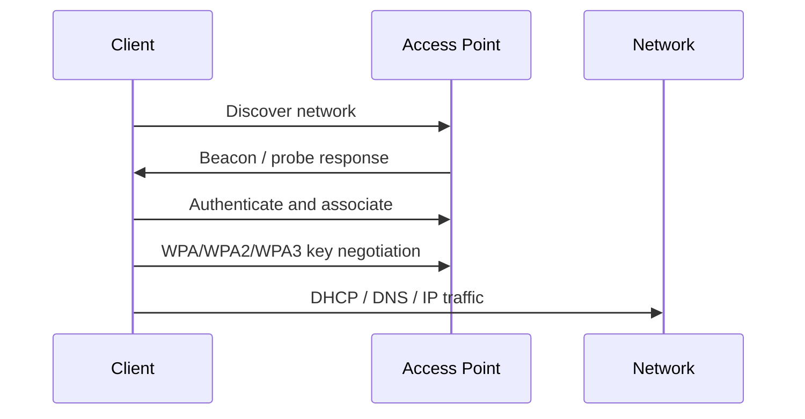

# Preface

## Purpose of this guide

This guide explains the capabilities of a Mar-x-Auder / ESP32 Marauder-style device as a practical way to understand wireless and network security. It is written for students and instructors who require protocol-level understanding rather than a menu walkthrough. Each capability is treated as an entry point into the underlying technology: Wi-Fi management frames, WPA authentication, Bluetooth discovery, DHCP, DNS, HTTP, TLS, packet capture, and user-interface trust.

The guide is intentionally transparent. The device is not presented as a harmless scanner, because that would be inaccurate. It can observe traffic, capture frames, transmit crafted frames, create deceptive wireless environments, and interfere with normal network behavior. The educational value comes from understanding what these capabilities actually do, where they sit in the protocol stack, what assumptions they challenge, and how defenders can recognize or reduce the risk.

The guide is also intentionally scoped. The practical examples are written for self-owned networks, lab access points, consented devices, and controlled classroom environments. The goal is protocol understanding and defensive literacy, not misuse against uninvolved people or systems.

## Audience

This guide is intended for students, instructors, and researchers who want to understand how portable Wi-Fi and Bluetooth research devices behave. It assumes basic computer literacy but does not assume prior expertise in 802.11, TCP/IP, TLS, or packet analysis.

The guide is suitable for:

- introductory wireless security classes;
- defensive security workshops;
- practical networking courses;
- authorized research labs;
- security-awareness demonstrations for technical audiences.

It is not written as a checklist for attacking public networks, collecting credentials, disrupting other users, or tracking uninvolved devices.

## Device family and terminology

Throughout the guide, the term **Mar-x-Auder** refers to a handheld device running ESP32 Marauder-style firmware or a derivative build. The exact menus, buttons, screen layout, and available features may vary by hardware version and firmware build.

The upstream ESP32 Marauder project describes the device family as a Wi-Fi and Bluetooth analysis tool that provides capabilities for frame capture, device enumeration, and frame transmission. This guide uses that broad capability model rather than assuming a single exact hardware model.

When a practical example says to use a specific menu item, treat the wording as representative. On some devices the feature may appear under a slightly different menu path or may require a different firmware build.

## What the guide teaches

The guide is organized around two kinds of knowledge.

First, it teaches the foundations required to understand the device:

- radio behavior and channels;
- 802.11 access points, stations, and management frames;
- WPA, WPA2, WPA3, handshakes, and protected management frames;
- TCP/IP, DHCP, DNS, HTTP, and TLS;
- Bluetooth and BLE discovery;
- packet capture and post-capture analysis.

Second, it teaches device abilities as concrete demonstrations of those foundations:

- discovering access points;
- observing clients and stations;
- analyzing channel usage and signal strength;
- capturing beacons, probe requests, and raw frames;
- understanding deauthentication and disassociation behavior;
- demonstrating beacon spam and access-point cloning concepts;
- understanding evil portal behavior;
- explaining authentication artifacts such as WPA handshakes and PMKID;
- reviewing Bluetooth/BLE visibility;
- connecting the offensive capability to defensive detection and hardening.

## How each ability chapter is structured

Each ability chapter follows a consistent internal structure. The goal is to make every practical example explain the technology behind the behavior.

```text
Ability: [Name]

1. What this ability demonstrates
2. Technologies involved
3. Where this sits in the protocol stack
4. Normal flow
5. Interference or observation point
6. What changes after the device is used
7. Ethical and safety boundary
8. Controlled Mar-x-Auder demonstration
9. Defensive understanding
```

Device behavior is explained as protocol behavior rather than as opaque device behavior. Each ability describes the expected protocol flow, the observation or interference point, and the evidence visible in frames, captures, logs, or client behavior.

## Capability types

The guide uses consistent language to describe what the device is doing.

| Capability type | Meaning |
| --- | --- |
| Observation | The device listens and displays information without intentionally changing the environment. |
| Capture | The device records frames or metadata for later analysis. |
| Interpretation | The device helps explain observed radio or protocol behavior. |
| Mapping | The device correlates wireless observations with time or location context. |
| Injection | The device transmits crafted wireless frames. |
| Interference | The device changes, disrupts, or adds noise to expected behavior. |
| Impersonation | The device presents a network, service, or identity that resembles another. |
| Deception | The user or client is shown a misleading flow, name, or page. |
| Collection | The device receives or stores information submitted during a controlled training flow. |
| Noise | The device adds artificial radio or discovery-layer activity for demonstration. |
| Controlled interference | The device intentionally changes behavior inside a scoped lab comparison. |
| Metadata awareness | The capability highlights identifiers, timing, or presence signals rather than payload contents. |
| Evidence | The capability produces artifacts used to evaluate defensive posture. |
| Audit | The capability is used to evaluate and improve defensive posture. |

A single ability can involve more than one type. For example, an evil portal demonstration may involve impersonation, deception, HTTP behavior, and credential-handling risk. A raw packet capture is observation and capture, but not interference.

## Protocol-stack framing

Every ability is mapped to the layer where it primarily operates. This matters because many wireless features happen before normal Internet traffic exists.

```text
User and application behavior
HTTP and captive portal flows
TLS and certificate validation
DNS name resolution
TCP / UDP transport
IP addressing and routing
DHCP / ARP / NDP local network services
802.11 data frames
802.11 management and control frames
Radio / channel behavior
```

For example, deauthentication occurs at the 802.11 management-frame layer. It is not an HTTP issue, not a TLS issue, and not a password-recovery technique. Evil portal behavior, by contrast, begins with Wi-Fi access but becomes a DHCP, DNS, HTTP, and user-interface trust issue.

## Diagram convention

Ability chapters use two diagrams where useful:

1. **Normal flow** — how the technology behaves without interference.
2. **Interfered or observed flow** — where the device observes, injects, impersonates, or changes the flow.

Example format:



The diagrams are not decoration. They are the core teaching method: they show where the capability lives in the chain and what assumption it affects.

## Safety model

This guide avoids country-specific legal analysis. Laws differ by jurisdiction, but the ethical line is straightforward.

Legitimate research uses:

- networks owned by the researcher, instructor, school, or lab;
- client devices owned by or explicitly consented to by participants;
- clear boundaries and controlled conditions;
- fake credentials and training data when demonstrating deceptive flows;
- minimal collection and careful deletion of unnecessary data;
- defensive reporting as the outcome.

Unethical use includes:

- disrupting uninvolved users;
- collecting credentials or identifiers from people outside the lab;
- impersonating real organizations or services without authorization;
- causing confusion in shared wireless environments;
- tracking devices or people without consent;
- presenting demonstrations as harmless when they can interfere with real networks.

## Use of external references

Foundation chapters link to standards, official documentation, or vendor-neutral educational references where appropriate. Ability chapters link back to the relevant foundation sections rather than duplicating full protocol explanations every time.

This keeps the guide readable while still allowing students to go deep when a capability touches multiple technologies.
