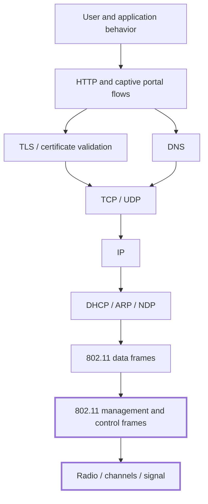

# Device Overview

## What the device is

The Mar-x-Auder is a handheld Wi-Fi and Bluetooth research device commonly associated with ESP32 Marauder-style firmware or derivative builds. It is built around an ESP32-family microcontroller and provides a portable interface for wireless observation, packet capture, and active frame transmission.

The exact hardware can vary. Some devices have a small screen and buttons. Others use a larger touchscreen. Some include a battery, SD card slot, external antenna connector, GPS module, or additional radio support. The firmware build determines which features are available and how they appear in the menu.

For this guide, the device is treated as a practical teaching instrument. It is used to make wireless behavior visible and to demonstrate how different parts of the Wi-Fi, Bluetooth, and network stack can be observed or interfered with in a controlled lab.

## What the device is not

The device is not a universal exploitation tool, a password extractor, or a replacement for understanding protocols. Many of its most important features work by using well-known behavior in wireless standards:

- listening for frames that are already transmitted over the air;
- saving captured frames for later analysis;
- transmitting crafted management frames;
- advertising fake network names;
- creating a captive portal-style web flow;
- observing authentication artifacts;
- demonstrating Bluetooth/BLE visibility.

The educational value comes from knowing which layer is involved and what assumption is being tested.

## High-level capability model

The device capabilities can be grouped into five broad families.

| Family | Description | Example abilities |
| --- | --- | --- |
| Discovery | Finds visible wireless networks and devices. | Access-point scan, station observation, Bluetooth/BLE discovery. |
| Analysis | Helps interpret the radio environment. | Channel analyzer, signal monitor, packet counters. |
| Capture | Records wireless frames or metadata. | Beacon sniffing, probe-request sniffing, raw PCAP capture, EAPOL/PMKID observation. |
| Transmission | Sends crafted Wi-Fi frames. | Beacon spam, probe request flood, deauthentication/disassociation demonstrations. |
| Impersonation and deception | Creates network or portal behavior that resembles something else. | AP clone spam, evil portal, fake SSID demonstrations. |

The same device may support additional features depending on firmware and hardware.

## The device in the protocol stack

Different features operate at different layers. Understanding the layer prevents confusion.



Many Mar-x-Auder capabilities live near the bottom of this stack. Beacon frames, probe requests, deauthentication, disassociation, and AP advertisement are 802.11 management-frame behaviors. They occur before normal IP, TCP, DNS, HTTP, or TLS communication can happen.

Other capabilities, such as evil portal demonstrations, begin with Wi-Fi access but quickly move upward into DHCP, DNS, HTTP, and user-interface trust.

## Passive and active behavior

The guide distinguishes passive behavior from active behavior.

Passive behavior includes observation and capture. The device listens for frames and displays or stores what it sees. Passive behavior can still raise privacy concerns, especially when captures include third-party identifiers, but it does not intentionally transmit interfering frames.

Active behavior includes injection, interference, impersonation, or deception. The device transmits frames or creates services that change what clients see or experience. Active behavior requires stricter lab control because it can affect devices beyond the intended target.

| Mode | Device behavior | Example |
| --- | --- | --- |
| Passive observation | Listen and display. | Scan for access points. |
| Passive capture | Listen and save. | Save beacon frames or raw Wi-Fi frames to PCAP. |
| Active transmission | Send crafted frames. | Transmit beacon spam or deauthentication frames. |
| Impersonation | Present a network-like identity. | Advertise a cloned-looking SSID. |
| Deception | Shape what a user sees. | Display a captive portal-style training page. |

## Common hardware components

A Mar-x-Auder-style device may include the following components.

| Component | Purpose |
| --- | --- |
| ESP32-family microcontroller | Runs the firmware and controls Wi-Fi/Bluetooth functions. |
| Wi-Fi radio | Observes and transmits 802.11 traffic supported by the chipset. |
| Bluetooth/BLE support | Enables nearby Bluetooth/BLE observation or supported demonstrations. |
| Screen | Displays menus, scans, counters, and captured metadata. |
| Buttons or touchscreen | Used to navigate features and start/stop actions. |
| SD card slot | Stores PCAP files, logs, portal pages, configuration, or other output depending on feature. |
| Battery | Allows portable use, if included. |
| External antenna connector | May improve reception/transmission characteristics if present. |
| GPS module | May support wardriving or location-tagged observations if present and enabled. |

Not every device includes every component.

## SD card role

The SD card is important for capture-oriented work. Depending on the firmware and feature, it may store:

- PCAP files;
- beacon captures;
- raw Wi-Fi captures;
- evil portal HTML files;
- captured training credentials in a lab scenario;
- logs;
- firmware update files;
- SSID lists or configuration files.

A missing or incompatible SD card may cause capture features to display data on screen but fail to save useful evidence. For course use, the SD card should be prepared before the lab and tested with a harmless passive capture.

## Firmware and feature variation

ESP32 Marauder-style firmware can run on different ESP32 hardware variants. A feature described in this guide may not exist on every build, and some features may behave differently across versions. Hardware differences may affect:

- menu structure;
- touchscreen orientation;
- screen size;
- SD card behavior;
- GPS support;
- Bluetooth/BLE support;
- supported Wi-Fi bands;
- available attack or sniffer modes;
- stability and power use.

Before a class or workshop, the instructor should verify the exact device model and firmware version.

## Recommended lab equipment

The device belongs in a small, controlled lab environment.

Recommended equipment:

- one Mar-x-Auder / ESP32 Marauder-style device;
- one spare Wi-Fi router or access point;
- one spare client device such as an old phone or laptop;
- one microSD card known to work with the device;
- one workstation with Wireshark installed;
- optional USB power bank;
- optional GPS module if wardriving is part of the guide;
- optional second client device for observing multi-client behavior.

The lab access point should not be the primary home, school, or office network. It should be a dedicated test network created for the guide.

## Suggested lab network

Use simple, artificial names that cannot be confused with real infrastructure.

```text
SSID: LabNetwork
Password: training-password-12345
Client name: LabClient
Portal name: TrainingPortal
```

The lab may later use stronger passphrases or alternate configurations to demonstrate defensive differences. For example, readers may compare WPA2-Personal with a weak passphrase, WPA2-Personal with a strong passphrase, and WPA3-Personal with Protected Management Frames where hardware supports it.

## Normal classroom flow

The guide introduces the device in this order:

1. identify the device model and firmware version;
2. prepare the SD card;
3. create a lab access point;
4. connect a lab client;
5. run passive observation features first;
6. review saved captures;
7. move to controlled active demonstrations;
8. connect the observed behavior to defensive controls.

This order prevents students from seeing the device as a collection of tricks. It establishes the device as a way to explore protocol behavior.

## Practical example: first safe verification

A useful first verification is a passive access-point scan.

1. Power on the device.
2. Open the Wi-Fi scanning or sniffer area of the menu.
3. Run a passive access-point discovery feature.
4. Confirm that the lab SSID appears.
5. Record the SSID, BSSID, channel, and signal strength if displayed.
6. Stop the scan.

This confirms that the device can receive frames and that the lab access point is visible. It does not transmit interfering traffic and is therefore a suitable first demonstration.

## Defensive understanding

The device overview establishes the main defensive lesson of the entire guide: wireless networks expose multiple layers of behavior before application traffic begins. Some information is intentionally advertised, some is leaked by clients, some can be captured for later analysis, and some assumptions can be challenged through crafted transmissions or deceptive network flows.

A defender who understands the layer involved can respond more accurately. A deauthentication demonstration points toward Protected Management Frames and monitoring. A fake SSID demonstration points toward user training and strong authentication. An evil portal demonstration points toward captive portal awareness, HTTPS behavior, and credential hygiene. A probe request demonstration points toward client privacy settings and MAC randomization.

The rest of the guide expands these lessons one capability at a time.
