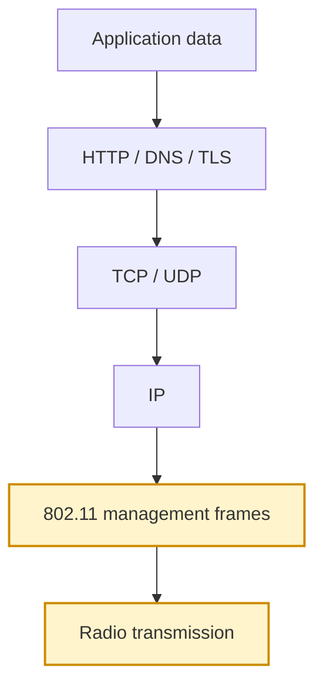
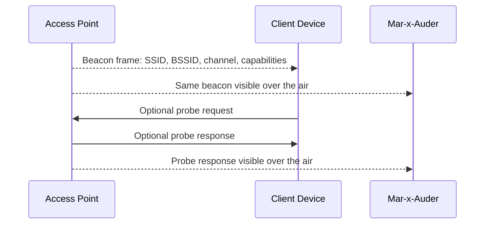
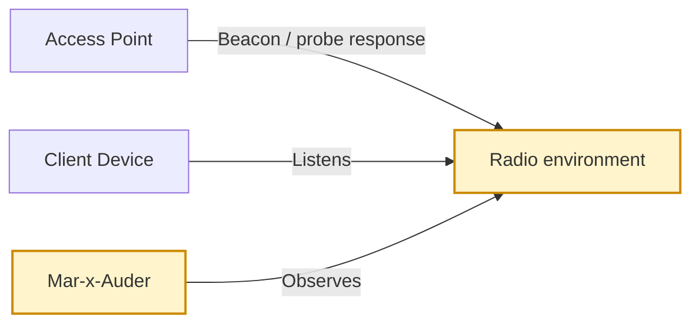

# Access Point Discovery

## What this ability demonstrates

Access point discovery demonstrates how Wi-Fi networks announce their presence and how a nearby observer can build a basic map of the wireless environment. The Mar-x-Auder listens for 802.11 management traffic and presents visible access points as a list of network names, radio identifiers, channels, signal strength, and security capabilities.

This ability is foundational because many later capabilities depend on understanding the difference between a network name, a radio identity, a channel, and a security configuration.

## Capability type

Observation

The device listens to traffic that is already transmitted over the air. In this mode, it is not joining a network, sending traffic to the access point, authenticating as a client, or testing a password.

## Technologies involved

This ability depends on the following foundation topics:

- [Radio and Wireless Basics](../foundations/01-radio-basics.md)
- [Wi-Fi and 802.11 Basics](../foundations/02-wifi-80211.md)
- [WPA, WPA2, and WPA3](../foundations/03-wpa-wpa2-wpa3.md)
- [Packet Capture and Analysis](../foundations/09-packet-capture.md)

The main building blocks involved are:

| Building block | Role in this ability |
|---|---|
| Radio channel | The frequency range on which the AP is transmitting |
| Beacon frame | Periodic AP advertisement announcing a network |
| Probe response | AP response to a station looking for networks |
| SSID | Human-readable network name |
| BSSID | Radio identity of the access point interface |
| RSSI | Approximate received signal strength |
| RSN information | Security information advertised by the AP |

## Where this sits in the protocol stack

Access point discovery happens before IP networking begins. The information comes from Wi-Fi management frames, not from TCP, HTTP, DNS, or TLS.

## Normal flow

In normal operation, an access point periodically transmits beacon frames. These frames are designed to be visible to nearby stations so that phones, laptops, and other clients can discover the network.

A client uses this information to decide which networks are available and which one it may try to join. The Mar-x-Auder observes the same broadcast or nearby management traffic and displays selected fields to the user.

## Observation point

The device observes the discovery layer. It does not need to know the Wi-Fi password because beacon frames and many discovery-related management frames are not encrypted.

## What the process expects

The normal Wi-Fi discovery process expects access points to announce themselves so clients can find networks. It does not treat the SSID as a secret. A visible network name is intentionally public.

Discovery also expects that many networks may be present in the same physical area. A device may therefore show several SSIDs, repeated SSIDs, or the same SSID coming from multiple BSSIDs.

## What the Mar-x-Auder reveals

Access point discovery reveals that a Wi-Fi menu is only a simplified user interface over a richer radio environment. A single visible network name may hide multiple radios, channels, and security configurations.

Typical fields include:

| Field | Meaning | Interpretation caution |
|---|---|---|
| SSID | Network name | Not a reliable identity by itself |
| BSSID | AP radio MAC-like identifier | More specific than SSID, but still not proof of trust |
| Channel | Radio channel used by the AP | Useful for interference and capture planning |
| RSSI | Received signal strength | Not exact distance or location proof |
| Security mode | Open, WPA/WPA2/WPA3 indicators | Advertised capability, not a full audit by itself |
| Vendor/OUI | Manufacturer hint based on address prefix | Often incomplete or misleading due to randomization or reused chipsets |

## Ethical and safety boundary

Legitimate research means observing networks in a controlled environment, on owned equipment, or as part of an authorized assessment. Access point discovery may appear passive, but it can still collect identifiers belonging to other people or organizations.

The ethical line is crossed when collected identifiers are used to track people, map private networks for later abuse, publish sensitive location-linked network data without a clear purpose, or profile uninvolved users.

A classroom or workshop should minimize unnecessary collection by using a lab router with a clear training SSID and by avoiding publication of third-party SSIDs, BSSIDs, or location data.

## Controlled Mar-x-Auder demonstration

1. Prepare a lab access point with a clear SSID such as `MX-Lab-Network`.
2. Place the Mar-x-Auder near the lab access point.
3. Open the Wi-Fi scanning or access point scan feature.
4. Start scanning and allow the device to observe nearby AP advertisements.
5. Locate the lab SSID in the result list.
6. Record the SSID, BSSID, channel, RSSI, and advertised security mode.
7. Move the device a few meters away and observe whether RSSI changes.
8. Compare the lab AP with other visible APs without copying unrelated identifiers into public notes.

The important outcome is not the number of networks found. The important outcome is understanding that AP discovery is based on radio-visible management frames and that network identity is more complicated than the SSID shown in a phone menu.

## Packet-capture evidence

If the same environment is captured as PCAP, beacon frames from the lab AP should be visible. In Wireshark, these frames typically appear as 802.11 management frames of subtype beacon.

Useful fields to inspect include:

- transmitter address;
- BSSID;
- SSID tag;
- channel information;
- supported rates;
- RSN / security information;
- vendor-specific information elements.

The packet capture reinforces the same lesson: the Mar-x-Auder display is a summary of structured 802.11 management information.

## Defensive understanding

Access point discovery helps defenders understand their own wireless footprint. It can reveal unexpected SSIDs, misnamed networks, weak or open lab networks, duplicate SSIDs, overlapping APs, and inconsistent security settings.

Defensive conclusions should be careful. Seeing an SSID is not enough to prove ownership, compromise, or malicious activity. A finding should be based on a combination of SSID, BSSID, physical location, channel, signal behavior, security mode, and organizational context.
