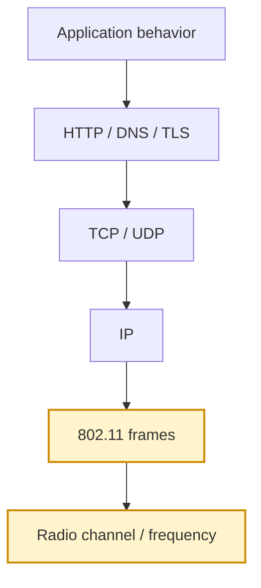
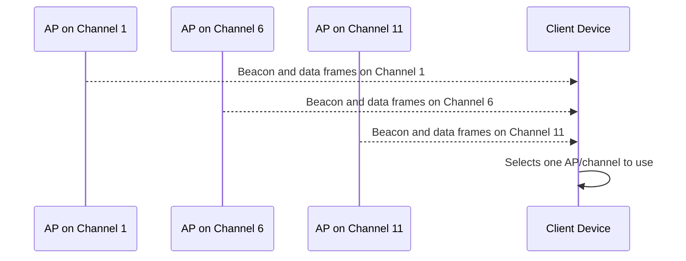
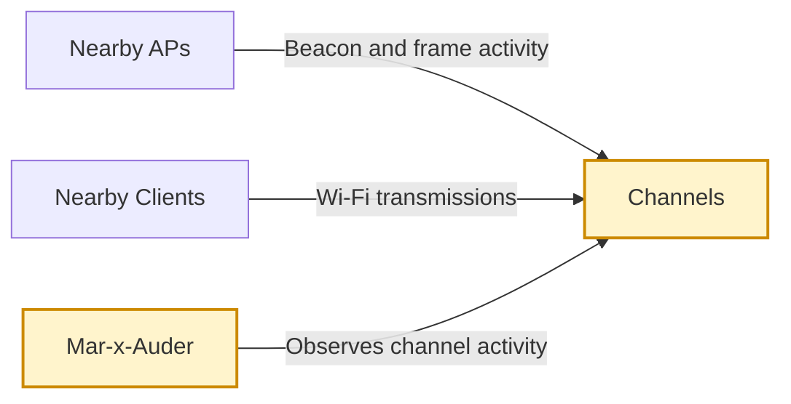

# Channel Analysis

## What this ability demonstrates

Channel analysis demonstrates that Wi-Fi performance and reliability are shaped by the radio environment, not only by router speed or internet bandwidth. The Mar-x-Auder can help visualize which channels are active, where nearby access points are concentrated, and how crowded or overlapping parts of the 2.4 GHz band may be.

This ability teaches students to separate network-layer problems from radio-layer problems. A slow connection may be caused by weak signal, congestion, interference, poor channel placement, excessive retransmissions, or upstream internet issues. Channel analysis focuses on the first part of that chain: radio conditions.

## Capability type

Observation / Interpretation

The device listens to wireless activity and presents channel-level information. It does not need to join a network or know the Wi-Fi password.

## Technologies involved

This ability depends on the following foundation topics:

- [Radio and Wireless Basics](../foundations/01-radio-basics.md)
- [Wi-Fi and 802.11 Basics](../foundations/02-wifi-80211.md)
- [Packet Capture and Analysis](../foundations/09-packet-capture.md)

The main building blocks involved are:

| Building block | Role in this ability |
|---|---|
| Frequency band | Defines the radio range used by Wi-Fi |
| Channel | A subdivision of the band used for transmission |
| Channel overlap | Condition where neighboring channels partially interfere |
| RSSI | Approximate signal strength of received transmissions |
| Beacon activity | Visible AP advertisements used to infer channel presence |
| Airtime | Shared radio capacity used by nearby transmitters |

## Where this sits in the protocol stack

Channel analysis happens at the radio and 802.11 layers. It explains conditions that exist before IP addresses, TCP sessions, DNS lookups, or HTTP requests.

## Normal flow

In normal Wi-Fi operation, access points and stations transmit on a configured channel. Nearby devices sharing the same or overlapping channel must coexist over the same radio medium.

In the 2.4 GHz band, channels are close together. Common planning practice uses non-overlapping or minimally overlapping channel groups such as 1, 6, and 11, depending on regional rules and channel width. If several APs are placed on nearby overlapping channels, they may interfere with each other more than necessary.

## Observation point

The Mar-x-Auder observes radio-visible Wi-Fi activity and groups what it sees by channel. The important point is that the device is not measuring internet speed. It is showing evidence about the wireless medium.

## What the process expects

Wi-Fi expects multiple devices to share the radio medium. Devices use contention mechanisms to avoid transmitting at the same time, but this does not create unlimited capacity. The more devices compete for airtime, the more delays, retries, and inconsistent performance may occur.

A well-planned network tries to reduce unnecessary overlap, choose appropriate channels, and place access points so coverage is strong without creating avoidable self-interference.

## What channel analysis reveals

Channel analysis reveals whether the lab network is operating in a crowded or quiet part of the band. It can also reveal whether several APs with the same SSID are distributed across channels, whether neighboring APs are concentrated in one area, or whether a router has automatically selected a poor channel.

Typical observations include:

| Observation | Possible meaning | Caution |
|---|---|---|
| Many APs on one channel | Crowded channel or dense environment | Number of APs is not the same as airtime utilization |
| Strong neighboring AP | Possible interference or competing airtime | Strong signal does not prove heavy traffic |
| Overlapping 2.4 GHz channels | Avoidable channel plan problem | Regional rules and channel width matter |
| Lab AP on busy channel | Potential performance issue | Confirm with real client tests and router data |
| Few APs visible | Quiet environment or limited scan range | Hidden networks and non-Wi-Fi interference may still exist |

## Ethical and safety boundary

Legitimate research uses channel analysis to understand and improve owned or authorized networks. The ethical line is crossed when channel observations are used to select targets for disruption, profile private environments, or publish location-linked network information without a defensive purpose.

Channel analysis is generally less sensitive than active interference, but it can still reveal organizational presence, device density, and infrastructure patterns. Treat collected identifiers as research data, not public trivia.

## Controlled Mar-x-Auder demonstration

1. Prepare a lab access point and note its configured channel.
2. Open the channel analyzer or equivalent Wi-Fi analysis feature on the Mar-x-Auder.
3. Observe which channels show nearby activity.
4. Identify the channel used by the lab AP.
5. Compare the lab AP channel with nearby activity.
6. If the lab router supports manual channel selection, move the lab AP to a clearer channel and repeat the observation.
7. Compare client behavior, signal stability, and visible channel crowding before and after the change.

The practical example should not be presented as a universal optimization recipe. It is a demonstration of the relationship between channel selection and the local RF environment.

## Packet-capture evidence

A channel analysis display may not always produce a PCAP by itself. When raw capture is used alongside it, beacon frames and other 802.11 frames should show the channel context and transmitter identities associated with the observed activity.

In Wireshark or another analyzer, useful evidence includes:

- beacon frames from the lab AP;
- channel/frequency metadata where available;
- BSSID and transmitter address;
- RSSI or radio metadata where supported by the capture format;
- relative density of visible frames on selected channels.

## Defensive understanding

Channel analysis is useful for diagnosing reliability problems and designing better Wi-Fi layouts. It helps defenders avoid confusing internet issues with radio issues.

Defensive improvements may include:

- selecting less crowded channels;
- reducing unnecessary channel overlap;
- adjusting AP placement;
- reducing transmit power in dense multi-AP deployments;
- moving critical clients to 5 GHz or 6 GHz where available;
- separating performance troubleshooting from security findings.

The key defensive lesson is that Wi-Fi is a shared radio system. Security, performance, and reliability all depend on understanding that shared medium.
