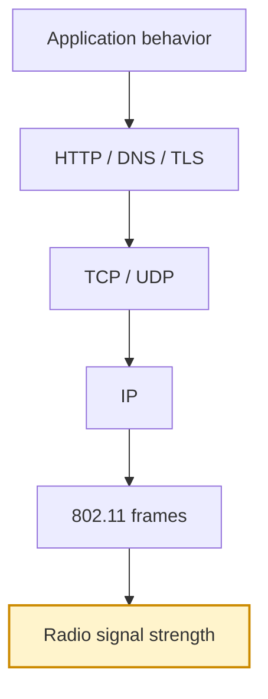
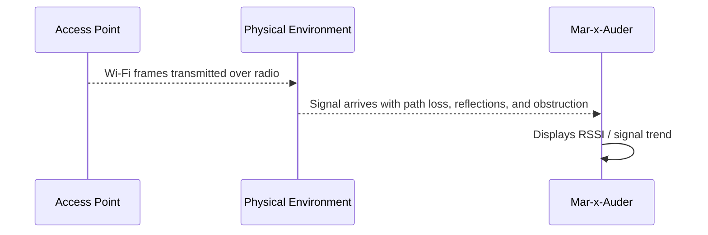
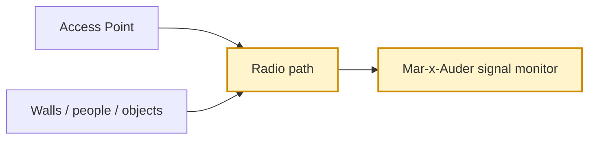

# Signal Monitoring

## What this ability demonstrates

Signal monitoring demonstrates how received Wi-Fi signal strength changes across space, time, orientation, obstacles, and device placement. The Mar-x-Auder can observe the strength of frames from a selected access point and show how the local radio environment changes as the device moves.

This ability teaches that Wi-Fi visibility is not the same as location certainty. A strong signal usually means the transmitter is nearby or unobstructed, but signal strength can be affected by walls, reflections, antenna orientation, body blocking, device hardware, and multipath behavior.

## Capability type

Observation / Interpretation

The device listens to frames from an access point or other visible transmitter and presents signal strength behavior. It does not need to authenticate to the network.

## Technologies involved

This ability depends on the following foundation topics:

- [Radio and Wireless Basics](../foundations/01-radio-basics.md)
- [Wi-Fi and 802.11 Basics](../foundations/02-wifi-80211.md)
- [Packet Capture and Analysis](../foundations/09-packet-capture.md)

The main building blocks involved are:

| Building block | Role in this ability |
|---|---|
| RSSI | Approximate received signal strength indicator |
| Beacon frames | Repeated AP transmissions used as signal samples |
| Path loss | Signal reduction as distance and obstacles increase |
| Multipath | Reflections that cause signal variation |
| Antenna orientation | Device position affects received signal |
| Channel conditions | Noise and interference influence usable signal quality |

## Where this sits in the protocol stack

Signal monitoring is a radio-layer observation. It is not measuring HTTP performance, TCP throughput, DNS reliability, or application behavior.

## Normal flow

An access point transmits beacon frames and other Wi-Fi frames. A nearby receiver detects those transmissions at some signal strength. As the receiver moves, the measured strength changes.

The access point does not need to know that the Mar-x-Auder is observing signal strength. The device is measuring what reaches its own radio.

## Observation point

The Mar-x-Auder observes the received signal of frames that are already visible over the air. The measurement is local to the device.

## What the process expects

Wi-Fi expects signal quality to vary. Clients and APs adapt using rate control, retransmissions, roaming decisions, and band selection. A client may remain connected with a weak signal, but performance may be inconsistent.

The network stack above Wi-Fi often hides this complexity. A user may simply see a slow website, a video call freeze, or a temporary disconnect. Signal monitoring helps connect those symptoms to radio conditions.

## What signal monitoring reveals

Signal monitoring reveals local radio behavior from the observer’s position. It can show coverage boundaries, weak areas, unstable signal zones, or unexpected attenuation caused by physical layout.

Typical observations include:

| Observation | Possible meaning | Caution |
|---|---|---|
| Strong stable RSSI | Good local coverage | Does not guarantee high throughput |
| Weak RSSI | Distance, walls, poor placement, or low transmit power | Weak signal alone does not identify the cause |
| Rapid fluctuation | Movement, interference, reflections, or body blocking | Consumer devices may smooth readings differently |
| Signal improves when moved | Local obstruction or placement issue | Orientation can affect the result |
| Different results across devices | Different antennas and radios | Do not compare devices as if they are calibrated instruments |

## Ethical and safety boundary

Legitimate research uses signal monitoring to understand coverage and placement of owned or authorized equipment. The ethical line is crossed when signal observations are used to locate, track, or profile uninvolved devices or people.

A signal reading should not be treated as a surveillance tool. RSSI is approximate, environment-dependent, and easily misinterpreted. In a teaching context, the focus should remain on coverage, interference, and defensive network design.

## Controlled Mar-x-Auder demonstration

1. Configure a lab access point with a recognizable SSID.
2. Use access point discovery to identify the lab AP and its channel.
3. Open the signal monitor feature and select the lab AP.
4. Stand near the AP and observe the signal reading.
5. Move to several known locations: same room, behind a wall, corridor, far corner, and near reflective surfaces.
6. Rotate the device and observe whether orientation changes the reading.
7. Record general trends, not exact location claims.
8. If AP placement can be changed, move the AP and repeat the observation.

The practical example demonstrates that signal strength is a local measurement, not a stable identity or precise distance calculation.

## Packet-capture evidence

Signal monitoring may not produce a PCAP by itself. When raw capture is used, packet metadata may include received signal information depending on the capture method and format.

Evidence to compare includes:

- repeated beacon frames from the lab AP;
- RSSI or radio metadata where available;
- frame loss or reduced visibility in weak areas;
- channel consistency;
- differences between capture locations.

The capture should be interpreted carefully because not all capture formats preserve the same radio metadata.

## Defensive understanding

Signal monitoring helps defenders improve coverage and reduce accidental exposure. A network that leaks strongly outside the intended area may increase the opportunity for observation or abuse. A network with weak indoor coverage may push users toward insecure alternatives such as phone hotspots or neighboring networks.

Defensive improvements may include:

- better AP placement;
- antenna orientation changes;
- transmit power tuning;
- adding APs in weak areas;
- reducing unnecessary external leakage;
- separating guest and internal networks;
- validating coverage after physical layout changes.

The key lesson is that wireless security and reliability begin with the physical radio environment.
