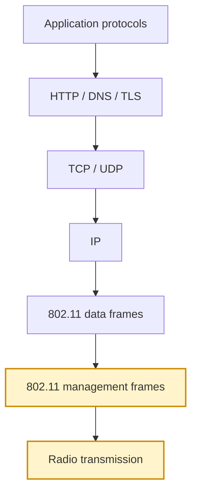
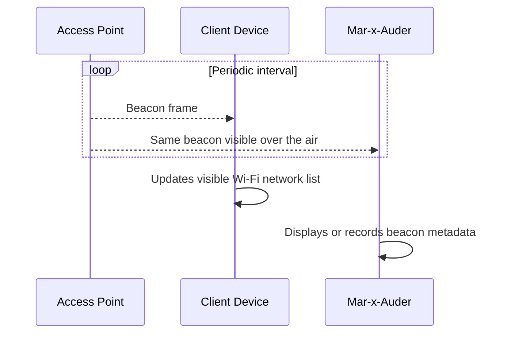
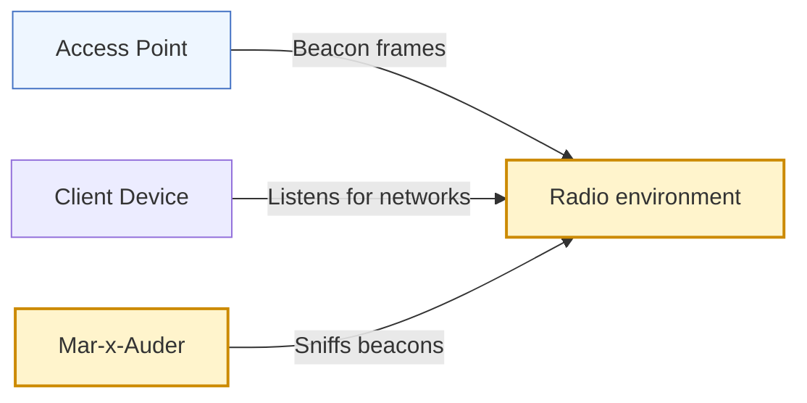

# Beacon Sniffing

## What this ability demonstrates

Beacon sniffing demonstrates how access points continuously advertise their presence and configuration to nearby devices. The Mar-x-Auder listens for these beacon frames and can display or capture the information carried inside them.

This ability is important because beacon frames are the foundation of Wi-Fi visibility. A client does not need to join a network to learn that a network exists, what name it advertises, which radio identity is transmitting it, which channel it uses, and which security capabilities it claims to support.

## Capability type

Observation / Capture

The device listens for management frames already transmitted by access points. When PCAP saving is enabled and an SD card is available, the same observations may be stored for later analysis.

## Technologies involved

This ability depends on the following foundation topics:

- [Radio and Wireless Basics](../foundations/01-radio-basics.md)
- [Wi-Fi and 802.11 Basics](../foundations/02-wifi-80211.md)
- [WPA, WPA2, and WPA3](../foundations/03-wpa-wpa2-wpa3.md)
- [Packet Capture and Analysis](../foundations/09-packet-capture.md)

The main building blocks involved are:

| Building block | Role in this ability |
|---|---|
| Beacon frame | Periodic AP advertisement |
| SSID | Network name advertised to clients |
| BSSID | AP radio identity associated with the beacon |
| Channel | Frequency channel on which the beacon is heard |
| Capability information | Basic AP feature flags |
| RSN information element | Security capabilities such as WPA/WPA2/WPA3 support |
| Vendor-specific elements | Optional implementation-specific metadata |

## Where this sits in the protocol stack

Beacon sniffing happens at the 802.11 management-frame layer. It does not require IP, TCP, DNS, HTTP, TLS, or application traffic.

## Normal flow

In normal Wi-Fi operation, an access point periodically broadcasts beacon frames. These frames allow nearby clients to discover the network without first sending data or authenticating.

A beacon is not a secret. It is intentionally transmitted so clients can discover the AP. For that reason, beacon sniffing is one of the clearest ways to show students that Wi-Fi network discovery happens before normal network traffic exists.

## Observation point

The Mar-x-Auder observes the access point's advertisement behavior. It is not communicating with the AP. It is not joining the network. It is not testing a password.

## What the process expects

The normal process expects access points to announce themselves. A client uses beacon data to decide whether a network exists, whether it has seen the network before, whether the security mode is compatible, and whether the signal seems strong enough to attempt connection.

The process does not expect the SSID alone to prove identity. Multiple radios can advertise the same SSID. A malicious or experimental device can also transmit beacons containing names that resemble legitimate networks. Beacon sniffing therefore introduces an important defensive idea: visibility is not identity.

## What the Mar-x-Auder reveals

Beacon sniffing reveals the structure behind a simple Wi-Fi network list. A phone may show one line such as `LabNetwork`, while the beacon data may show several BSSIDs, different channels, different signal levels, and different advertised capabilities.

Typical observations include:

| Observation | Meaning |
|---|---|
| Repeated beacon frames | APs advertise continuously, not only when a client asks |
| Multiple BSSIDs with the same SSID | A single network name may be served by multiple radios/APs |
| Hidden or blank SSID behavior | Some APs suppress the visible SSID field, but still transmit management traffic |
| RSN information | Security capability is advertised before a client joins |
| Vendor-specific information | Devices may reveal implementation hints through optional fields |

## Ethical and safety boundary

Beacon sniffing is passive, but passive collection still has ethical limits. Legitimate research focuses on owned networks, authorized environments, or controlled classroom labs. It avoids publishing unrelated SSIDs, BSSIDs, vendor hints, or location-linked observations that could expose other people or organizations.

The ethical line is crossed when beacon data is collected or shared for tracking, targeting, doxxing, profiling, or preparing unauthorized interference.

## Controlled Mar-x-Auder demonstration

1. Configure a lab AP with a clearly identifiable SSID such as `MX-Beacon-Lab`.
2. Insert a FAT32-formatted SD card if PCAP capture is desired.
3. Place the Mar-x-Auder near the lab AP.
4. Open the beacon sniffing feature.
5. Start sniffing and observe the listed beacon frames or summaries.
6. Confirm that the lab SSID appears with the expected BSSID and channel.
7. If PCAP saving is enabled, stop the capture and review the saved file in Wireshark.
8. Compare the Mar-x-Auder summary with the full beacon frame fields visible in packet analysis.

The expected result is a direct connection between the device display and the underlying 802.11 management frames.

## Packet-capture evidence

A PCAP should show beacon frames from the lab AP. Useful Wireshark fields include:

- frame type and subtype: management / beacon;
- transmitter address;
- BSSID;
- SSID parameter set;
- supported rates;
- channel information;
- RSN information;
- vendor-specific tags.

The packet capture makes clear that the device is not inventing a network list. It is summarizing structured information broadcast by APs.

## Defensive understanding

Beacon sniffing helps defenders inventory the wireless environment. It can reveal unauthorized APs, misnamed lab networks, inconsistent security settings, duplicate SSIDs, old equipment, or unexpected vendor signatures.

Defensive interpretation must remain cautious. Beacon data alone does not prove malicious activity. It is a starting point for understanding the wireless footprint and deciding where deeper investigation is warranted.
