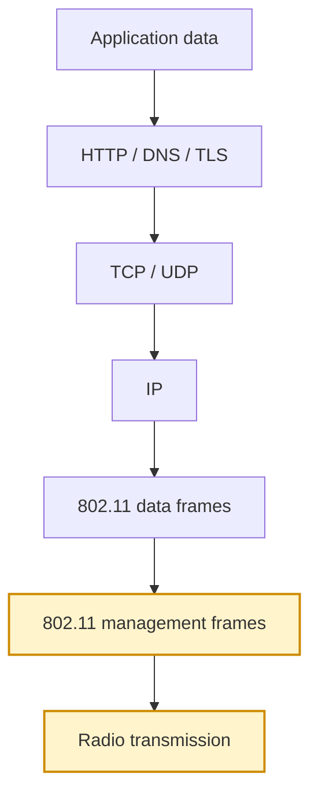
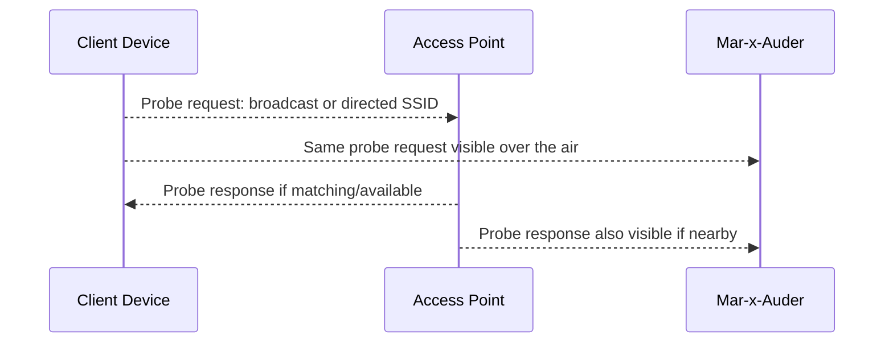
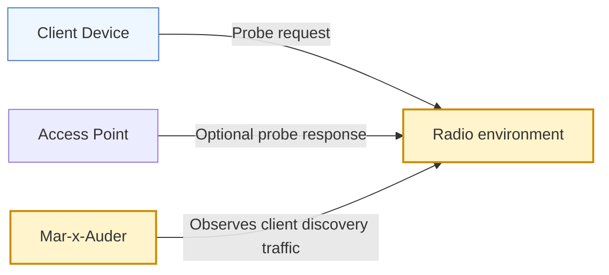

# Probe Request Observation

## What this ability demonstrates

Probe request observation demonstrates how client devices search for Wi-Fi networks and how that search process can reveal information. The Mar-x-Auder listens for probe requests transmitted by nearby stations and can display or capture selected metadata from those frames.

This ability is one of the most useful privacy demonstrations in the guide. It shows that Wi-Fi discovery is not only an access-point behavior. Client devices may also transmit discovery traffic while looking for networks or checking whether known networks are nearby.

## Capability type

Observation / Capture

The device listens for client-originated Wi-Fi management frames. In this mode, it is not forcing clients to connect, not joining a network, and not decrypting traffic.

## Technologies involved

This ability depends on the following foundation topics:

- [Radio and Wireless Basics](../foundations/01-radio-basics.md)
- [Wi-Fi and 802.11 Basics](../foundations/02-wifi-80211.md)
- [Packet Capture and Analysis](../foundations/09-packet-capture.md)

The main building blocks involved are:

| Building block | Role in this ability |
|---|---|
| Station | Client device searching for or using Wi-Fi |
| Probe request | Client request asking for nearby network information |
| Probe response | AP response to a probe request |
| Source address | Address used by the station in the request |
| Broadcast probe | Probe that asks for any available network |
| Directed probe | Probe that asks for a specific SSID |
| MAC randomization | Privacy mechanism that may reduce stable device tracking |

## Where this sits in the protocol stack

Probe request observation happens before IP networking. The frames are Wi-Fi management frames transmitted during network discovery.

## Normal flow

A client can discover networks passively by listening for beacons. It may also discover networks actively by sending probe requests. Some probe requests ask for any nearby network; others may ask for a specific SSID.

A client uses the responses to decide which networks are available and whether to attempt connection.

## Observation point

The Mar-x-Auder observes the client discovery step. This is different from access point discovery: the signal source is the client device, not the AP.

## What the process expects

The normal process expects a client to find networks efficiently. Active probing can speed discovery, especially when a device is looking for a previously known network or when passive discovery is slow.

The privacy problem is that discovery traffic may reveal information before the client has joined any network. Depending on device behavior, configuration, and operating-system privacy features, probe requests may reveal device identifiers, preferred network names, or patterns that make a device recognizable over time.

## What the Mar-x-Auder reveals

Probe request observation can reveal how much discovery traffic nearby devices emit. A modern phone may use randomized source addresses and avoid directed probes in many situations. Older or misconfigured devices may be noisier and easier to recognize.

Typical observations include:

| Observation | Meaning |
|---|---|
| Broadcast probe request | A client is asking what networks are nearby |
| Directed probe request | A client is asking for a specific network name |
| Repeated probes | A client is actively searching or retrying discovery |
| Randomized source address | The device may be attempting to reduce tracking |
| Stable source address | The device may be easier to recognize over time |
| Known SSID in probe | The client may reveal a network it previously used |

## Ethical and safety boundary

Probe request observation can expose information about people and their devices. Legitimate research uses owned devices, lab devices, or explicitly consented participants. It avoids collecting unrelated client identifiers and avoids publishing probe-derived data that could identify or profile a person.

The ethical line is crossed when probe data is used to track people, infer where they live or work, identify their devices without consent, or build profiles of uninvolved users.

## Controlled Mar-x-Auder demonstration

1. Prepare a lab client device such as a spare phone or laptop.
2. Create one or more lab SSIDs that do not resemble real personal or organizational networks.
3. Open the probe request observation or probe sniffing feature on the Mar-x-Auder.
4. Toggle Wi-Fi on the lab client or move the client near the lab AP.
5. Observe whether probe requests appear.
6. Compare the behavior when the client has no saved networks, one saved lab network, or Wi-Fi privacy/randomization enabled.
7. If PCAP saving is enabled, review the probe requests in Wireshark and compare them with the Mar-x-Auder display.

The expected result is an understanding of client-side discovery behavior, not a list of nearby people or devices.

## Packet-capture evidence

A PCAP may show probe request frames from the lab client. Useful fields include:

- frame type and subtype: management / probe request;
- source address;
- destination address;
- SSID parameter set, if present;
- supported rates;
- vendor-specific elements;
- sequence behavior across repeated probes.

If the client uses randomization, captures may show addresses that do not match the device's fixed hardware address. This is an important privacy feature and part of the observation.

## Defensive understanding

Probe request observation teaches defenders that client devices may leak information before joining a network. Defensive guidance includes enabling modern Wi-Fi privacy features, keeping operating systems updated, avoiding unnecessary saved networks, and being cautious with devices that repeatedly search for sensitive SSIDs.

For organizations, the lesson is that wireless privacy includes both access point configuration and client behavior. A secure AP does not prevent a client from revealing discovery metadata elsewhere.
