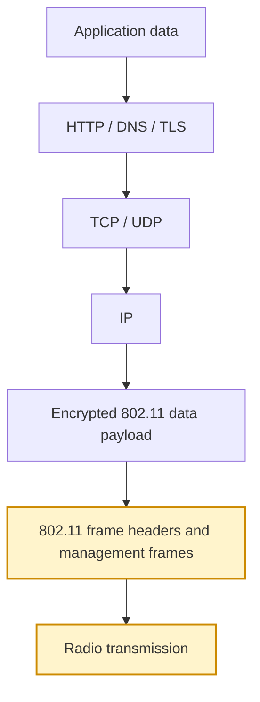
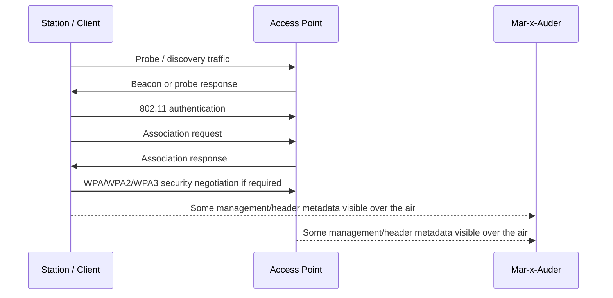
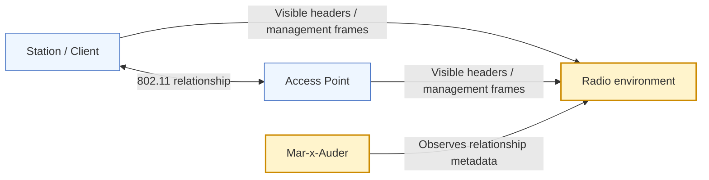

# Station Observation

## What this ability demonstrates

Station observation demonstrates how Wi-Fi clients, also called stations, can be observed in relation to nearby access points. The Mar-x-Auder can help identify client-side activity such as devices probing for networks, associating with APs, or appearing as active participants in the local wireless environment.

This ability is important because Wi-Fi is not only a list of networks. It is a relationship between access points and stations. Understanding that relationship is necessary before studying deauthentication, association behavior, handshake capture, evil-twin scenarios, or defensive monitoring.

## Capability type

Observation / Capture

The device listens for frames that indicate station presence or station/AP relationships. In this mode, it is not forcing a station to disconnect, not impersonating an AP, and not attempting to decrypt data.

## Technologies involved

This ability depends on the following foundation topics:

- [Radio and Wireless Basics](../foundations/01-radio-basics.md)
- [Wi-Fi and 802.11 Basics](../foundations/02-wifi-80211.md)
- [WPA, WPA2, and WPA3](../foundations/03-wpa-wpa2-wpa3.md)
- [Packet Capture and Analysis](../foundations/09-packet-capture.md)

The main building blocks involved are:

| Building block | Role in this ability |
|---|---|
| Station | Wi-Fi client such as a phone or laptop |
| Access point | Infrastructure device serving the network |
| Association | Link-layer relationship between a station and AP |
| Authentication | 802.11 authentication step before association |
| BSSID | AP radio identity used in the relationship |
| Station address | Address used by the client device |
| Data frame direction | Indicator of whether traffic is from/to AP or station |

## Where this sits in the protocol stack

Station observation is primarily an 802.11-layer capability. Some observations may involve encrypted data frames, but the useful metadata is usually visible at the Wi-Fi frame level.

## Normal flow

In infrastructure Wi-Fi, a station discovers an access point, authenticates at the 802.11 layer, associates with the AP, completes any required security negotiation, and then sends normal network traffic through the AP.

After connection, the client may send IP traffic, but the content of that traffic is usually encrypted at the Wi-Fi layer and may also be protected by TLS at the application layer.

## Observation point

The Mar-x-Auder observes the station as a wireless participant. Depending on the feature and environment, it may show station addresses, associated APs, RSSI, observed frame counts, or relationship hints between client and AP.

## What the process expects

The normal process expects each station to communicate through an AP using addresses and frame headers that allow the wireless link to function. Even when payloads are encrypted, certain metadata remains necessary for delivery and coordination.

The process also expects that stations may move, sleep, roam, reconnect, or randomize addresses depending on device behavior and operating-system privacy settings.

## What the Mar-x-Auder reveals

Station observation reveals the difference between content and metadata. The device may not see the user's actual application content, but it can still observe that a station exists, that it is active, that it appears near a specific AP, or that it is participating in a particular Wi-Fi exchange.

Typical observations include:

| Observation | Meaning |
|---|---|
| Station address | Identifier used by the client in observed frames |
| Associated BSSID | AP identity the station appears to communicate with |
| Signal strength | Approximate strength of the station's transmissions |
| Probe behavior | Client discovery activity before association |
| Authentication/association frames | Link setup activity |
| Encrypted data frames | Traffic exists, but payload content is not visible without keys |

## Ethical and safety boundary

Station observation can become personal because stations are often phones, laptops, watches, or other user-carried devices. Legitimate research uses lab clients, owned devices, or consented participants. It avoids identifying, tracking, or profiling uninvolved devices.

The ethical line is crossed when station data is used to monitor a person's movement, infer habits, identify device ownership, or prepare interference against a device that is not part of the lab.

## Controlled Mar-x-Auder demonstration

1. Prepare a lab AP with a known SSID.
2. Prepare a lab client device and connect it to the lab AP.
3. Place the Mar-x-Auder near both devices.
4. Open the station scanning or station observation feature.
5. Observe whether the lab client appears as a station.
6. Generate benign traffic from the lab client, such as loading a simple webpage.
7. Observe whether station activity changes while remembering that payload content should remain protected.
8. Disconnect and reconnect the lab client to observe discovery, authentication, and association behavior.

The point of the example is to show the station/AP relationship, not to inspect private user content.

## Packet-capture evidence

A PCAP may show management frames related to station discovery, authentication, association, reassociation, disassociation, or deauthentication. It may also show data frames where frame headers are visible while payloads are encrypted.

Useful fields include:

- receiver address;
- transmitter address;
- source address;
- destination address;
- BSSID;
- frame type and subtype;
- sequence numbers;
- retry flags;
- association request/response details;
- security negotiation frames where visible.

Packet analysis should reinforce that encrypted Wi-Fi still exposes some metadata required for radio communication.

## Defensive understanding

Station observation helps defenders understand who or what is active in a wireless environment. It can support troubleshooting, rogue-device investigation, coverage analysis, and detection of unusual client behavior.

Defensive use should be scoped and privacy-aware. A finding should not identify a person from station metadata alone unless the assessment has a clear authorization basis and a clear defensive purpose.
