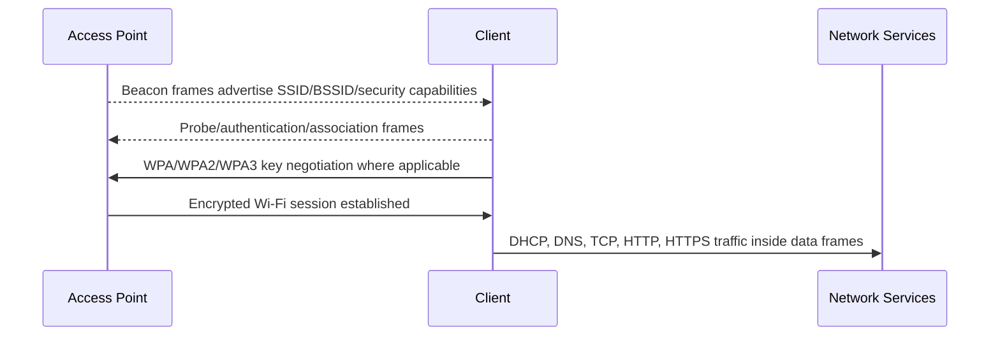
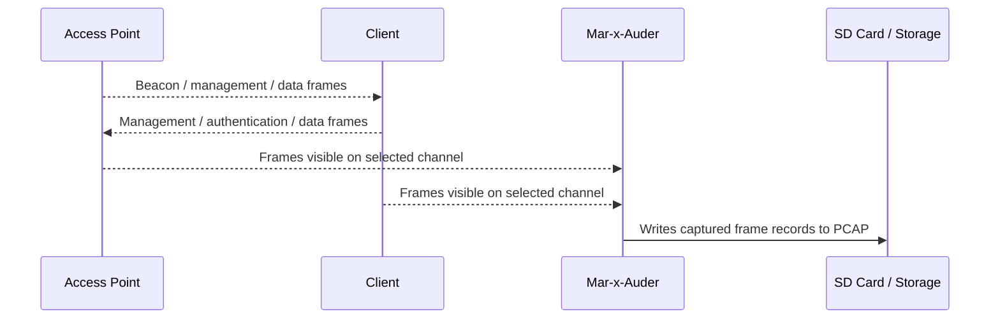

# Raw Packet Capture

## What this ability demonstrates

Raw packet capture demonstrates that wireless research is not limited to what a phone or laptop Wi-Fi menu displays. A Wi-Fi interface operating in a capture-oriented mode can observe 802.11 frames moving through the air and store them for later analysis in tools such as Wireshark.

On the Mar-x-Auder / ESP32 Marauder, raw capture is the bridge between simple visual observation and evidence-based protocol analysis. It allows students to see the difference between a network name shown in a user interface and the actual frame-level behavior that makes the network visible and usable.

## Capability type

Observation / Capture

The device listens and records. In this ability, it is not attempting to join a network, authenticate to an access point, decrypt traffic, or interfere with client behavior.

## Technologies involved

This ability uses and relates to:

- [Radio and wireless basics](../foundations/01-radio-basics.md)
- [Wi-Fi / 802.11 basics](../foundations/02-wifi-80211.md)
- [WPA, WPA2, and WPA3](../foundations/03-wpa-wpa2-wpa3.md)
- [Packet capture and analysis](../foundations/09-packet-capture.md)

## Where this sits in the protocol stack

Raw packet capture primarily operates at the radio and 802.11 layers.

```text
Application   Not normally visible unless traffic is open or decoded elsewhere
TLS           Encrypted payloads remain protected
HTTP          Visible only for unencrypted HTTP traffic after network access exists
TCP / UDP     May be visible as encrypted data frames, depending on capture/decryption limits
IP            May be visible only inside data frames and only when decodable
802.11        Primary capture target: management, control, and data frames
Radio         Capture depends on channel, signal strength, and distance
```

A key teaching point is that wireless packet capture does not automatically mean content capture. The device can observe frame metadata and some frame types directly, but encrypted payloads remain encrypted unless separate keys and decryption context are available.

## Normal flow

In a normal Wi-Fi environment, access points and stations exchange several classes of frames. Some of them are visible before any client joins the network. Others are exchanged only between associated devices.



## Observation point

The Mar-x-Auder observes the radio channel and records frames it can see.



The device is not in the communication path. It is an observer. Capture quality depends on channel selection, antenna placement, signal strength, supported bands, and whether the relevant frames are actually transmitted while the capture is running.

## What changes after observation

Nothing in the network should change. That is the point of passive capture.

The normal process continues as before:

- access points continue beaconing;
- clients continue probing, joining, roaming, or transmitting;
- encrypted sessions remain encrypted;
- the device stores evidence of what it can observe.

The researcher gains a durable record: a PCAP file that can be reviewed after the live event has passed.

## Key interpretation

Raw capture is useful because it separates assumptions from evidence.

A student might think that a network is “not doing anything” because no web page is open. Packet capture shows that Wi-Fi devices are often still transmitting management traffic, discovery traffic, retries, acknowledgments, and encrypted data frames.

A student might think that capturing Wi-Fi means capturing passwords or messages. Packet capture shows the opposite: strong encryption and correct protocol design limit what can be learned from the air.

A student might think that SSID names are network identity. Packet capture shows that SSID is only one field in a larger frame structure, and that BSSID, security parameters, channel, and timing also matter.

## Ethical and safety boundary

Legitimate research uses raw capture to understand networks and devices that are owned, administered, or explicitly included in the research scope. It is also legitimate to use capture defensively to troubleshoot a classroom lab, a home network, or a test environment.

The ethical line is crossed when packet capture is used to collect, retain, publish, or analyze information about uninvolved people or devices. Even when payloads are encrypted, captured metadata may still reveal device presence, movement, network names, timing, and behavior.

Accidental third-party capture is handled as data minimization work: avoid storing it, avoid sharing it, and avoid turning unrelated people into research subjects.

## Controlled Mar-x-Auder demonstration

Use a dedicated lab access point and one lab client.

1. Insert a compatible SD card into the device.
2. Confirm that packet capture saving is enabled.
3. Identify the lab AP channel using access point discovery or the router configuration page.
4. Set the Mar-x-Auder to observe the lab channel rather than hopping across many channels.
5. Start raw packet capture.
6. Connect the lab client to the lab AP.
7. Generate benign traffic, such as loading a local test page or pinging a known local address.
8. Stop capture.
9. Remove the SD card and open the PCAP file in Wireshark.

The purpose of the example is not to collect secrets. The purpose is to identify frame types and understand which parts of network behavior happen before, during, and after IP connectivity.

## Packet-capture evidence

A useful capture may contain:

- beacon frames from the lab AP;
- probe requests or probe responses;
- authentication and association frames;
- EAPOL frames if a WPA/WPA2/WPA3 connection is established during capture;
- data frames after association;
- retransmissions or retries if signal quality is poor;
- channel and signal metadata, depending on capture format and device support.

The capture does not imply all traffic content to be readable. On a properly protected network, most application data should remain encrypted at one or more layers.

## Common interpretation mistakes

### Mistake: PCAP means plaintext

A PCAP file is a container for captured packet or frame records. It does not imply that the content is decrypted.

### Mistake: More packets means better evidence

A small capture taken on the correct channel during the relevant event is usually more useful than a large noisy capture taken across unrelated channels.

### Mistake: RSSI equals exact distance

Signal strength can suggest proximity, but it is affected by walls, antenna orientation, reflections, device power, and environmental noise.

### Mistake: No visible payload means no useful finding

Metadata can still explain network behavior. Management frames, authentication artifacts, retransmissions, and channel usage can be more useful than payload content for wireless troubleshooting.

## Defensive understanding

Raw capture teaches defenders how to prove what happened rather than guess.

It helps answer questions such as:

- Was the client actually seeing the AP?
- Did the client attempt to associate?
- Did authentication negotiation begin?
- Were deauthentication or disassociation frames present?
- Is the problem signal quality, channel selection, authentication, DHCP, DNS, or application behavior?

This ability also teaches why privacy-sensitive environments should treat wireless metadata as meaningful data, even when payloads are encrypted.
