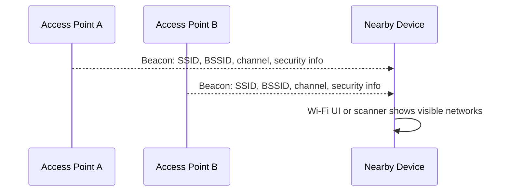
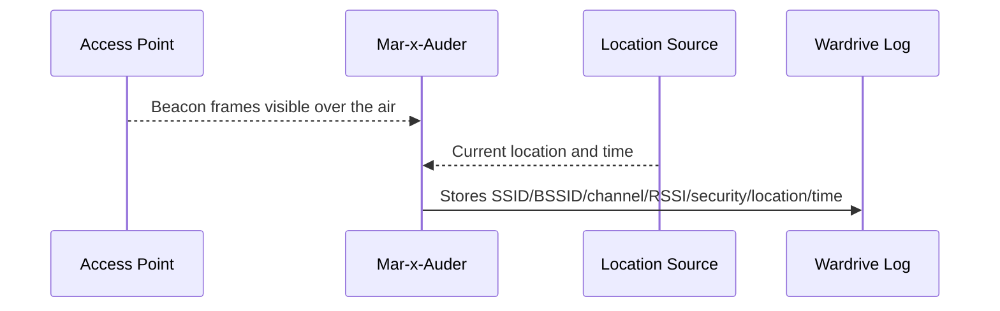

# Wardriving

## What this ability demonstrates

Wardriving demonstrates that wireless observations can be combined with location data to create a map of access points and other radio-visible devices. The important lesson is not that networks can be mapped; the important lesson is that routine radio advertisements can become sensitive when collected, stored, and correlated with geography.

For students, wardriving is a way to understand the privacy implications of beacon frames, BSSIDs, SSIDs, signal strength, and location metadata.

## Capability type

Observation / Capture / Mapping

The device listens and records. Depending on hardware and configuration, location may come from an attached GPS module or from a companion workflow. The ethical sensitivity comes from correlation: wireless identifiers plus time plus location.

## Technologies involved

This ability uses and relates to:

- [Radio and wireless basics](../foundations/01-radio-basics.md)
- [Wi-Fi / 802.11 basics](../foundations/02-wifi-80211.md)
- [Packet capture and analysis](../foundations/09-packet-capture.md)

It may also involve:

- GPS or other location sources;
- CSV, JSON, PCAP, or other export formats;
- mapping tools;
- data minimization practices.

## Where this sits in the protocol stack

Wardriving is mostly radio and 802.11 metadata collection.

```text
Application   Not the focus
TLS           Not the focus
HTTP          Not the focus
TCP / UDP     Not the focus
IP            Not usually needed
802.11        SSID, BSSID, channel, security capabilities, beacon metadata
Radio         RSSI, channel, visibility, movement, range
Location      Time, position, route, observation point
```

Wardriving does not require joining networks. The researcher is usually observing broadcast management traffic that access points transmit to announce their presence.

## Normal flow

Access points periodically transmit beacon frames. Nearby clients and tools can hear those beacons if they are on the right channel and within range.



## Observation and mapping point

Wardriving adds location and time to normal observation.



The interference point is intentionally absent. Wardriving should not change the behavior of the observed network. The sensitivity comes from building a dataset.

## What changes after observation

The wireless environment does not change. The data context changes.

A single beacon frame is ordinary radio behavior. A large collection of beacon frames tied to location can reveal:

- where a network is likely located;
- what equipment vendors are common in an area;
- whether networks use open, WPA2, WPA3, or enterprise security;
- whether SSIDs reveal personal names, companies, apartments, or device types;
- whether the same mobile hotspot or device appears across different locations.

The main lesson is that metadata becomes more powerful when aggregated.

## Ethical and safety boundary

Legitimate research keeps wardriving scoped, minimized, and purposeful. Examples include mapping a school lab, evaluating a company campus with authorization, or demonstrating privacy risks using a controlled training environment.

The ethical line is crossed when wardriving is used to profile homes, track individuals, expose private SSIDs, publish sensitive locations, or build datasets about uninvolved people without a legitimate research purpose.

Location-linked radio observations are sensitive by default. Educational datasets must mask, aggregate, or discard data that is not needed for the learning objective.

## Controlled Mar-x-Auder demonstration

Use a controlled area such as a lab floor, classroom, or office area where the instructor controls the APs or has permission to perform the survey.

1. Prepare two or more lab access points with clearly marked training SSIDs.
2. Configure the Mar-x-Auder wardriving or scan logging feature according to the installed firmware and hardware support.
3. Begin logging in the controlled area.
4. Walk a short, defined route.
5. Stop logging.
6. Export the results.
7. Review the observed SSID, BSSID, channel, RSSI, and location/time fields.
8. Remove or mask any unrelated third-party observations before sharing the dataset.

The practical objective is to show how ordinary beacon visibility becomes a map when combined with movement and location.

## Dataset evidence

A useful wardriving record may include:

- SSID;
- BSSID;
- channel;
- RSSI or signal strength;
- security mode where detected;
- vendor/OUI where available;
- timestamp;
- latitude/longitude where location is configured;
- observation count across the route.

The dataset should be interpreted carefully. Stronger signal does not always mean closer. Indoor reflections, wall materials, AP transmit power, antenna direction, and channel conditions can all affect the result.

## Privacy-preserving presentation

Student material uses lab SSIDs and synthetic data wherever possible.

When showing real survey data, apply minimization:

- remove household names or personal SSIDs;
- truncate or hash BSSIDs if identity is not needed;
- reduce location precision;
- aggregate by area instead of exact point;
- exclude unrelated networks from screenshots;
- avoid publishing raw route files.

The educational goal is to understand wireless exposure, not to build a public catalog of other people's networks.

## Common interpretation mistakes

### Mistake: A mapped AP is exactly at the strongest observation point

The strongest observation point is not necessarily the physical AP location. Signal propagation is affected by many environmental factors.

### Mistake: An SSID identifies a person

An SSID may include a personal name, but the researcher should not treat it as verified identity. Avoid making personal claims from radio metadata.

### Mistake: Open network means intentionally public

An open network may be a guest network, misconfiguration, device setup network, captive portal network, or temporary lab network. Do not infer intent without context.

### Mistake: Location-linked metadata is harmless because no payload was captured

Location-linked metadata can still be sensitive. The privacy risk is correlation, not only content.

## Defensive understanding

Wardriving teaches defenders to think about wireless visibility as external exposure.

It supports questions such as:

- Are internal or sensitive names exposed in SSIDs?
- Are old or weakly protected networks still visible?
- Are guest and production networks clearly separated?
- Are APs leaking vendor or deployment information unnecessarily?
- Does the organization understand what can be seen from outside the building?

It also teaches students why privacy-conscious naming, WPA3/PMF adoption, strong configuration, and careful data handling matter.
