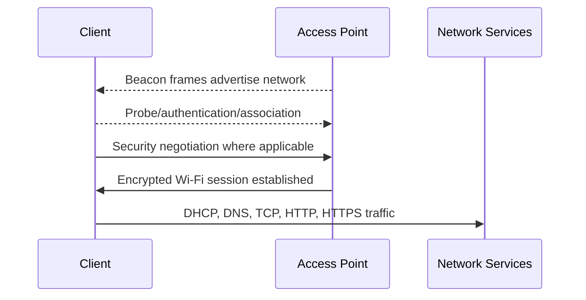
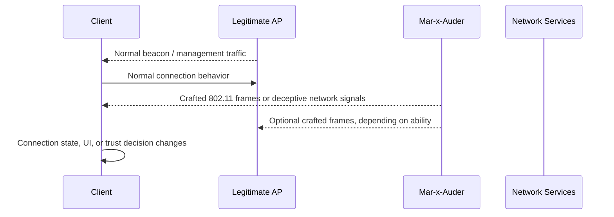

# Active Frame Transmission

## What this ability demonstrates

Active frame transmission is the conceptual boundary between passive wireless observation and wireless interference. In passive abilities, the Mar-x-Auder listens. In active abilities, it transmits crafted frames or creates a network condition that can influence how other devices behave.

This chapter explains that boundary before the guide covers specific active capabilities such as deauthentication, beacon spam, AP clone spam, probe request flooding, and evil portal workflows.

## Capability type

Injection / Interference / Impersonation

Active transmission does not always mean the same thing. Some features create fake advertisements. Some generate noise. Some imitate parts of normal network behavior. Some attempt to influence a client or access point state. The common factor is that the device is no longer merely observing.

## Technologies involved

This chapter links to several foundations because active transmission can occur at different layers:

- [Radio and wireless basics](../foundations/01-radio-basics.md)
- [Wi-Fi / 802.11 basics](../foundations/02-wifi-80211.md)
- [WPA, WPA2, and WPA3](../foundations/03-wpa-wpa2-wpa3.md)
- [DHCP, DNS, HTTP, and captive portals](../foundations/06-dhcp-dns-http-captive-portals.md)
- [TLS, certificates, and trust](../foundations/07-tls-certificates.md)
- [Packet capture and analysis](../foundations/09-packet-capture.md)

## Where this sits in the protocol stack

Active Mar-x-Auder features are not all in one layer.

```text
Application   Evil portal page, fake login experience, user-interface deception
TLS           Certificate warnings and trust boundaries affect impersonation attempts
HTTP          Captive portal behavior and redirects
TCP / UDP     Used after a client joins an active network scenario
IP            DHCP, DNS, routing, and local network behavior
802.11        Beacon spoofing, probe behavior, deauth/disassociation, association effects
Radio         Transmission range, channel, interference, airtime, signal strength
```

Many Wi-Fi-specific active features happen before IP, TCP, HTTP, or TLS are involved. This is why a deauthentication demonstration is different from an evil portal demonstration. They affect different parts of the chain.

## Normal flow

In a normal environment, clients and access points exchange frames according to expected protocol roles.



The client expects that management frames, access point advertisements, and network services represent the environment accurately enough to make connection decisions.

## Interference point

Active transmission adds another participant that injects frames or presents a competing network behavior.



The exact interference depends on the ability:

- deauthentication targets association state;
- beacon spam targets network visibility;
- AP clone spam targets user and client assumptions about SSID identity;
- probe request flooding targets discovery noise;
- evil portal targets post-connection web trust and captive portal behavior.

## What changes after interference

The normal process expects a small number of honest participants: a client, an access point, and network services. Active transmission introduces another transmitter that may imitate, disrupt, or confuse part of that process.

The result may be:

- a client disconnects or reconnects;
- a Wi-Fi menu shows fake or duplicate networks;
- a client sees a deceptive captive portal;
- packet captures include frames that did not originate from the legitimate AP or client;
- defenders see unusual management-frame volume, duplicate SSIDs, or abnormal connection churn.

This is why active features are treated differently from passive features. Even when the technical mechanism is simple, the effect on nearby users can be real.

## Ethical and safety boundary

Legitimate research uses active transmission only inside a controlled scope: owned APs, owned clients, clearly defined lab SSIDs, and people who understand that the demonstration is taking place.

The ethical line is crossed when active transmission affects uninvolved people, disrupts their connectivity, imitates networks they trust, collects information from them, or causes them to make a decision they would not have made if they understood the setup.

The guide avoids country-specific legal language because laws vary. The ethical principle is stable: do not transmit crafted traffic into someone else's network environment or device experience without authorization and informed scope.

## Controlled Mar-x-Auder demonstration

Use this as the setup pattern for later active chapters.

1. Prepare a lab AP with a clearly named training SSID.
2. Prepare one lab client, such as a spare phone or laptop.
3. Keep the lab close-range and low-impact.
4. Identify the lab AP channel and BSSID.
5. Start with passive observation so the normal baseline is visible.
6. Run the active feature only against the lab environment described in the relevant chapter.
7. Stop the feature immediately after the demonstration.
8. Compare the before/after behavior using the client UI, AP logs where available, and packet capture.

This pattern prevents active demonstrations from becoming uncontrolled RF noise.

## Packet-capture evidence

Depending on the active ability, capture evidence may include:

- forged or repeated management frames;
- duplicate SSID advertisements from different BSSIDs;
- abnormal deauthentication or disassociation frames;
- unusual probe request volume;
- association attempts toward a training AP;
- DNS/HTTP behavior in an evil portal scenario;
- client reconnect attempts after disruption.

A useful capture clearly shows the difference between normal baseline behavior and the interference period.

## Common interpretation mistakes

### Mistake: Active transmission means encryption is broken

Many active Wi-Fi features do not break encryption. They exploit unauthenticated or weakly authenticated control behavior, user-interface assumptions, or network discovery behavior.

### Mistake: SSID impersonation means full network compromise

Advertising the same SSID as another network does not provide the real network's cryptographic keys. It can still mislead users or clients, but that is different from decrypting the real network.

### Mistake: Deauthentication proves password weakness

Deauthentication demonstrates management-frame disruption. Password strength is a separate issue.

### Mistake: Evil portal is a WPA attack

An evil portal is primarily a deception and captive-portal workflow. It does not recover the WPA passphrase from encrypted traffic.

## Defensive understanding

Active frame transmission explains why wireless defense is not only about choosing a strong password.

Defenders need to understand:

- Protected Management Frames reduce some management-frame attacks;
- WPA3 changes important authentication assumptions;
- SSIDs are labels, not identity guarantees;
- user training matters for portals and duplicate networks;
- wireless intrusion detection can help identify abnormal management-frame activity;
- packet capture is often needed to distinguish signal problems, authentication failures, and active interference.

This chapter prepares the reader for the specific active capabilities that follow.
