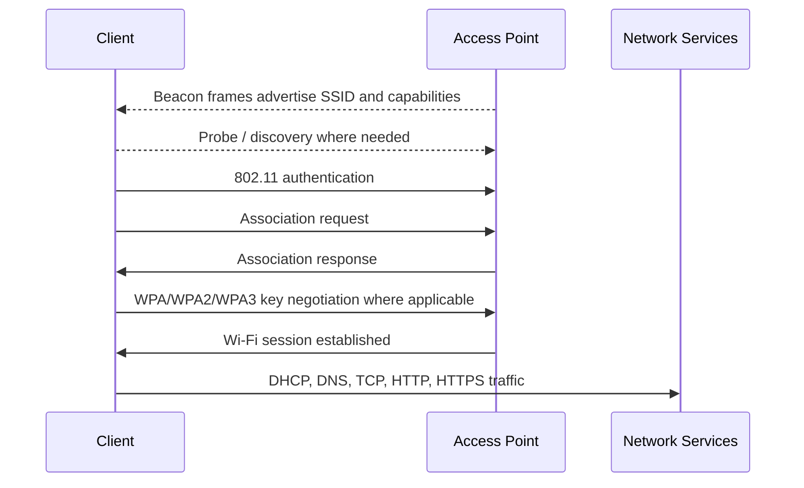
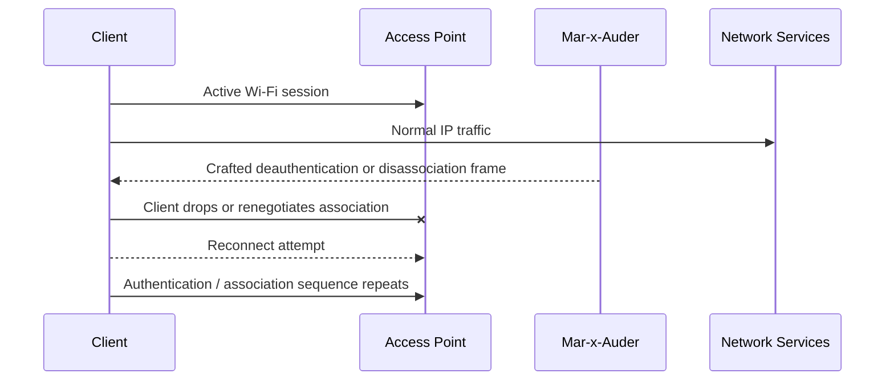

# Deauthentication and Disassociation

## What this ability demonstrates

Deauthentication and disassociation demonstrate how fragile parts of the Wi-Fi connection state can be when management frames are not protected. The Mar-x-Auder can transmit crafted 802.11 management frames that ask a client or access point to end an existing relationship.

The important lesson is precise: this capability does not reveal the Wi-Fi password, decrypt traffic, or bypass encryption. It interferes with the connection state between a station and an access point.

## Capability type

Injection / Interference / Denial-of-Service Demonstration

This is an active capability. The device transmits crafted frames into the wireless environment. Even when used briefly, it can interrupt connectivity for a client in range.

## Technologies involved

This ability uses the following building blocks:

- [Radio and wireless basics](../foundations/01-radio-basics.md)
- [Wi-Fi / 802.11 basics](../foundations/02-wifi-80211.md)
- [WPA, WPA2, and WPA3](../foundations/03-wpa-wpa2-wpa3.md)
- [Packet capture and analysis](../foundations/09-packet-capture.md)

The specific blocks involved are:

- 802.11 management frames;
- station and access point association state;
- deauthentication and disassociation reason codes;
- Protected Management Frames, when supported and required;
- client reconnection behavior.

## Where this sits in the protocol stack

```text
Application   Not involved
TLS           Not involved
HTTP          Not involved
TCP / UDP     Not involved
IP            Not involved
802.11        Deauthentication and disassociation management frames
Radio         Transmission range, channel, airtime, signal strength
```

This ability happens below IP. A client can be deauthenticated before DHCP, DNS, TCP, HTTP, or TLS are relevant. That is why normal network logs may show symptoms such as reconnects, but the actual interference occurs at the Wi-Fi management-frame layer.

## Normal flow

In a normal Wi-Fi session, a station discovers an access point, authenticates, associates, completes security negotiation where required, and then uses the network.



Once associated, the client and AP maintain a relationship. The client expects the AP to continue carrying its traffic, and the AP expects the client to remain a valid station until the relationship is intentionally ended.

## Interference point

A deauthentication or disassociation demonstration injects a management frame into this established relationship.



The interference occurs at the management-frame layer. The client is not being forced to reveal the password. The client is being told that the current association should end or be renegotiated.

## What the process expected

The normal process expects the AP and client to manage association state honestly. When a real AP sends a valid deauthentication or disassociation frame, the client should treat the current connection as ended.

This is useful behavior in normal operations. Access points need a way to remove clients, reboot, roam, reject clients, or manage network state.

## What changes after interference

After interference, the client may experience one or more of the following:

- the Wi-Fi icon briefly disconnects;
- the client reconnects automatically;
- application traffic stalls or times out;
- video calls or downloads pause;
- the client repeats authentication and association;
- if WPA/WPA2/WPA3 is used, security negotiation may repeat;
- packet captures show abnormal deauthentication or disassociation frames.

The exact result depends on the client, access point, security mode, signal conditions, and whether Protected Management Frames are enabled and required.

## Protected Management Frames

Protected Management Frames are designed to reduce the effectiveness of forged management-frame disruption. They protect certain robust management frames after security has been established.

This matters because a deauthentication demonstration should be interpreted differently depending on the network mode:

| Network posture | Expected behavior |
|---|---|
| Open or older WPA/WPA2 without PMF | More likely to accept disruptive management frames |
| WPA2 with PMF optional | Behavior depends on AP and client negotiation |
| WPA2/WPA3 with PMF required | More resistant to forged robust management-frame disruption |
| WPA3-Personal only | PMF is part of the expected protection model |

The defensive lesson is not simply “use a stronger password.” A strong password does not by itself protect management frames. The relevant control is PMF support and configuration, along with modern Wi-Fi security posture.

## Ethical and safety boundary

Legitimate research is limited to a lab network, owned access point, owned client, and informed participants. The purpose is to understand how management-frame disruption works and how protections change the result.

The ethical line is crossed when deauthentication or disassociation traffic is transmitted toward networks or devices outside the lab scope. Even brief interference can interrupt calls, payments, work sessions, medical devices, classroom connectivity, or other activities that the researcher cannot see.

The fact that the action occurs over radio does not make it neutral. If it changes another person's connection state without their informed consent, it is outside legitimate research.

## Controlled Mar-x-Auder demonstration

Use a controlled lab environment:

- one spare access point configured with a clearly named training SSID;
- one spare client device;
- no production network;
- close physical range;
- a known Wi-Fi channel;
- SD card capture enabled where supported.

Controlled demonstration flow:

1. Start with passive AP discovery and identify only the lab AP.
2. Record the lab SSID, BSSID, channel, and security mode.
3. Connect the lab client to the lab AP and confirm normal connectivity.
4. Start a passive capture if available, or use an external Wireshark capture station.
5. Use the Mar-x-Auder deauthentication/disassociation capability only against the selected lab AP/client relationship.
6. Observe the client disconnect/reconnect behavior.
7. Stop the transmission immediately after the demonstration.
8. Review the capture for management frames and reconnection behavior.
9. Repeat only if changing a defensive variable, such as enabling PMF or WPA3 on the lab AP.

The official ESP32 Marauder documentation describes Wi-Fi attacks as active transmission of crafted Wi-Fi packets and lists Deauth Flood among the available attack capabilities. It also describes a deauthentication workflow as broadcasting deauthentication frames to clients connected to a target access point. This guide confines that capability to a self-owned lab so the mechanism can be understood without affecting uninvolved devices.

## Packet-capture evidence

A useful capture may include:

- beacon frames from the lab AP;
- normal authentication and association frames;
- data traffic before interference;
- deauthentication or disassociation frames;
- reason codes in the management frames;
- client probe or reconnect behavior;
- repeated association and key negotiation after disruption.

The most important thing to notice is that the interference appears before normal IP traffic. If the client loses association, TCP sessions may stall later, but the cause is lower in the stack.

## Common interpretation mistakes

### Mistake: Deauthentication means the password was cracked

Deauthentication does not reveal the passphrase. It interferes with connection state.

### Mistake: HTTPS protects against deauthentication

HTTPS protects application-layer traffic after IP connectivity exists. It does not prevent the Wi-Fi link from being disrupted.

### Mistake: Strong WPA2 passphrases prevent deauthentication

Strong passphrases help prevent password guessing. They do not automatically protect management frames. PMF is the relevant concept.

### Mistake: A successful disconnect proves the AP is insecure in every sense

A disconnect demonstrates susceptibility to management-frame interference under the tested conditions. It does not measure password strength, router patch level, or application security.

## Defensive understanding

This ability teaches defenders to distinguish between different kinds of wireless problems.

A user may report “the Wi-Fi is bad,” but the cause could be:

- poor signal;
- crowded channels;
- AP overload;
- roaming behavior;
- authentication failure;
- management-frame interference;
- intentional deauthentication;
- client driver bugs.

Defensive mitigations include:

- enabling WPA3 where practical;
- requiring Protected Management Frames where client compatibility allows;
- avoiding obsolete Wi-Fi security modes;
- monitoring for abnormal deauthentication/disassociation volume;
- maintaining AP firmware;
- using wireless intrusion detection where appropriate;
- validating findings with packet capture rather than relying only on user reports.

## References

- ESP32 Marauder Wiki, WiFi Attacks: https://github.com/justcallmekoko/ESP32Marauder/wiki/wifi-attacks
- ESP32 Marauder Wiki, Deauthentication Attack Workflow: https://github.com/justcallmekoko/ESP32Marauder/wiki/deauthentication-attack-workflow
- ESP32 Marauder Wiki, Deauth Flood: https://github.com/justcallmekoko/ESP32Marauder/wiki/deauth-flood
