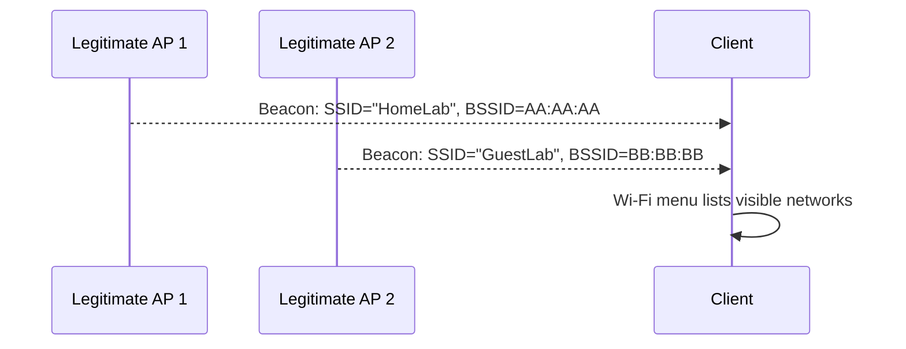
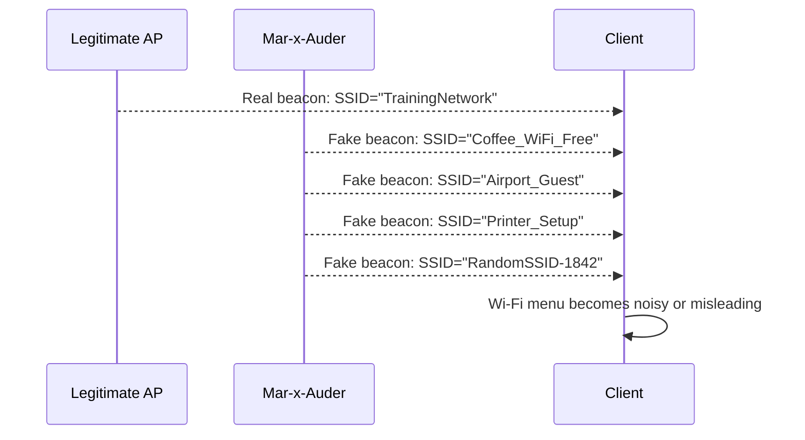

# Beacon Spam

## What this ability demonstrates

Beacon spam demonstrates that Wi-Fi network names are advertised through broadcast management frames. A device can transmit beacon frames for networks that do not actually exist, causing nearby clients to display many fake SSIDs.

The important lesson is that an SSID is not a proof of identity. It is a label carried inside a beacon frame.

## Capability type

Injection / Interference / Wireless Noise

Beacon spam is active transmission. The device advertises fake or training SSIDs into the local radio environment. It does not require joining an existing network and does not decrypt traffic.

## Technologies involved

This ability uses the following building blocks:

- [Radio and wireless basics](../foundations/01-radio-basics.md)
- [Wi-Fi / 802.11 basics](../foundations/02-wifi-80211.md)
- [Packet capture and analysis](../foundations/09-packet-capture.md)

The specific blocks involved are:

- 802.11 beacon frames;
- SSID field;
- BSSID / transmitter address;
- channel and signal visibility;
- client Wi-Fi network-list behavior.

## Where this sits in the protocol stack

```text
Application   Not involved
TLS           Not involved
HTTP          Not involved
TCP / UDP     Not involved
IP            Not involved
802.11        Fake beacon frames advertising SSIDs
Radio         Transmission range, channel, airtime, signal visibility
```

Beacon spam happens before IP networking. A client does not need to connect to the fake networks for the effect to be visible. The effect is created by the presence of broadcast Wi-Fi management frames.

## Normal flow

In a normal Wi-Fi environment, each access point periodically broadcasts beacon frames that announce its presence and capabilities.



The client builds a list of visible networks from beacons, probe responses, saved-network state, signal strength, and operating-system logic.

## Interference point

Beacon spam adds many additional beacon frames that do not represent real access points with normal network service behind them.



The interference occurs at the discovery layer. The client is being shown an artificial wireless environment.

## What the process expected

The normal process expects beacon frames to roughly represent real networks. A client assumes that an SSID displayed in the Wi-Fi menu corresponds to an access point that may be reachable.

This assumption is convenient, not cryptographic. Beacons are advertisements.

## What changes after interference

After beacon spam, nearby clients may show:

- many fake networks;
- confusing names;
- duplicate-looking entries;
- rapidly changing network lists;
- networks that cannot actually be joined;
- misleading signal-strength impressions.

Packet captures may show a large number of beacon frames with changing SSIDs and transmitter addresses.

## Beacon spam list vs random beacon spam

The Mar-x-Auder / ESP32 Marauder family may support more than one style of beacon spam.

| Style | Meaning |
|---|---|
| Beacon spam list | The device advertises SSIDs from a prepared list. |
| Beacon spam random | The device advertises randomly generated SSIDs. |
| Rick Roll / novelty beacon | The device advertises a themed set of SSIDs for demonstration or amusement. |

The underlying concept is the same: crafted beacon frames are transmitted so nearby devices see networks that are not normal infrastructure.

## Ethical and safety boundary

Legitimate research uses beacon spam only in a controlled demonstration environment with a clear training purpose. The SSIDs should be harmless, clearly artificial, and limited to the lab.

The ethical line is crossed when fake SSIDs are broadcast where uninvolved people may be confused, misled, disrupted, or encouraged to connect to something they do not understand. Even if no credentials are collected, changing someone else's device environment without consent is not legitimate research.

Beacon spam can also pollute the local RF environment and make troubleshooting harder for others nearby. The absence of password theft does not make the behavior harmless.

## Controlled Mar-x-Auder demonstration

Use a controlled lab environment:

- one room or small area;
- low-impact duration;
- no production SSID names;
- no names imitating real organizations, neighbors, schools, employers, airports, or public hotspots;
- optional passive capture station for evidence.

Controlled demonstration flow:

1. Begin with passive AP discovery and record the normal list of visible networks.
2. Prepare a small set of clearly artificial training SSIDs, such as `LAB_FAKE_01`, `LAB_FAKE_02`, and `LAB_FAKE_03`.
3. Start the Mar-x-Auder beacon spam capability using the training SSID list or a clearly artificial random mode.
4. Observe how a nearby lab client displays the additional networks.
5. Stop transmission promptly.
6. Compare the before/after Wi-Fi menu and packet capture.

The official ESP32 Marauder documentation lists Beacon Spam List, Beacon Spam Random, and Rick Roll Beacon as Wi-Fi attack capabilities. The documentation describes beacon spam as transmitting crafted Wi-Fi beacon packets, either from a list of SSIDs or random values. This guide limits the usage to controlled educational demonstrations.

## Packet-capture evidence

A capture may include:

- many beacon frames in a short period;
- SSIDs that do not belong to real APs;
- changing or artificial transmitter addresses;
- repeated tagged parameters;
- no normal association or data traffic behind those SSIDs unless another feature creates an actual AP.

This distinction is important. Beacon spam may advertise a network name, but advertisement alone is not the same thing as operating a complete access point with DHCP, DNS, routing, and internet access.

## Common interpretation mistakes

### Mistake: A displayed SSID proves a network exists

A displayed SSID proves only that the client observed an advertisement or remembered a network. It does not prove that a real, usable, trustworthy network exists.

### Mistake: Beacon spam clones the real network

Beacon spam can imitate names. It does not automatically copy cryptographic identity, backend services, or credentials.

### Mistake: Fake SSIDs are harmless because clients do not connect

Fake SSIDs can still confuse users, pollute network lists, and interfere with troubleshooting. In some environments, they can trigger automated behavior or help a later deception flow.

### Mistake: This is a TCP/IP attack

Beacon spam occurs before TCP/IP. It is an 802.11 management-frame phenomenon.

## Defensive understanding

This ability teaches that SSID names are not security boundaries.

Defenders and users should understand:

- a network name alone is not identity;
- duplicate or strange SSIDs should be treated with suspicion;
- managed environments should monitor for unexpected SSID advertisements;
- users should not be trained to trust Wi-Fi names without context;
- wireless intrusion detection can identify beacon floods or unauthorized SSID advertisements;
- strong WPA2/WPA3 authentication protects connection establishment, but it does not stop nearby devices from advertising fake names.

## References

- ESP32 Marauder Wiki, WiFi Attacks: https://github.com/justcallmekoko/ESP32Marauder/wiki/wifi-attacks
- ESP32 Marauder Wiki, Beacon Spam List: https://github.com/justcallmekoko/ESP32Marauder/wiki/beacon-spam-list
- ESP32 Marauder Wiki, Beacon Spam Random: https://github.com/justcallmekoko/ESP32Marauder/wiki/beacon-spam-random
