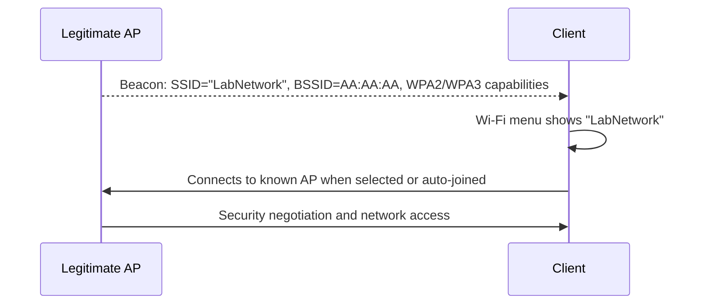
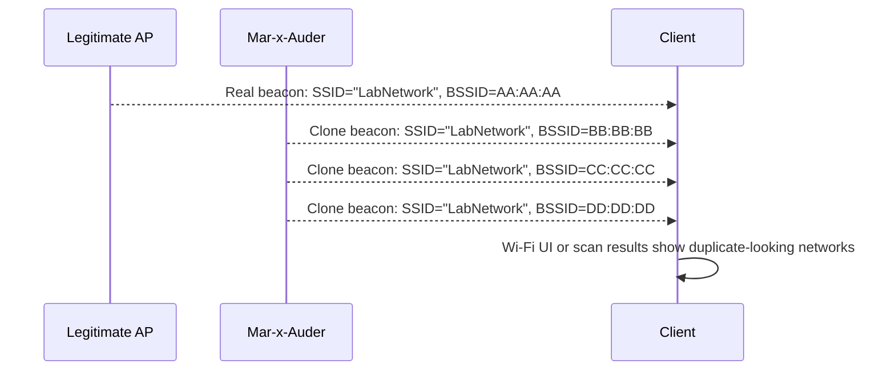

# AP Clone Spam

## What this ability demonstrates

AP clone spam demonstrates a specific form of Wi-Fi identity confusion: multiple beacon advertisements can appear to represent the same network name. The client or user may see duplicate-looking networks even though only one of them is the legitimate access point.

The important lesson is that SSID is not identity. A cloned-looking SSID is an advertisement, not proof that the transmitter is the real network.

## Capability type

Injection / Impersonation / Interference

AP clone spam is active transmission. The Mar-x-Auder transmits crafted beacon frames that imitate the visible name of a selected or observed network. This can confuse users and client network-selection logic.

## Technologies involved

This ability uses the following building blocks:

- [Radio and wireless basics](../foundations/01-radio-basics.md)
- [Wi-Fi / 802.11 basics](../foundations/02-wifi-80211.md)
- [WPA, WPA2, and WPA3](../foundations/03-wpa-wpa2-wpa3.md)
- [TLS, certificates, and trust](../foundations/07-tls-certificates.md)
- [Packet capture and analysis](../foundations/09-packet-capture.md)

The specific blocks involved are:

- SSID advertisement;
- BSSID and transmitter identity;
- beacon frames;
- client network selection;
- WPA/WPA2/WPA3 authentication boundaries;
- user-interface trust.

## Where this sits in the protocol stack

```text
Application   User may make a trust decision based on Wi-Fi menu display
TLS           Relevant later if the user reaches web services through a deceptive network
HTTP          Not involved in beacon cloning itself
TCP / UDP     Not involved in beacon cloning itself
IP            Not involved in beacon cloning itself
802.11        Cloned-looking beacon advertisements
Radio         Transmission range, channel, signal visibility
```

AP clone spam begins at the 802.11 management-frame layer. Higher-layer consequences depend on whether the user or client later connects to an impersonating network or portal.

## Normal flow

In a normal environment, a legitimate AP advertises a network name and clients use a combination of SSID, BSSID, security settings, saved configuration, and signal quality to decide what to show and whether to connect.



The user usually sees the SSID. The device and operating system track more information internally, including BSSID and security configuration.

## Interference point

AP clone spam adds additional beacon advertisements using the same or similar SSID as the legitimate AP.



The interference is not the same as possessing the real AP's credentials or keys. It is an impersonation of the advertisement layer.

## What the process expected

The normal process expects the SSID list to be a useful representation of nearby networks. A user often assumes that one network name means one network.

This assumption is incomplete. In real deployments, the same SSID may legitimately appear from multiple APs in a managed network. In an impersonation scenario, the same visual effect can be produced by an unauthorized transmitter.

## What changes after interference

After AP clone spam, a client may show:

- duplicate networks with the same SSID;
- unstable or confusing scan results;
- multiple BSSIDs advertising the same name;
- signal levels that make the fake advertisement appear closer or stronger;
- possible connection attempts depending on client behavior and security settings.

If the cloned advertisement does not provide the expected authentication and network services, the client may fail to connect. If the clone is combined with another capability, such as an evil portal in a lab, the user may be led into a deceptive post-connection flow.

## SSID clone vs real network identity

The distinction is central to the chapter.

| Concept | Explanation |
|---|---|
| SSID | Human-readable network name advertised in management frames. |
| BSSID | Radio MAC-like identifier for an AP interface. |
| Clone beacon | A crafted advertisement using the same or similar SSID. |
| Real network identity | A combination of radio identity, security configuration, key negotiation, infrastructure, and user trust. |
| WPA/WPA2/WPA3 protection | Determines whether the client can actually authenticate and establish a protected session. |
| TLS protection | Protects application-layer connections after the network path exists. |

A clone can imitate what a user sees in the Wi-Fi list. It does not automatically become the real network.

## Ethical and safety boundary

Legitimate research uses AP clone spam only against a lab SSID created for the demonstration. The purpose is to teach why SSID names are weak identity signals and how users can be misled.

The ethical line is crossed when a cloned SSID imitates a real home network, business, school, airport, hotel, café, event network, or any network used by uninvolved people. Even if no credentials are collected, imitation can confuse people, trigger unwanted connection attempts, and prepare the ground for deception.

The ethical boundary is especially strict when the cloned name resembles an organization or service that people trust.

## Controlled Mar-x-Auder demonstration

Use a controlled lab environment:

- create a lab SSID such as `LabNetwork`;
- connect one lab client to the real lab AP;
- observe the normal AP with passive discovery;
- run AP clone spam only for the lab SSID;
- observe how the client scan results change;
- stop the transmission promptly;
- compare BSSID values in scan results or packet capture.

Controlled demonstration flow:

1. Record the real lab AP SSID, BSSID, channel, and security mode.
2. Open the client's Wi-Fi menu and document the normal display.
3. Start the Mar-x-Auder AP clone spam capability for the lab AP only.
4. Observe duplicate-looking SSID entries or scan-result changes.
5. Review a packet capture to identify that the SSID is the same while BSSID/transmitter values differ.
6. Stop the feature and verify that the Wi-Fi environment returns to baseline.

The official ESP32 Marauder documentation lists AP Clone Spam among its Wi-Fi attack capabilities. This guide treats it as a controlled demonstration of SSID identity weakness, not as a tool for impersonating real networks.

## Packet-capture evidence

A capture may include:

- legitimate beacon frames from the real AP;
- additional beacon frames using the same SSID;
- different BSSIDs or transmitter addresses;
- possibly different supported rates or tagged parameters;
- no valid data session unless a client connects to a real or rogue AP;
- no proof that the clone possesses the real network's cryptographic material.

A sound analysis compares fields rather than relying on the visible SSID alone.

## Common interpretation mistakes

### Mistake: Same SSID means same network

The same SSID may be used by multiple legitimate APs, or it may be imitated by a rogue transmitter. SSID alone is not enough.

### Mistake: AP clone spam bypasses WPA

It does not bypass WPA by itself. WPA/WPA2/WPA3 authentication still determines whether a client can establish a protected session.

### Mistake: The strongest signal is safest

A stronger signal may simply mean the transmitter is closer. It does not prove legitimacy.

### Mistake: TLS is irrelevant

TLS becomes relevant if a user connects through a deceptive network and visits websites. Correct TLS validation can prevent silent impersonation of HTTPS sites, even if the Wi-Fi network name is misleading.

## Defensive understanding

This ability teaches defenders and users that network identity is layered.

Defensive practices include:

- using WPA2/WPA3 correctly;
- requiring strong passphrases or enterprise authentication where appropriate;
- validating WPA Enterprise server certificates;
- teaching users not to trust SSID names alone;
- monitoring for unexpected BSSIDs advertising protected corporate SSIDs;
- investigating duplicate SSID reports with packet capture or wireless management tools;
- paying attention to certificate warnings and unexpected captive portals.

The main defensive lesson is that wireless names are only advertisements. Trust should come from authenticated protocols and verified configuration, not visual familiarity.

## References

- ESP32 Marauder Wiki, WiFi Attacks: https://github.com/justcallmekoko/ESP32Marauder/wiki/wifi-attacks
- ESP32 Marauder Wiki, Beacon Spam List: https://github.com/justcallmekoko/ESP32Marauder/wiki/beacon-spam-list
- ESP32 Marauder Wiki, Beacon Spam Random: https://github.com/justcallmekoko/ESP32Marauder/wiki/beacon-spam-random
