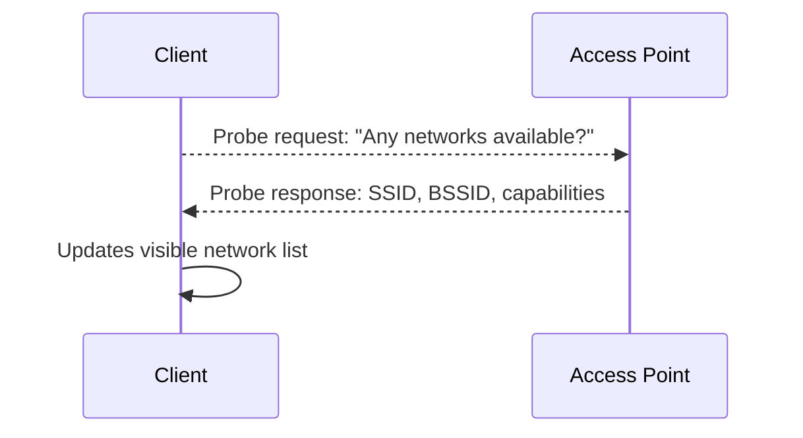
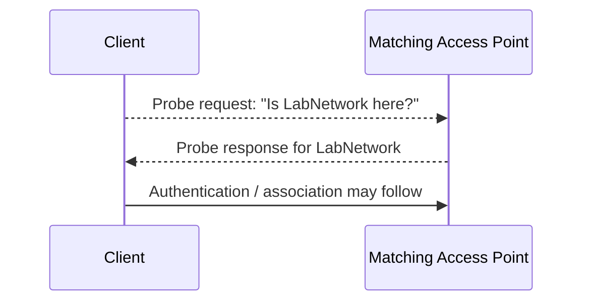
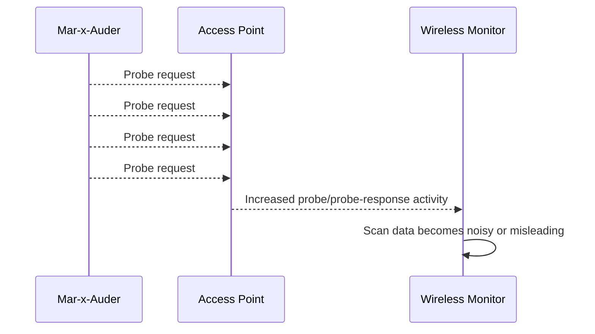

# Probe Request Flooding

## What this ability demonstrates

Probe request flooding demonstrates that Wi-Fi discovery traffic can itself be generated, spoofed, and amplified. In normal Wi-Fi operation, clients send probe request frames to discover nearby networks or to ask whether a specific known network is present. The Mar-x-Auder can actively transmit large volumes of probe request frames, turning a normal discovery mechanism into noise or pressure on nearby wireless infrastructure.

The important lesson is that probe requests are management frames. They are not TCP/IP traffic, they do not require an established Wi-Fi connection, and they happen before a client has an IP address.

## Capability type

Injection / Interference / Discovery Noise

This is an active capability. The device transmits crafted 802.11 probe request frames. It can increase airtime usage, pollute monitoring data, confuse wireless analysis, and in some environments place unnecessary processing pressure on access points.

## Technologies involved

This ability uses the following building blocks:

- [Radio and wireless basics](../foundations/01-radio-basics.md)
- [Wi-Fi / 802.11 basics](../foundations/02-wifi-80211.md)
- [Packet capture and analysis](../foundations/09-packet-capture.md)

The specific blocks involved are:

- 802.11 management frames;
- probe request and probe response behavior;
- SSID discovery;
- channel behavior and airtime;
- monitoring and detection limits;
- client/AP discovery assumptions.

## Where this sits in the protocol stack

```text
Application   Not involved
TLS           Not involved
HTTP          Not involved
TCP / UDP     Not involved
IP            Not involved
802.11        Probe request management frames
Radio         Airtime, channel use, signal range, transmission volume
```

Probe request flooding happens below IP. No DHCP lease, DNS query, TCP connection, or HTTP request is required for the traffic to exist.

## Normal flow

A client may discover networks passively by listening for beacons, actively by sending broadcast probe requests, or actively by sending directed probe requests for a specific SSID.



In a directed probe scenario, the client may ask for a known network by name:



This discovery behavior is normal. It helps clients find networks quickly, especially when roaming or waking from sleep.

## Interference point

Probe request flooding injects many probe request frames into the wireless environment.



The interference occurs at the discovery layer. The Mar-x-Auder is not joining the network. It is transmitting discovery traffic that can be observed by access points and wireless monitoring tools.

## What the process expected

The normal process expects probe requests to represent real client discovery behavior. A monitoring system may treat probe requests as evidence that a client is looking for a network. An access point may respond to matching probe requests with probe responses.

This assumption is useful in normal environments but fragile in hostile or noisy conditions. Probe requests can be fabricated.

## What changes after interference

After probe request flooding, the environment may show:

- a high volume of probe request frames;
- probe requests for SSIDs that are not actually being sought by real users;
- increased probe response traffic from APs that respond;
- noisy wireless monitoring dashboards;
- misleading station-discovery data;
- unnecessary airtime consumption;
- possible connection instability in constrained or already crowded environments.

The exact impact depends on the AP, client density, channel utilization, signal level, and feature implementation.

## Probe request flooding vs probe request observation

Probe request flooding should be distinguished from probe request observation.

| Capability | Direction | Meaning |
|---|---|---|
| Probe request observation | Passive | The device listens for probe requests sent by nearby clients. |
| Probe request flooding | Active | The device transmits crafted probe requests. |

Observation teaches privacy leakage. Flooding teaches that discovery traffic can be forged and used as noise or pressure.

## Ethical and safety boundary

Legitimate research is limited to a controlled lab network and a short, clearly scoped demonstration. The purpose is to show that Wi-Fi discovery traffic is unauthenticated, spoofable, and noisy under active transmission.

The ethical line is crossed when probe request flooding is transmitted in a shared environment, near networks or clients outside the lab, or for the purpose of degrading someone else's connectivity or corrupting their monitoring data.

Probe request flooding may appear less dramatic than deauthentication, but it is still active radio interference. It creates traffic that did not naturally exist and may affect systems the researcher does not control.

## Controlled Mar-x-Auder demonstration

Use a controlled lab environment:

- one lab access point;
- one monitoring station or Wireshark capture setup;
- a known 2.4 GHz channel;
- no production or third-party target networks;
- short transmission duration.

Controlled demonstration flow:

1. Place the lab AP on a known channel.
2. Start a passive capture or packet monitor on the same channel.
3. Observe baseline discovery traffic for a short period.
4. Start the Mar-x-Auder probe request flood capability only in the lab scope.
5. Observe the increase in probe request frames.
6. Stop the feature promptly.
7. Compare baseline and active periods in the capture.

The official ESP32 Marauder documentation lists Probe Request Flood under Wi-Fi attack capabilities, and the project also documents probe request sniffing as displaying source MAC and destination ESSID/BSSID for captured probe requests. This guide treats flooding as a controlled demonstration of discovery-layer spoofability, not as a tool for interfering with real networks.

## Packet-capture evidence

A useful capture may include:

- normal background probe requests before the demonstration;
- a sudden increase in probe request frames;
- repeated or varied SSID fields depending on the selected behavior;
- transmitter addresses associated with the crafted traffic;
- probe responses from APs when requests match advertised networks;
- no IP, TCP, DNS, HTTP, or TLS traffic caused directly by the probe frames.

The key analysis point is that the interference appears entirely in 802.11 management traffic.

## Common interpretation mistakes

### Mistake: Probe request flooding means the device connected to the AP

Probe requests are discovery frames. They do not mean a successful Wi-Fi association or network login occurred.

### Mistake: Probe request flooding is harmless because it is not deauth

It is still active transmission. It may consume airtime, pressure APs, and pollute monitoring data.

### Mistake: Every observed probe request represents a real user intention

Probe requests can be spoofed. Monitoring systems should avoid treating every observed probe as a trustworthy signal.

### Mistake: TCP/IP tools will explain this behavior

TCP/IP tools may show nothing. The activity happens before IP networking begins.

## Defensive understanding

This ability teaches defenders to avoid overtrusting wireless discovery data. A large number of probe requests may indicate normal client behavior, a misbehaving client, test equipment, or crafted injection.

Defensive mitigations and practices include:

- monitoring probe request volume over time;
- correlating probe activity with association events;
- avoiding identity conclusions based on probe traffic alone;
- using RF-aware monitoring for crowded environments;
- treating discovery-layer telemetry as untrusted unless corroborated;
- designing alerting to detect sudden abnormal bursts rather than individual frames.

## References

- ESP32 Marauder Wiki, Probe Request Sniff: https://github.com/justcallmekoko/ESP32Marauder/wiki/probe-request-sniff
- ESP32 Marauder Wiki, Probe Request Attack Workflow: https://github.com/justcallmekoko/ESP32Marauder/wiki/probe-request-attack-workflow
- ESP32 Marauder Wiki, WiFi Attacks: https://github.com/justcallmekoko/ESP32Marauder/wiki/wifi-attacks
