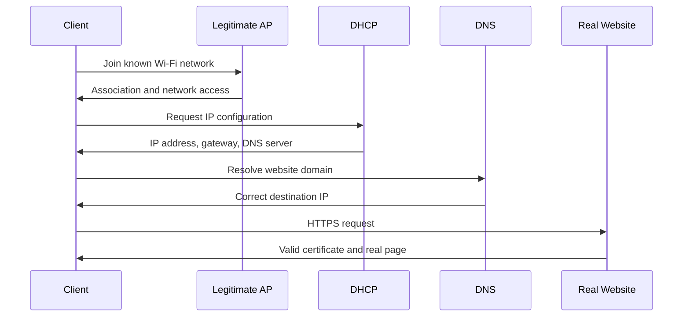
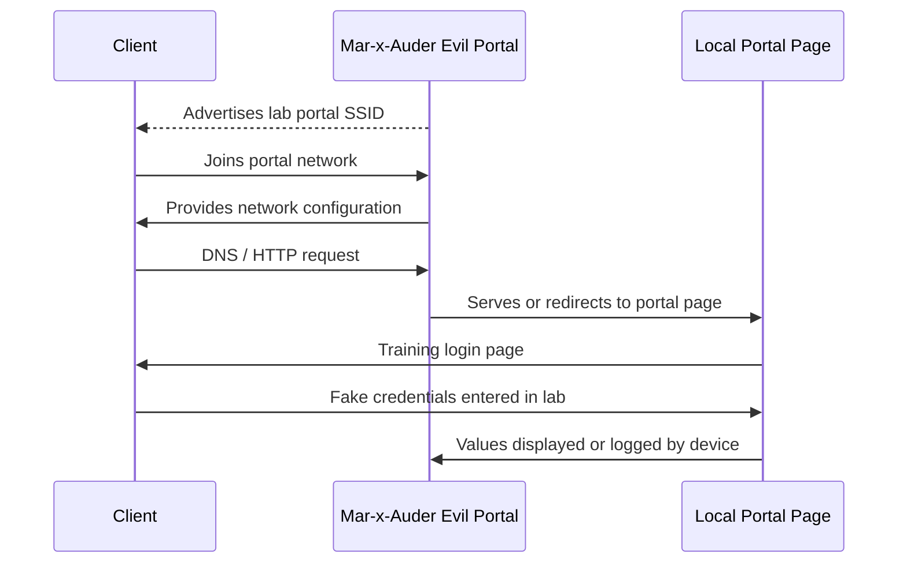

# Evil Portal

## What this ability demonstrates

Evil Portal demonstrates how a device can create a deceptive Wi-Fi and web experience. The Mar-x-Auder can create an access point and serve a web page that behaves like a captive portal. A client that connects to the portal network can be redirected to the page served by the device.

The important lesson is precise: Evil Portal is not a cryptographic break of WPA, WPA2, WPA3, TLS, or HTTPS. It is a combination of access point impersonation, captive-portal behavior, DNS/HTTP control, and user-interface deception.

## Capability type

Impersonation / Deception / Collection

This is an active capability. The device creates a network-facing experience and can collect information entered into the served page. In a legitimate class setting, the page must be a training page and the entered values must be fake.

## Technologies involved

This ability uses the following building blocks:

- [Wi-Fi / 802.11 basics](../foundations/02-wifi-80211.md)
- [DHCP, DNS, HTTP, and captive portals](../foundations/06-dhcp-dns-http-captive-portals.md)
- [TLS, certificates, and trust](../foundations/07-tls-certificates.md)
- [Packet capture and analysis](../foundations/09-packet-capture.md)

The specific blocks involved are:

- access point advertisement;
- client network selection;
- DHCP address assignment;
- DNS handling or redirection;
- HTTP captive portal presentation;
- credential-entry user interface;
- TLS boundaries and browser trust behavior.

## Where this sits in the protocol stack

```text
Application   Fake or training login page, user trust decision
TLS           Important boundary; prevents silent impersonation of real HTTPS sites
HTTP          Captive portal presentation and redirection behavior
TCP / UDP     Web server traffic, DNS traffic, DHCP traffic
IP            Client receives network configuration
802.11        Client joins the portal AP
Radio         Network is advertised over Wi-Fi
```

Evil Portal spans multiple layers. The deception is visible to the user at the application layer, but it begins with Wi-Fi network selection and continues through IP configuration, DNS/HTTP behavior, and browser trust decisions.

## Normal flow

A normal client joins a trusted Wi-Fi network, receives network configuration, resolves domains through DNS, and connects to real services.



In the normal flow, the user expects the network name, browser page, and service identity to align.

## Interference point

Evil Portal changes the post-connection experience. The client connects to an AP controlled by the device and is directed to a locally served portal page.



The interference occurs after the client chooses to connect to the portal network. The deception is not that WPA encryption was broken. The deception is that the user is shown a page that may appear to request trusted information.

## What the process expected

The normal process expects the user to understand which network they joined and which website or captive portal they are interacting with. It also expects the browser to protect real HTTPS sessions through certificate validation.

Captive portals complicate this expectation. Users are trained to expect login or acceptance pages on public Wi-Fi, and some operating systems automatically open captive portal mini-browsers. That creates room for deceptive pages.

## What changes after interference

After Evil Portal is introduced, a client may experience:

- an unexpected Wi-Fi network or cloned-looking network name;
- a captive portal page instead of normal browsing;
- DNS/HTTP behavior that sends the user to a local page;
- a prompt asking for information;
- logged values if the user submits the form;
- certificate warnings or failures if the user attempts real HTTPS destinations and the portal cannot present a trusted certificate for those domains.

The certificate behavior is central. Copying a public certificate is not enough to impersonate an HTTPS site. A trusted certificate must match the hostname, chain to a trusted authority, and be paired with the corresponding private key.

## TLS and certificate boundary

The capability does not silently clone HTTPS trust. Serving a page or copying a public certificate is not enough to impersonate a trusted HTTPS site.

| Scenario | Expected browser behavior |
|---|---|
| HTTP captive portal page | Page can be displayed without TLS validation. |
| HTTPS site with valid certificate and real hostname | Browser expects a correct certificate and private-key proof. |
| Fake HTTPS site with wrong/self-signed certificate | Browser should warn or block. |
| Rogue root CA installed on client | Client may trust certificates issued by that root; this is a separate trust compromise. |
| User ignores warning | Browser protection is bypassed by user action, not by Wi-Fi cryptography. |

The main teaching point is that Evil Portal abuses user trust and captive-portal behavior. It is not the same as decrypting HTTPS traffic or stealing a WPA password from the air.

## Ethical and safety boundary

Legitimate research uses only a clearly marked training portal, lab SSID, owned client devices, and fake credentials. The purpose is to teach why users should distrust unexpected login prompts and why network names alone are not proof of identity.

The ethical line is crossed when a portal imitates a real organization, collects real credentials, targets uninvolved users, hides its training nature from participants, or is combined with disruption to push people off a real network and toward the portal.

The boundary is not about whether the page is technically simple. It is about informed consent and whether real users are being deceived into giving information.

## Controlled Mar-x-Auder demonstration

Use a controlled lab environment:

- a Mar-x-Auder with SD card support if required by the firmware build;
- a training SSID such as `Training-Portal-Lab`;
- a training `index.html` page that clearly says it is a lab demonstration;
- fake credentials only, such as `student@example.test` and `not-a-real-password`;
- one owned test client;
- no imitation of a real school, company, ISP, bank, cloud provider, or email service.

Controlled demonstration flow:

1. Prepare a training portal page that explicitly identifies itself as a classroom demonstration.
2. Configure the device to use a lab-only SSID.
3. Start the Evil Portal capability.
4. Connect the test client to the lab portal SSID.
5. Open a browser or allow the captive portal prompt to appear.
6. Enter fake credentials only.
7. Observe where the submitted values are displayed or logged by the device.
8. Stop the portal.
9. Delete the demonstration log after review.
10. Discuss why the flow was persuasive and where browser/TLS protections did or did not apply.

The official ESP32 Marauder documentation describes Evil Portal as spawning an access point, hosting a webserver, redirecting client web requests to the served page, and displaying or logging submitted username/password fields. The same documentation notes that Evil Portal can be combined with deauthentication settings when enabled. This guide restricts the capability to a transparent training portal and does not use deauthentication to move real users.

## Packet-capture evidence

A useful capture may include:

- beacon frames advertising the portal SSID;
- client authentication and association to the portal AP;
- DHCP request and response;
- DNS queries or DNS-like redirection behavior;
- HTTP request to a captive-portal detection endpoint or arbitrary site;
- HTTP response or redirect to the portal page;
- form submission if using HTTP;
- TLS warnings or failed HTTPS sessions if the client attempts to reach real HTTPS domains through the portal.

The most important analysis point is that the credential-entry moment happens at the application/user-interface layer, not in the WPA handshake.

## Common interpretation mistakes

### Mistake: Evil Portal cracks the Wi-Fi password

It does not. It asks the user to type information into a page.

### Mistake: Evil Portal breaks HTTPS

It does not silently break HTTPS. Browser certificate validation remains a major boundary.

### Mistake: A copied certificate proves a fake site is trusted

Certificates are public. The private key and trusted validation chain matter.

### Mistake: Captive portal prompts are always safe

Captive portal prompts are a user-interface pattern. They can be abused.

### Mistake: The risk is only technical

The core risk is a combination of technical control and human trust.

## Defensive understanding

This ability teaches defenders to treat Wi-Fi names and captive portal pages as weak trust signals.

Defensive lessons include:

- do not enter sensitive credentials into unexpected portals;
- prefer known cellular or trusted networks for sensitive login activity;
- pay attention to HTTPS certificate warnings;
- avoid training users to enter enterprise credentials into generic Wi-Fi portals;
- use managed onboarding for enterprise Wi-Fi where possible;
- validate WPA-Enterprise server certificates correctly;
- monitor for rogue APs or duplicate SSIDs in managed environments;
- separate guest captive portals from core identity systems.

## References

- ESP32 Marauder Wiki, Evil Portal: https://github.com/justcallmekoko/ESP32Marauder/wiki/evilportal
- ESP32 Marauder Wiki, Evil Portal Workflow: https://github.com/justcallmekoko/ESP32Marauder/wiki/evil-portal-workflow
- ESP32 Marauder Wiki, Marauder Settings: https://github.com/justcallmekoko/ESP32Marauder/wiki/marauder-settings
