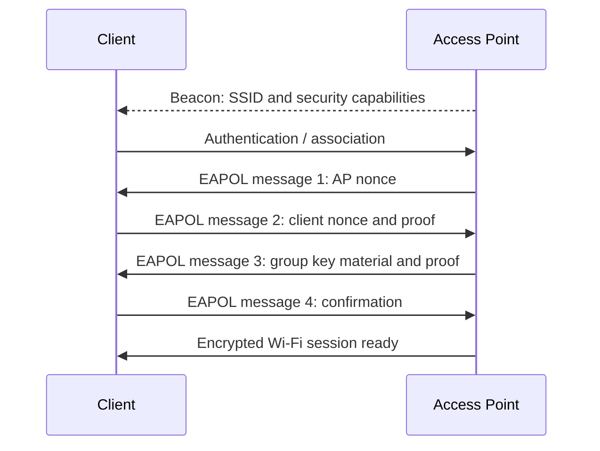
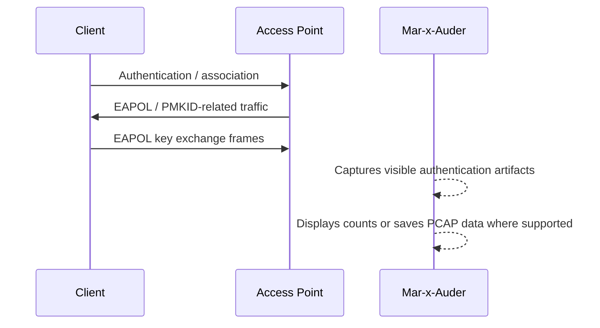

# Handshake and PMKID Capture

## What this ability demonstrates

Handshake and PMKID capture demonstrates that Wi-Fi authentication produces observable artifacts. The Mar-x-Auder can listen for EAPOL and PMKID-related traffic and save or display capture data that helps students understand how WPA/WPA2 authentication appears over the air.

The important lesson is precise: these captures do not contain the Wi-Fi password in plaintext. They may, however, provide enough authentication material for an offline password-audit workflow when the network uses a weak passphrase. This chapter explains the mechanism and risk without turning the guide into a cracking tutorial.

## Capability type

Observation / Capture / Evidence

This is primarily a capture capability. Depending on configuration and workflow, authentication traffic may be observed passively during normal client connection or may be triggered by another active feature in a lab. The distinction matters: capture is observation; forcing reconnection is interference.

## Technologies involved

This ability uses the following building blocks:

- [Wi-Fi / 802.11 basics](../foundations/02-wifi-80211.md)
- [WPA, WPA2, and WPA3](../foundations/03-wpa-wpa2-wpa3.md)
- [Packet capture and analysis](../foundations/09-packet-capture.md)

The specific blocks involved are:

- WPA/WPA2-Personal;
- pre-shared keys and passphrases;
- PMK, PTK, GTK concepts;
- EAPOL key frames;
- 4-way handshake;
- PMKID;
- offline password-audit risk;
- channel selection and capture timing.

## Where this sits in the protocol stack

```text
Application   Not involved
TLS           Not involved
HTTP          Not involved
TCP / UDP     Not involved
IP            Not involved until after link security succeeds
802.11        Authentication, association, EAPOL key exchange, PMKID artifacts
Radio         Capture range, channel, timing, signal quality
```

Handshake and PMKID capture happens before normal IP networking. A client has not yet begun ordinary DHCP, DNS, TCP, or HTTP traffic until the Wi-Fi link and security negotiation are complete.

## Normal flow

In a WPA/WPA2-Personal network, a client discovers an AP, authenticates and associates at the 802.11 layer, then completes key negotiation. The simplified view is that the client and AP prove they know shared key material derived from the passphrase without sending the passphrase itself.



The exact details vary by mode and implementation, but the main point is consistent: the passphrase is not transmitted directly.

## Observation point

The Mar-x-Auder observes authentication artifacts on the wireless channel.



The device is not decrypting the session. It is capturing frames that are visible over the air during authentication.

## What the process expected

The normal process expects that an observer can see some Wi-Fi metadata and authentication exchange frames, but cannot derive the password directly from them. Security relies in part on the passphrase being strong enough that offline guessing is impractical.

This expectation fails when the passphrase is weak, reused, predictable, or based on a small dictionary of likely values.

## What changes after capture

After capture, a researcher may have evidence that:

- a WPA/WPA2 authentication exchange occurred;
- EAPOL frames were visible;
- PMKID-related material was present where applicable;
- the AP and client were using a particular security mode;
- the network's password strength matters because captured material can be tested offline in an authorized audit.

The capture itself does not prove the password is weak. It proves that authentication artifacts were captured. Password weakness is a separate finding that requires an authorized password-audit process.

## PMKID and EAPOL distinction

The relevant artifacts are distinct:

| Artifact | Meaning |
|---|---|
| EAPOL key frames | Frames used during WPA/WPA2 key negotiation between AP and client. |
| 4-way handshake | Exchange used to derive working encryption keys after association. |
| PMKID | Identifier derived from key material and MAC addresses; in some configurations it can be captured without a full client handshake. |
| Passphrase | The user-entered Wi-Fi secret; not visible directly in these captures. |
| Offline audit | Testing candidate passphrases against captured material in an authorized setting. |

A capture is therefore sensitive even when it does not contain plaintext credentials.

## Passive capture vs forced reconnection

Handshake capture may happen passively when a lab client naturally connects or reconnects. Some workflows try to cause reconnection by using deauthentication or related interference. These are ethically and technically different.

| Method | Meaning | Boundary |
|---|---|---|
| Passive observation | Wait for a lab client to connect normally. | Preferred for teaching capture mechanics. |
| Manual reconnect | Ask the owner of the lab client to toggle Wi-Fi or reconnect. | Acceptable in a controlled lab. |
| Forced reconnect | Use active interference to make the client reconnect. | Only within a self-owned lab; see the deauthentication chapter. |

The recommended teaching path is passive observation or manual reconnect on a lab device.

## Ethical and safety boundary

Legitimate research is limited to owned networks, owned clients, and explicit password-audit authorization. The purpose is to understand authentication artifacts and why weak passphrases are dangerous.

The ethical line is crossed when authentication artifacts are captured from networks or clients outside the lab scope, when captures are retained longer than necessary, when they are shared without authorization, or when they are used for password guessing without the network owner's informed consent.

Authentication captures are sensitive. Treat them as evidence, not as harmless metadata.

## Controlled Mar-x-Auder demonstration

Use a controlled lab environment:

- one lab AP using WPA2-Personal;
- one lab client;
- a known channel;
- a strong passphrase for normal testing, or a deliberately weak training passphrase only if the course is explicitly teaching password-audit risk;
- SD card capture enabled where supported.

Controlled demonstration flow:

1. Identify the lab AP using passive AP discovery.
2. Record the lab SSID, BSSID, channel, and security mode.
3. Tune the Mar-x-Auder capture to the lab AP channel where the device workflow supports channel selection.
4. Start EAPOL/PMKID scanning or the relevant PMKID sniffing capability.
5. Reconnect the lab client manually or wait for a natural connection event.
6. Observe whether EAPOL or PMKID-related frames are displayed or saved.
7. Stop the capture.
8. Review the PCAP or screen output as protocol evidence.
9. Store or delete the capture according to the class evidence-handling rules.

The official ESP32 Marauder documentation describes EAPOL/PMKID Scan as filtering captured Wi-Fi traffic for EAPOL/PMKID packets and saving PMKID packets to PCAP on an attached SD card. The command documentation for `sniffpmkid` describes displaying captured PMKID/EAPOL frames during Wi-Fi authentication sessions. This guide uses those capabilities to teach authentication mechanics and password-audit risk, not to provide unauthorized cracking instructions.

## Packet-capture evidence

A useful capture may include:

- beacon frames advertising the lab AP security capabilities;
- authentication and association frames;
- EAPOL key frames;
- PMKID-related material where present;
- client reconnect timing;
- no plaintext Wi-Fi passphrase;
- no normal IP traffic until after security negotiation succeeds.

The analysis should focus on identifying the protocol phase and understanding what each artifact means.

## Common interpretation mistakes

### Mistake: The capture contains the Wi-Fi password

It does not contain the passphrase in plaintext.

### Mistake: Capturing a handshake means the password is weak

The capture only provides material that may be used in an authorized audit. Password strength is a separate question.

### Mistake: HTTPS is relevant to the handshake

HTTPS happens much later at the application layer. WPA/WPA2 key negotiation happens before IP connectivity.

### Mistake: Deauthentication is required for handshake capture

Not always. A lab client can reconnect normally or manually. Forced reconnection is an active interference technique and should be treated separately.

### Mistake: WPA3 behaves the same as WPA2

WPA3-Personal uses SAE and has different security properties. WPA3 behavior should be covered separately in the WPA3 SAE and PMF chapter.

## Defensive understanding

This ability teaches defenders that wireless authentication evidence can be sensitive even when passwords are not visible.

Defensive lessons include:

- use long, random WPA2-Personal passphrases;
- prefer WPA3-Personal where compatibility allows;
- avoid shared passphrases based on names, addresses, phone numbers, brands, or common phrases;
- rotate lab or guest passwords after demonstrations;
- treat captured handshakes and PMKID material as sensitive evidence;
- monitor for suspicious deauthentication or forced-reconnect behavior;
- use WPA-Enterprise for environments where individual identity and revocation are required.

## References

- ESP32 Marauder Wiki, EAPOL PMKID Scan: https://github.com/justcallmekoko/ESP32Marauder/wiki/eapol-pmkid-scan
- ESP32 Marauder Wiki, sniffpmkid: https://github.com/justcallmekoko/ESP32Marauder/wiki/sniffpmkid
- ESP32 Marauder Wiki, WiFi Sniffers: https://github.com/justcallmekoko/ESP32Marauder/wiki/wifi-sniffers
