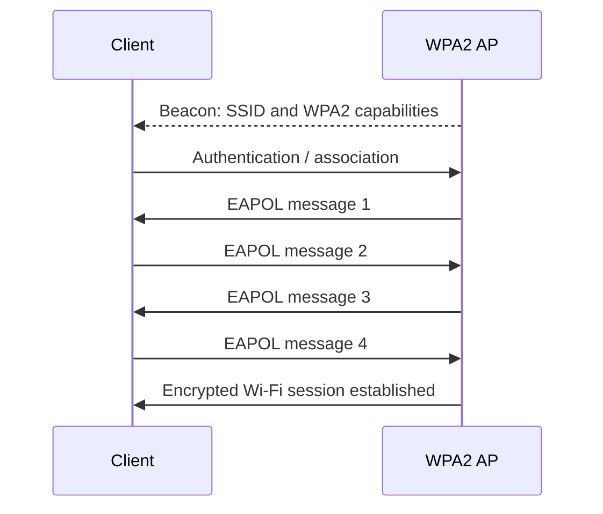
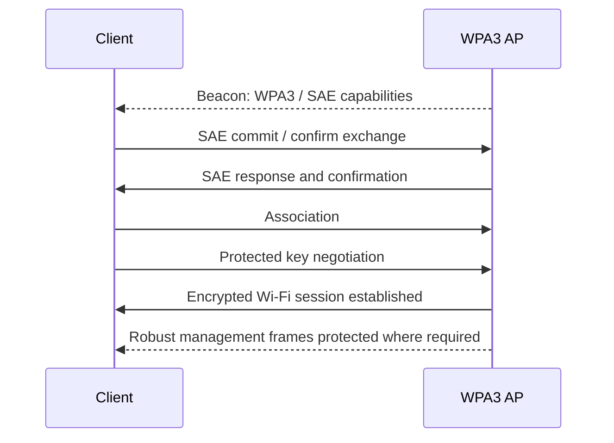
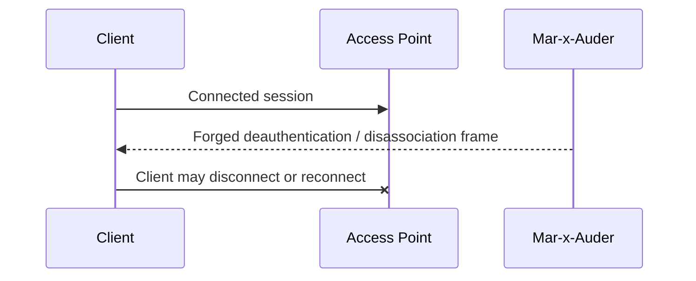
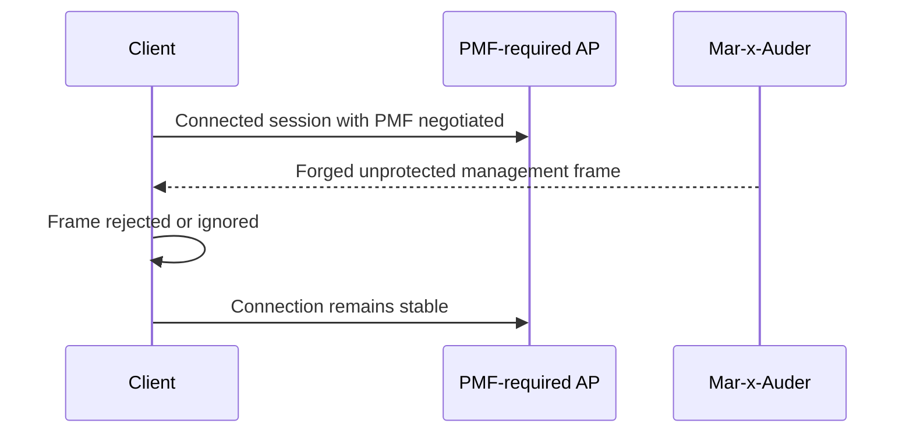

# WPA3 SAE and Protected Management Frames

## What this ability demonstrates

This ability demonstrates how newer Wi-Fi protections change the behavior of some older wireless assumptions. The Mar-x-Auder can help students compare how a lab network behaves when it uses older WPA2-Personal settings, WPA2 with Protected Management Frames where available, and WPA3-Personal with SAE and mandatory management-frame protection.

The goal is not to present WPA3 as unbreakable. The goal is to show that different security modes protect different parts of the process. WPA3-Personal changes how password-based authentication is performed, while Protected Management Frames protect selected management frames from spoofing and manipulation.

## Capability type

Observation / Interpretation / Controlled Interference

This chapter compares protocol behavior under different security configurations. It may include a controlled deauthentication comparison against self-owned lab devices, but the focus is on understanding protection boundaries rather than causing disconnections.

## Technologies involved

This ability uses the following building blocks:

- [Wi-Fi / 802.11 basics](../foundations/02-wifi-80211.md)
- [WPA, WPA2, and WPA3](../foundations/03-wpa-wpa2-wpa3.md)
- [Packet capture and analysis](../foundations/09-packet-capture.md)

The specific blocks involved are:

- WPA2-Personal;
- WPA3-Personal;
- SAE, Simultaneous Authentication of Equals;
- Protected Management Frames;
- deauthentication and disassociation frames;
- authentication artifacts;
- client compatibility and transition mode.

## Where this sits in the protocol stack

```text
Application   Not involved
TLS           Not involved
HTTP          Not involved
TCP / UDP     Not involved
IP            Not involved until after Wi-Fi security succeeds
802.11        Authentication, association, management frames, security negotiation
Radio         Channel, signal range, capture and injection visibility
```

WPA3 SAE and PMF are Wi-Fi link-layer protections. They operate before normal IP networking, DNS, HTTP, or TLS traffic exists.

## Normal flow: WPA2-Personal

A simplified WPA2-Personal connection begins with discovery, association, and key negotiation based on a pre-shared passphrase. The passphrase itself is not sent over the air, but the authentication exchange produces observable artifacts.



In WPA2-Personal, a weak passphrase can be a major risk because captured authentication material may support offline password-audit workflows. WPA2 can also operate without Protected Management Frames, leaving some management-frame behavior exposed to spoofing.

## Normal flow: WPA3-Personal with SAE and PMF

WPA3-Personal replaces the WPA2-Personal passphrase-derived handshake model with SAE. SAE is a password-authenticated key exchange designed to reduce the usefulness of captured authentication artifacts for offline guessing. WPA3-Personal also requires Protected Management Frames in WPA3-only operation.



The important distinction is that WPA3 changes the password-authentication model, while PMF protects selected management frames after the required protection has been negotiated.

## Interference point: older management-frame assumptions

In older or weaker configurations, some management frames may be accepted without cryptographic protection. This creates an opportunity for management-frame interference, such as deauthentication or disassociation injection.



When PMF is required and functioning, the same class of forged robust management frame should not be accepted in the same way.



The exact result depends on AP support, client support, security mode, transition mode, implementation behavior, and which frame type is being tested.

## What the process expected

The normal process expects the client and AP to maintain a stable authenticated relationship after association and key negotiation. Management frames that can affect this relationship should either be legitimate or protected in configurations that require PMF.

Older networks often assumed that management frames were part of the trusted Wi-Fi environment. That assumption is the weakness being demonstrated.

## What changes when protections are enabled

When WPA3-Personal and PMF-required settings are used, the reader should observe a different defensive posture:

- weak offline password-audit assumptions from WPA2-Personal no longer apply in the same way;
- robust management frames receive protection once the connection reaches the protected state;
- some clients may refuse to connect if they do not support the required mode;
- transition modes may weaken the clarity of the protection boundary because older WPA2 clients may still be allowed;
- active interference that works against an older lab setup may fail or produce different behavior.

The conclusion should be precise: WPA3 and PMF reduce specific risks. They do not protect against every possible wireless, configuration, usability, or social-engineering problem.

## WPA3-only vs transition mode

Many networks are configured in compatibility or transition mode to support both WPA2 and WPA3 clients. This is convenient, but it can make classroom observations confusing.

| Mode | Meaning | Teaching implication |
|---|---|---|
| WPA2-Personal | Legacy PSK-based personal network | Useful baseline for older behavior. |
| WPA2-Personal with optional PMF | Some management-frame protection may be available but not required | Clients may behave inconsistently. |
| WPA3-Personal transition mode | Supports WPA2 and WPA3 clients | Compatibility may preserve weaker paths. |
| WPA3-Personal only | SAE and PMF required | Best mode for demonstrating modern expected behavior. |

For a clean explanation, use separate lab SSIDs instead of changing one SSID repeatedly.

## Ethical and safety boundary

Legitimate research compares security behavior on self-owned APs and self-owned clients. The purpose is to demonstrate why modern Wi-Fi protections matter.

The ethical line is crossed when interference is directed at uninvolved networks, when students attempt to disconnect other users, when authentication artifacts are collected from devices outside the lab, or when compatibility testing is used to pressure real users onto weaker networks.

This capability is restricted to owned or explicitly authorized lab environments. It is not a basis for testing neighboring, office, school, hotel, or public networks.

## Controlled Mar-x-Auder demonstration

Use a controlled lab environment with one spare AP and one lab client. Ideally, configure multiple SSIDs:

- `LAB-WPA2` using WPA2-Personal;
- `LAB-WPA2-PMF` if the AP supports WPA2 with PMF;
- `LAB-WPA3` using WPA3-Personal only, if the AP and client support it;
- avoid using a production SSID or any shared environment.

Controlled demonstration flow:

1. Use access point discovery to identify each lab SSID, BSSID, channel, and security mode.
2. Confirm that the lab client can connect to each SSID.
3. Use raw packet capture or relevant sniffing features to observe the discovery and authentication phase for each mode.
4. Review beacon security capabilities and authentication-related frames where visible.
5. For a controlled comparison, use the deauthentication lab only against `LAB-WPA2` and the lab client.
6. Repeat the observation against `LAB-WPA3` or a PMF-required network only if the instructor owns the AP and client and the demonstration is scoped to the lab.
7. Compare whether the client disconnects, ignores the frame, reconnects differently, or refuses older behavior.
8. Stop all active features immediately after the observation.

The purpose of the practical example is to compare behavior. It is not to maximize disruption.

## Packet-capture evidence

A useful comparison may show:

- beacon frames advertising different security capabilities;
- WPA2 RSN information;
- SAE-related authentication behavior for WPA3;
- EAPOL behavior where applicable;
- deauthentication or disassociation frames in the controlled WPA2 comparison;
- absence or rejection of unprotected robust management frames where PMF is required;
- client compatibility differences between WPA2, WPA3 transition mode, and WPA3-only mode.

Packet captures should be interpreted together with AP configuration. A capture without knowing the AP mode can be misleading.

## Common interpretation mistakes

### Mistake: WPA3 means nothing can go wrong

WPA3 improves specific parts of Wi-Fi security. It does not solve weak device configuration, rogue portals, user deception, insecure applications, or all denial-of-service conditions.

### Mistake: PMF protects every frame from the beginning

PMF protects robust management frames after negotiation. It is not a universal shield over every radio event from the first moment a device hears a beacon.

### Mistake: Transition mode is equivalent to WPA3-only

Transition mode exists for compatibility. It may allow older behavior for older clients.

### Mistake: A failed deauth test proves perfect security

It only shows how that device, AP, configuration, and test condition behaved. It is evidence, not a universal proof.

## Defensive understanding

This ability teaches defenders to avoid treating Wi-Fi security modes as labels only. Configuration details matter.

Defensive lessons include:

- prefer WPA3-Personal where client compatibility allows;
- require PMF where practical;
- avoid transition mode once older clients are no longer needed;
- use long, random passphrases even when modern protocols are enabled;
- document which SSIDs exist for compatibility and why;
- monitor for repeated deauthentication/disassociation patterns;
- separate guest, lab, IoT, and production networks;
- teach users that a familiar SSID name is not sufficient proof of trust.

## References

- ESP32 Marauder Wiki, WiFi Attacks: https://github.com/justcallmekoko/ESP32Marauder/wiki/wifi-attacks
- ESP32 Marauder Wiki, WiFi Sniffers: https://github.com/justcallmekoko/ESP32Marauder/wiki/wifi-sniffers
- Wi-Fi Alliance, WPA3: https://www.wi-fi.org/discover-wi-fi/security
- IEEE 802.11 Working Group: https://www.ieee802.org/11/
