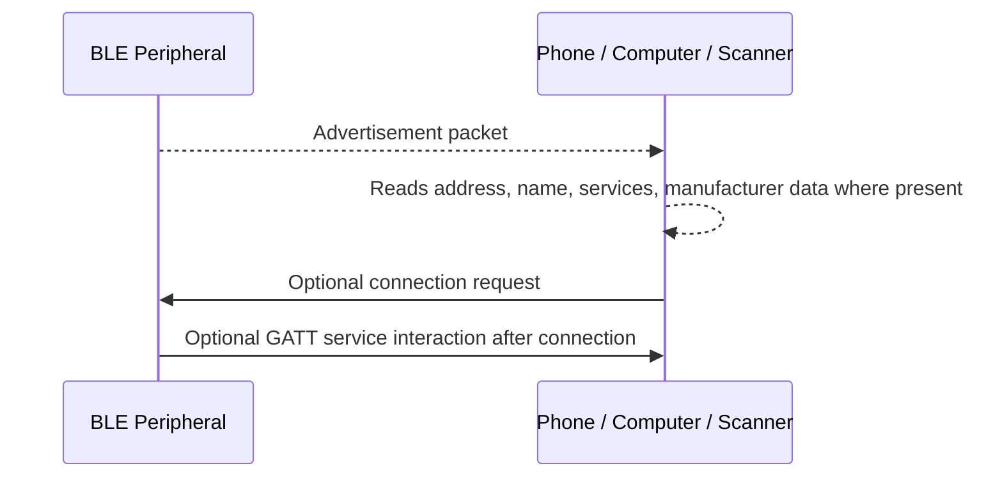
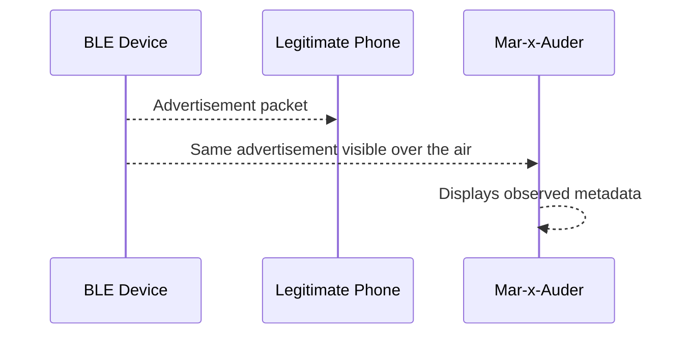

# Bluetooth and BLE Observation

## What this ability demonstrates

Bluetooth and BLE observation demonstrates that wireless discovery is not limited to Wi-Fi. Many devices continuously or periodically emit Bluetooth or BLE signals that can reveal nearby device presence, device class, advertising names, service identifiers, or manufacturer-specific metadata.

The important lesson is that Bluetooth visibility is a protocol behavior, not a mystical tracking capability. The Mar-x-Auder can help students observe that nearby devices may advertise their existence before any pairing or user interaction occurs.

## Capability type

Observation / Capture / Metadata Awareness

This chapter focuses on passive Bluetooth and BLE observation. It does not require pairing with devices, connecting to devices, or interfering with devices.

## Technologies involved

This ability uses the following building blocks:

- [Radio and wireless basics](../foundations/01-radio-basics.md)
- [Bluetooth and BLE](../foundations/08-bluetooth-ble.md)
- [Packet capture and analysis](../foundations/09-packet-capture.md)

The specific blocks involved are:

- Bluetooth Classic discovery;
- BLE advertising;
- advertising channels;
- device names;
- service UUIDs;
- manufacturer data;
- MAC address behavior and randomization;
- privacy limitations.

## Where this sits in the protocol stack

```text
Application   May be hinted by advertised services, but not directly accessed
TLS           Not involved
HTTP          Not involved
TCP / UDP     Not involved
IP            Not involved for ordinary BLE advertising
Bluetooth     Advertising, discovery, device metadata
Radio         2.4 GHz radio behavior, range, interference, signal strength
```

BLE advertising is not TCP/IP traffic. A phone, watch, tracker, keyboard, headset, or sensor can advertise information over Bluetooth without creating an IP connection.

## Normal flow

A BLE peripheral may periodically advertise so that scanners or central devices can discover it. The advertisement may include a device name, service identifiers, manufacturer data, or other fields. Not every device advertises the same information, and modern devices may randomize addresses or limit identifying data.



Observation occurs before pairing. A scanner can often see advertising packets without being trusted by the device.

## Observation point

The Mar-x-Auder acts as a nearby scanner and records or displays what it can observe from Bluetooth/BLE activity.



The device is not necessarily connecting to, controlling, or pairing with the observed device. It is listening to advertisements that are already transmitted.

## What the process expected

The normal process expects devices to advertise enough information for legitimate discovery and connection. For example, a headset needs to be discoverable during pairing, and a BLE sensor may advertise a service so an app can find it.

The privacy risk is that useful discovery metadata may also be visible to observers who are not the intended user.

## What changes after observation

After observation, a researcher may be able to infer:

- that Bluetooth/BLE devices are nearby;
- whether a device is advertising a name;
- whether certain service types are visible;
- whether manufacturer-specific data is present;
- whether address randomization appears to be used;
- whether a device becomes more visible during pairing mode.

This does not mean the observer can control the device. Visibility and control are different concepts.

## Bluetooth Classic vs BLE

Bluetooth Classic and BLE should not be treated as the same thing.

| Feature | Bluetooth Classic | BLE |
|---|---|---|
| Common use | Audio, keyboards, older peripherals | Sensors, wearables, beacons, modern low-power devices |
| Discovery style | Inquiry and pairing workflows | Advertising and scanning |
| Power model | Higher power than BLE | Designed for low power |
| Metadata exposure | Device class/name may be visible in discovery | Advertisements may include names, services, manufacturer data |
| Teaching focus | Pairing and device identity | Advertising and passive metadata visibility |

Correct analysis identifies which Bluetooth mode is being observed before drawing conclusions.

## Ethical and safety boundary

Legitimate research observes devices owned by the student, instructor, or lab, or devices whose owners have consented to participation. Passive observation can still be sensitive because it may reveal presence, movement, device type, or personal device names.

The ethical line is crossed when Bluetooth/BLE observation is used to track people, identify uninvolved devices, collect persistent identifiers outside the lab, publish device names or addresses, or build a presence profile of someone without consent.

Bluetooth metadata is treated as potentially personal information.

## Controlled Mar-x-Auder demonstration

Use a controlled lab environment:

- one Mar-x-Auder device;
- one lab phone;
- one lab BLE device such as a training beacon, development board, headset, or sensor;
- optional Bluetooth scanner app on the lab phone for comparison;
- no collection of uninvolved device identifiers.

Controlled demonstration flow:

1. Place the lab BLE device near the Mar-x-Auder.
2. Enable Bluetooth/BLE scanning or the relevant Bluetooth observation feature on the Mar-x-Auder.
3. Record whether the device name, address, service UUIDs, manufacturer data, or signal strength are visible.
4. Move the lab device farther away and observe signal changes.
5. Place the lab device into pairing or advertising mode and compare what changes.
6. If accidental third-party devices appear, do not record or publish their identifiers.
7. Repeat with a device that uses address randomization and compare the observation.

The example should emphasize what is visible and what remains protected.

## Capture and screen evidence

Depending on device support and nearby Bluetooth behavior, output may include:

- device address or randomized address;
- advertised name;
- RSSI or signal strength;
- service UUIDs;
- manufacturer-specific data;
- device class or type indicators;
- repeated advertisements over time;
- differences between normal and pairing/discoverable states.

The exact output depends on firmware, hardware, and Bluetooth mode.

## Common interpretation mistakes

### Mistake: Seeing a device means controlling it

Observation does not imply control. Pairing, authentication, protocol support, and application behavior determine what can be done after discovery.

### Mistake: RSSI proves distance

Signal strength is affected by walls, bodies, antennas, reflection, interference, and device orientation. It is not a reliable distance measurement by itself.

### Mistake: Randomized addresses guarantee anonymity

Randomization reduces tracking risk but does not eliminate every correlation signal. Names, service patterns, timing, manufacturer data, and behavior may still reveal information.

### Mistake: BLE is the same as Wi-Fi

BLE advertising does not use SSIDs, WPA handshakes, DHCP, DNS, or HTTP in the same way Wi-Fi networks do.

## Defensive understanding

This ability teaches defenders that Bluetooth/BLE visibility is an information-exposure issue.

Defensive lessons include:

- disable discoverable mode when not needed;
- avoid personal names in Bluetooth device names;
- understand which devices advertise continuously;
- prefer devices and operating systems with address randomization;
- evaluate BLE beacons and trackers as privacy-sensitive infrastructure;
- avoid collecting unnecessary Bluetooth identifiers in security assessments;
- treat Bluetooth observation logs as sensitive data.

## References

- Bluetooth SIG, Specifications: https://www.bluetooth.com/specifications/specs/
- Bluetooth SIG, Bluetooth Technology Overview: https://www.bluetooth.com/learn-about-bluetooth/tech-overview/
- ESP32 Marauder Wiki: https://github.com/justcallmekoko/ESP32Marauder/wiki
