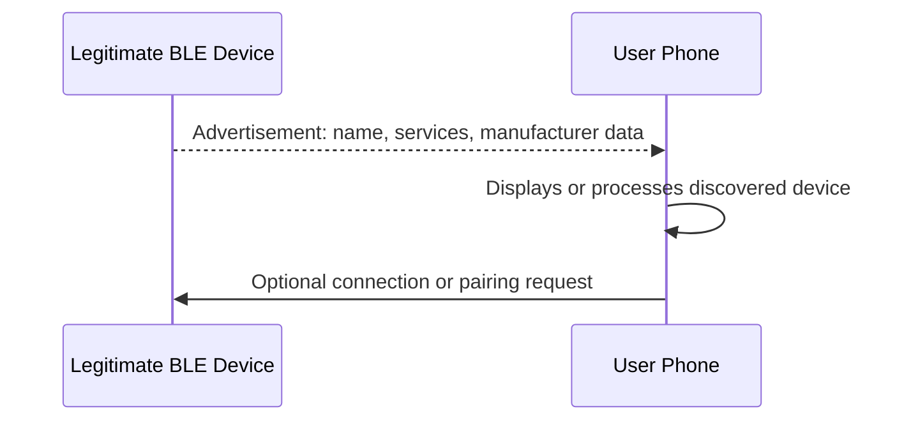
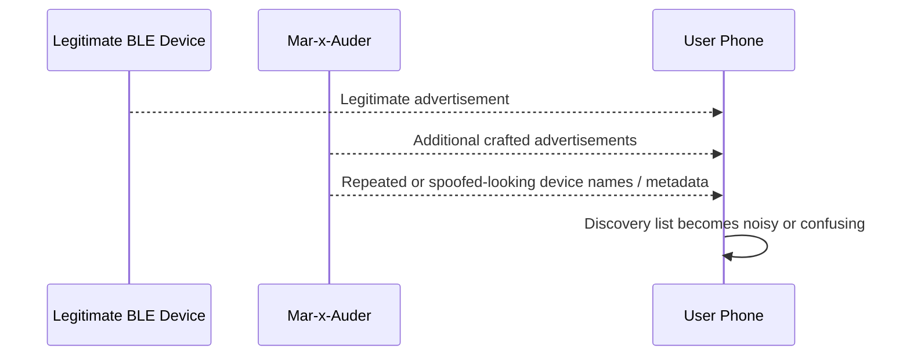

# Bluetooth Active Features

## What this ability demonstrates

Bluetooth active features demonstrate that some wireless tools can do more than observe nearby devices. They may transmit advertisements, create discovery noise, imitate certain visible device properties, or attempt interactions that affect how nearby clients display or react to Bluetooth/BLE signals.

The important lesson is that active Bluetooth/BLE behavior changes the shared radio environment. Even when a feature appears harmless, it can confuse users, trigger prompts, pollute scans, or interfere with classroom and nearby devices.

## Capability type

Injection / Impersonation / Interference / Demonstration

This chapter covers active Bluetooth/BLE concepts at a controlled-lab level. It does not teach bypassing pairing security, exploiting specific devices, extracting secrets, or taking control of third-party devices.

## Technologies involved

This ability uses the following building blocks:

- [Radio and wireless basics](../foundations/01-radio-basics.md)
- [Bluetooth and BLE](../foundations/08-bluetooth-ble.md)
- [Packet capture and analysis](../foundations/09-packet-capture.md)

The specific blocks involved are:

- BLE advertising;
- device discovery;
- advertised names and service identifiers;
- manufacturer data;
- pairing prompts and user-interface trust;
- radio noise and scan pollution;
- consent and proximity boundaries.

## Where this sits in the protocol stack

```text
Application   May affect user interfaces or apps that react to Bluetooth metadata
TLS           Not involved
HTTP          Not involved
TCP / UDP     Not involved
IP            Not involved for ordinary BLE advertising
Bluetooth     Active advertising, spoofed-looking metadata, discovery interference
Radio         2.4 GHz transmission, range, channel use, local interference
```

Most Bluetooth active demonstrations happen below IP networking. They are not web attacks, TCP attacks, or Wi-Fi password attacks.

## Normal flow

In the normal BLE discovery flow, a device advertises its presence and another device scans for advertisements. The scanner may display a name, identify a service, or offer to connect if the device appears relevant.



The normal trust assumption is that the advertised device information reasonably describes a real nearby device.

## Interference point

An active tool can transmit additional Bluetooth/BLE advertisements or other discovery-layer signals. These may imitate names, create large amounts of noise, or cause nearby clients to display misleading device entries.



The interference occurs at the discovery and advertising layer. It does not prove that the Mar-x-Auder can pair with or control the target device.

## What the process expected

The normal process expects Bluetooth discovery results to be limited to real nearby devices advertising their own properties. A user interface may assume that a displayed device name corresponds to a meaningful physical object.

That expectation is weak because names and some advertising fields can be transmitted by other devices. A scanner can be shown noisy or misleading discovery data.

## What changes after interference

After active Bluetooth/BLE transmission, nearby devices or scanning tools may show:

- many additional device names;
- repeated advertisements;
- spoofed-looking or confusing entries;
- pairing prompts in some environments or with some feature types;
- noisy scan results that hide the real device of interest;
- temporary user-interface confusion.

This is why active Bluetooth demonstrations must be short, controlled, and clearly scoped.

## Active Bluetooth concepts

Different tools and firmware builds may expose different active Bluetooth/BLE features. The chapter explains concepts rather than relying on one menu layout.

| Concept | Meaning | Teaching value |
|---|---|---|
| Advertisement injection | Transmitting BLE advertisements | Shows that discovery metadata can be created by arbitrary transmitters. |
| Name spoofing | Advertising misleading or duplicate names | Shows why user-visible names are not identity. |
| Scan pollution | Creating many discovery entries | Shows how local radio/UI noise affects visibility and trust. |
| Pairing-prompt abuse | Triggering confusing prompts where supported | Shows why users should not accept unexpected pairing requests. |
| Service impersonation | Advertising service identifiers associated with known device types | Shows why service discovery is not the same as authentication. |

The chapter avoids claiming that any visible active feature automatically compromises devices. It usually demonstrates trust, noise, and discovery-layer weakness rather than control.

## Ethical and safety boundary

Legitimate research uses self-owned devices, consented participants, a short time window, and an isolated or clearly controlled environment. The purpose is to show how Bluetooth/BLE discovery can be noisy or misleading.

The ethical line is crossed when active Bluetooth features are used to annoy nearby people, trigger prompts on uninvolved devices, imitate real products or organizations in a shared environment, interfere with medical, accessibility, classroom, workplace, or personal devices, or create persistent tracking or confusion.

Because Bluetooth is proximity-based, the boundary is not only the target device. It includes every nearby person whose device may receive the transmitted signal.

## Controlled Mar-x-Auder demonstration

Use a controlled lab environment:

- one Mar-x-Auder device;
- one lab phone or tablet;
- one optional lab BLE scanner app;
- one lab BLE device for comparison;
- a short demonstration window;
- no collection or publication of third-party identifiers.

Controlled demonstration flow:

1. Begin with passive Bluetooth/BLE observation and identify the lab device.
2. Record what the lab phone or scanner normally shows.
3. Enable a supported Mar-x-Auder Bluetooth/BLE active demonstration feature, such as advertisement generation or device-name demonstration, only for the lab period.
4. Observe how the lab phone or scanner output changes.
5. Stop the active feature immediately after the observation.
6. Compare the normal discovery list with the interfered discovery list.
7. Discuss which fields were trustworthy and which were merely advertised claims.

The example should not target uninvolved phones, wearables, headsets, vehicles, or sensors. If unexpected devices appear in the scanner output, ignore and do not record them.

## Capture and screen evidence

Depending on device and firmware support, output may show:

- additional advertised device names;
- repeated advertisements;
- signal strength changes;
- manufacturer or service identifiers;
- temporary pairing or connection prompts on a lab device;
- crowded or confusing scan results;
- differences between real devices and generated advertisements.

A useful observation is not that the active feature is powerful. A useful observation is that discovery systems often display unauthenticated claims.

## Common interpretation mistakes

### Mistake: A spoofed Bluetooth name is the same as device compromise

It is not. A name can be copied or imitated without controlling the real device.

### Mistake: A pairing prompt means the device is hacked

A prompt is a user-interface event. Security depends on pairing mode, authentication, user approval, and the specific protocol.

### Mistake: Bluetooth active features are safe because they are short range

Short range does not mean harmless. Nearby devices may belong to people who did not consent to the demonstration.

### Mistake: Service UUIDs prove identity

Service identifiers describe advertised capabilities. They are not proof that the transmitter is the genuine product or service provider.

## Defensive understanding

This ability teaches defenders and users that Bluetooth discovery is a trust boundary.

Defensive lessons include:

- do not accept unexpected pairing requests;
- keep Bluetooth off when not needed in sensitive settings;
- use non-personal device names;
- investigate repeated or suspicious pairing prompts;
- design apps to authenticate devices after discovery rather than trusting advertised names alone;
- treat BLE identifiers and advertisements as potentially spoofable;
- avoid deploying safety-critical workflows that rely only on nearby advertised metadata.

## References

- Bluetooth SIG, Specifications: https://www.bluetooth.com/specifications/specs/
- Bluetooth SIG, Bluetooth Technology Overview: https://www.bluetooth.com/learn-about-bluetooth/tech-overview/
- ESP32 Marauder Wiki: https://github.com/justcallmekoko/ESP32Marauder/wiki
