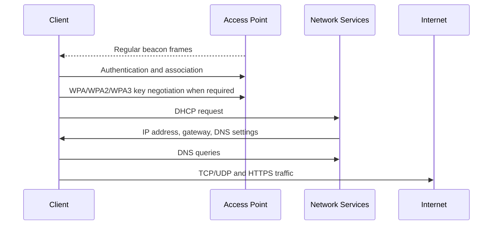
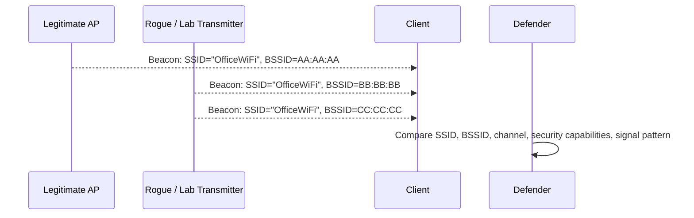
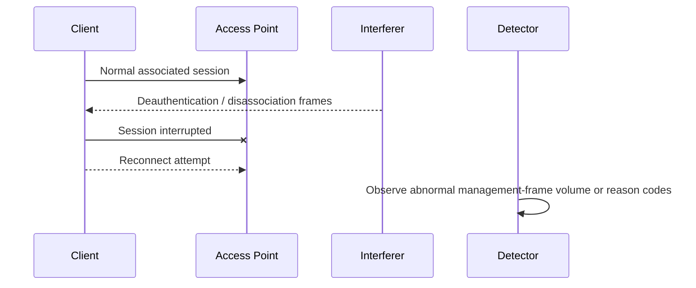
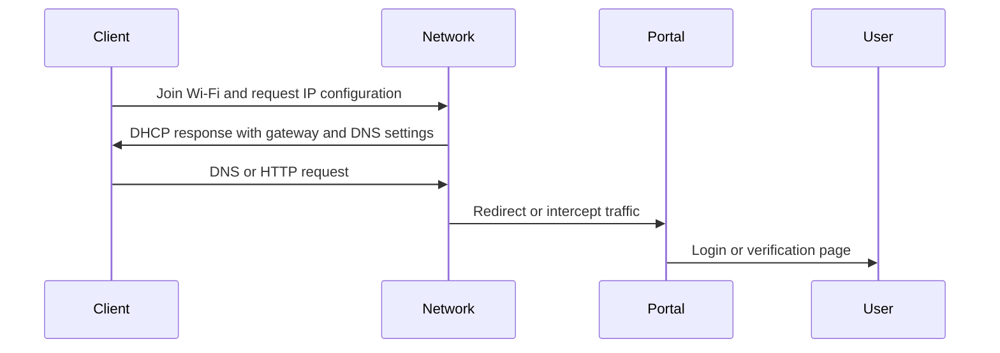

# Detection Signals

## Purpose

This section explains how the behaviors demonstrated by the Mar-x-Auder can appear from the defender's point of view. It is not a product-specific monitoring guide. It is a protocol-oriented detection guide: the goal is to understand which signals may appear at the radio, 802.11, network, and application layers when wireless observation, interference, impersonation, or deception occurs.

Detection should be treated as evidence-building, not as a single-alert decision. Wireless environments are noisy. A weak signal, a roaming client, a misconfigured AP, and deliberate interference can all produce symptoms that look similar to users. A useful detection process separates symptoms from evidence.

## Technologies involved

This section connects to the following foundations:

- [Radio and wireless basics](../foundations/01-radio-basics.md)
- [Wi-Fi / 802.11 basics](../foundations/02-wifi-80211.md)
- [WPA, WPA2, and WPA3](../foundations/03-wpa-wpa2-wpa3.md)
- [TCP/IP networking](../foundations/05-tcp-ip-networking.md)
- [DHCP, DNS, HTTP, and captive portals](../foundations/06-dhcp-dns-http-captive-portals.md)
- [TLS, certificates, and trust](../foundations/07-tls-certificates.md)
- [Bluetooth and BLE](../foundations/08-bluetooth-ble.md)
- [Packet capture and analysis](../foundations/09-packet-capture.md)

The main detection principle is to identify the layer where the abnormal behavior begins.

## Detection by protocol layer

```text
Application   Unexpected login prompts, fake portals, credential requests
TLS           Certificate warnings, hostname mismatch, untrusted issuer
HTTP          Redirect loops, captive portal pages, unexpected forms
DNS           Unexpected answers, all names resolving to portal host
DHCP          Unexpected gateway/DNS server, wrong subnet
IP            Loss of reachability, changed route, captive network behavior
802.11        Deauth/disassoc frames, duplicate SSIDs, probe floods, beacon floods
Radio         Signal anomalies, channel congestion, airtime saturation
```

A user may experience all layers as a single problem: "the Wi-Fi is strange." Detection requires decomposing that complaint into observable signals.

## Normal wireless environment

In a normal managed or home Wi-Fi environment, the basic flow is stable:



The defender expects the AP list to be understandable, clients to remain associated unless roaming or sleeping, DHCP settings to match the intended network, DNS to resolve normally, and HTTPS sites to present valid certificates.

## Detection of access point impersonation

Access point impersonation and AP clone behavior commonly appear as duplicate or confusing network advertisements.



Signals that may indicate impersonation or clone-style behavior include:

- the same SSID appearing with unexpected BSSIDs;
- the same SSID appearing on unexpected channels;
- the same SSID appearing with weaker, missing, or inconsistent security capabilities;
- sudden appearance of many SSIDs with similar names;
- clients showing duplicate networks in their Wi-Fi interface;
- a known network name appearing in a location where it should not exist.

Not every duplicate SSID is suspicious. Enterprise and mesh networks often use the same SSID across multiple APs. The key is whether the observed BSSID, channel, vendor, security mode, and location match the expected deployment.

## Detection of deauthentication and disassociation interference

Deauthentication and disassociation interference appears at the 802.11 management-frame layer. The user may notice disconnects, but the evidence is in the wireless frames.



Potential signals include:

- unusual volume of deauthentication frames;
- unusual volume of disassociation frames;
- many clients reconnecting in a short time window;
- repeated WPA/EAPOL handshakes after stable connections;
- client logs showing frequent disconnect/reconnect cycles;
- AP logs showing reason codes or roaming events that do not match normal movement;
- complaints concentrated in one physical area or one channel.

Important distinction: deauthentication-like symptoms can also be caused by weak signal, roaming bugs, AP overload, firmware issues, or power-saving behavior. Packet capture is the best way to distinguish normal instability from crafted management-frame interference.

## Detection of probe request noise

Probe request flooding or spoofed discovery behavior can create excessive client-looking traffic. From a defensive perspective, the signal is not only the number of frames but their implausibility.

Indicators include:

- a sudden burst of probe requests from many apparent source addresses;
- unrealistic SSID names in directed probes;
- source addresses that change rapidly;
- probe requests that do not match the expected nearby device population;
- channel airtime consumed by management traffic rather than useful data.

Modern devices may use MAC randomization, so changing source addresses are not automatically malicious. The defensive question is whether the timing, volume, naming pattern, and physical context make sense.

## Detection of evil portal and captive-portal deception

Evil portal behavior usually becomes visible after a client joins a network. The strongest signals appear in DHCP, DNS, HTTP, and user-interface behavior.



Signals include:

- unexpected captive portal prompt;
- login page that does not match the expected organization;
- HTTP redirection to an unfamiliar local address;
- DNS answers that point many unrelated domains to the same host;
- gateway or DNS server not matching the intended network;
- TLS certificate warnings when trying to visit HTTPS sites;
- a portal requesting credentials it should not need.

A legitimate captive portal should have a clear purpose, recognizable ownership, and minimal credential requirements. A suspicious portal often asks for unrelated credentials, such as email, cloud, school, router, or Wi-Fi passwords.

## Detection of handshake and PMKID capture activity

Handshake and PMKID capture can be passive, or it can be paired with active interference that causes clients to reconnect. Purely passive capture is difficult to detect from the network side because the device only listens. Active collection workflows may be more visible when they create reconnection events.

Signals that may matter:

- repeated deauthentication/disassociation followed by reconnects;
- repeated EAPOL handshakes without an obvious roaming reason;
- a client repeatedly cycling through association;
- abnormal management-frame activity near the AP channel;
- suspicious activity occurring when no legitimate maintenance or roaming event is expected.

The defensive lesson is important: a passive listener may leave no network-side trace. Strong passphrases, WPA3 where practical, and PMF are preventive controls, not merely detection controls.

## Detection of Bluetooth/BLE observation or interference

Bluetooth and BLE detection is different from Wi-Fi detection because many devices advertise routinely and intermittently. Observation alone may not be visible to the device being observed.

Potential signals include:

- unexpected pairing prompts;
- repeated connection attempts;
- unusual BLE advertisement floods in a controlled environment;
- device names or identifiers appearing in scanning tools unexpectedly;
- user reports of unexpected nearby-device prompts.

BLE privacy features and address randomization complicate interpretation. A single observation rarely proves misuse. Patterns over time, proximity, and user reports matter.

## Evidence sources

Useful evidence may come from several places:

| Source | What it can show | Limitations |
|---|---|---|
| Mar-x-Auder capture | Local RF/802.11 frames, SSIDs, BSSIDs, probes, beacons | Limited radio perspective; may miss channels or frames |
| Wireshark capture station | Detailed frame analysis | Requires correct adapter, channel, and capture setup |
| Access point logs | Client joins/leaves, reason codes, authentication results | Often lacks over-the-air detail |
| Controller/WIDS/WIPS | Centralized wireless anomaly detection | Available mostly in managed environments |
| Client logs | User-side disconnects, portal prompts, certificate warnings | Hard to collect consistently |
| Screenshots | User-facing evidence | Does not prove radio-layer cause by itself |
| DHCP/DNS logs | Captive portal or rogue network clues | Only available on networks under control |

## Evidence quality

A useful finding should connect three things:

1. **Symptom:** what users or systems experienced.
2. **Observation:** what was captured or logged.
3. **Protocol explanation:** why that observation explains the symptom.

Poor finding:

> The network was hacked because Wi-Fi disconnected.

Better finding:

> The lab client repeatedly disconnected while abnormal deauthentication frames were observed on the same channel and BSSID. The behavior occurred before IP traffic and caused the client to repeat association. This indicates management-frame interference under the tested conditions.

## Common interpretation mistakes

### Mistake: Any duplicate SSID is an attack

Many legitimate deployments use the same SSID across multiple access points. Compare BSSID inventory, channel plan, security capabilities, and physical location before concluding that a clone exists.

### Mistake: Any disconnect means deauthentication interference

Poor signal, roaming, AP overload, client power saving, and firmware problems can all cause disconnects. Deauthentication interference should be supported by frame evidence or a strong correlated pattern.

### Mistake: HTTPS warnings are Wi-Fi encryption failures

HTTPS warnings happen at the TLS/application trust layer. They may appear during portal deception or interception attempts, but they are not evidence that WPA itself was broken.

### Mistake: Passive sniffing can always be detected

A passive listener may not transmit anything. Detection is strongest for active interference or deception. Prevention and hardening are therefore essential.

## Defensive use of the Mar-x-Auder

The same device used to demonstrate capabilities can also help students understand detection:

- scan for expected and unexpected SSIDs;
- compare BSSIDs against an approved inventory;
- observe whether clients emit directed probes;
- capture beacon and management-frame behavior in a controlled lab;
- compare a normal baseline with an interference scenario;
- export PCAPs for Wireshark analysis;
- document the layer where each anomaly begins.

The device should not be treated as a complete defensive platform. It is a teaching instrument and local observation tool. Its value is in helping students connect protocol behavior to visible symptoms.

## References

- ESP32 Marauder Wiki, WiFi Sniffers: https://github.com/justcallmekoko/ESP32Marauder/wiki/wifi-sniffers
- ESP32 Marauder Wiki, WiFi Attacks: https://github.com/justcallmekoko/ESP32Marauder/wiki/wifi-attacks
- Wireshark User's Guide: https://www.wireshark.org/docs/wsug_html_chunked/
