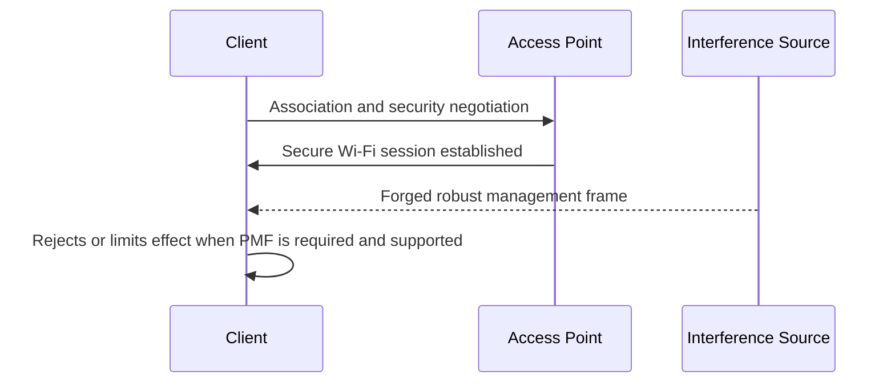
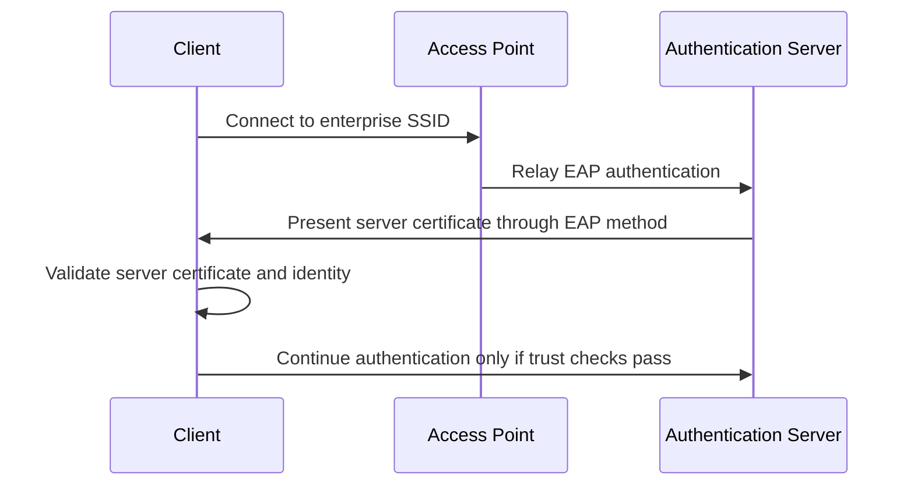

# Hardening Wi-Fi Networks

## Purpose

This section translates the capability chapters into practical defensive controls. The goal is not to create a perfect network. The goal is to understand which controls reduce which classes of wireless risk.

Hardening should be based on the layer being protected. A strong Wi-Fi password helps against password guessing, but it does not by itself prevent beacon spam. HTTPS helps protect web sessions, but it does not prevent deauthentication. Protected Management Frames help with certain management-frame attacks, but they do not make users immune to fake login pages.

Good defensive posture comes from combining controls across layers.

## Technologies involved

This section connects to the following foundations:

- [Radio and wireless basics](../foundations/01-radio-basics.md)
- [Wi-Fi / 802.11 basics](../foundations/02-wifi-80211.md)
- [WPA, WPA2, and WPA3](../foundations/03-wpa-wpa2-wpa3.md)
- [WPA Enterprise and certificates](../foundations/04-wpa-enterprise-and-certificates.md)
- [TCP/IP networking](../foundations/05-tcp-ip-networking.md)
- [DHCP, DNS, HTTP, and captive portals](../foundations/06-dhcp-dns-http-captive-portals.md)
- [TLS, certificates, and trust](../foundations/07-tls-certificates.md)

## Defensive control map

| Risk demonstrated in guide | Primary layer | Useful controls |
|---|---|---|
| Weak Wi-Fi password audit risk | WPA/WPA2/WPA3 | Strong passphrase, WPA3-SAE where practical, avoid reused passwords |
| Deauthentication/disassociation interference | 802.11 management | Protected Management Frames, WPA3, monitoring, modern clients/APs |
| Fake SSIDs / AP clone behavior | 802.11 management / user trust | Known BSSID inventory, WPA2/WPA3, user training, managed profiles |
| Evil portal deception | DHCP/DNS/HTTP/user interface | User training, HTTPS awareness, trusted captive portal design, VPN where appropriate |
| Enterprise evil twin risk | 802.1X/EAP/TLS | Server certificate validation, managed supplicant profiles, trusted CA pinning/policy |
| Probe privacy leakage | Client discovery behavior | MAC randomization, avoid auto-join unknown networks, forget unused networks |
| Channel congestion/interference | Radio | Channel planning, AP placement, transmit power tuning |
| Bluetooth/BLE exposure | BLE advertising/pairing | Disable unused discoverability, update devices, avoid unexpected pairing |

## Network security mode

The Wi-Fi security mode determines which authentication and encryption model is used.

Recommended direction for modern networks:

1. Prefer WPA3-Personal where all important clients support it.
2. Use WPA2/WPA3 transition mode only when compatibility requires it.
3. Use WPA2-Personal with a strong passphrase when WPA3 cannot be used.
4. Avoid WEP, WPA-TKIP, and open networks for trusted use.
5. Avoid WPS where possible.

Security mode should not be judged only by whether the network "has a password." The type of protection matters.

## Password and passphrase strength

For WPA/WPA2-Personal, the passphrase is a major security boundary. Captured authentication material does not directly reveal the passphrase, but weak passphrases can be tested through offline guessing workflows.

A useful passphrase should be:

- long;
- unique to that network;
- not based on names, addresses, phone numbers, brands, or local jokes;
- not reused across other systems;
- stored in a password manager where practical;
- changed when shared with people who no longer need access.

Poor passphrase examples:

- `companyname2024`
- `familywifi`
- `12345678`
- `routerbrand123`
- a phone number or address

Better pattern:

- several unrelated words plus additional length;
- randomly generated password-manager secret;
- a passphrase not guessable from the environment.

The defensive point is simple: if authentication artifacts are captured, the strength of the passphrase determines how useful those artifacts are to an attacker.

## Protected Management Frames

Protected Management Frames are relevant to management-frame interference such as deauthentication and disassociation. They protect certain robust management frames after a security association is established.

PMF hardening guidance:

- enable PMF where supported;
- prefer "required" for networks where all clients support it;
- use "capable/optional" during transition if older clients remain;
- test compatibility before changing production networks;
- pair PMF with WPA3 where practical.

PMF does not solve every wireless problem. It does not prevent beacon spam, all forms of RF interference, weak passphrases, or user deception through fake portals. It specifically strengthens a class of management-frame trust problems.

## WPA3 and SAE

WPA3-Personal uses SAE rather than the older WPA2-Personal PSK handshake model. The practical defensive value is improved resistance to offline dictionary attacks and a stronger modern security baseline.

WPA3 guidance:

- use WPA3-only where client compatibility allows;
- use transition mode only as a temporary compatibility bridge;
- avoid assuming transition mode gives the same posture as WPA3-only;
- require PMF when using WPA3-only networks;
- document which devices still require WPA2 compatibility.

Transition mode can be useful, but it should not become a permanent substitute for moving devices to modern support.

## Enterprise Wi-Fi hardening

WPA-Enterprise introduces a different trust model. Instead of a shared passphrase, clients authenticate through 802.1X/EAP, often backed by RADIUS. The most important user-facing risk is misconfigured certificate validation.

A secure enterprise client configuration should define:

- the expected EAP method;
- the trusted server certificate authority;
- the expected server certificate identity or domain;
- whether user certificates or username/password credentials are used;
- whether users are allowed to bypass certificate warnings.

The common failure is allowing users to accept unknown certificates manually. That turns a technical trust decision into a social-engineering opportunity.

## SSID and BSSID management

SSID is not identity. It is a name advertised in beacon frames. Defenders should not rely on the visible network name alone.

Useful practices:

- maintain an inventory of legitimate BSSIDs for important networks;
- know expected channels and AP locations;
- use managed Wi-Fi profiles on organization-owned devices;
- avoid generic SSIDs that are easy to imitate convincingly;
- train users that duplicate SSIDs or unexpected captive portals are warning signs.

For small/home networks, a full BSSID inventory may be unnecessary, but users should still understand that a familiar name in the Wi-Fi menu is not proof of authenticity.

## Captive portal hygiene

Captive portals are often necessary in guest networks, hotels, campuses, and public venues. They are also a source of user confusion.

A defensible captive portal should:

- clearly identify the organization operating it;
- avoid asking for unrelated credentials;
- use plain language explaining why the page appears;
- not imitate login pages from email, banks, cloud providers, or device vendors;
- avoid collecting sensitive information unless absolutely required;
- provide a support path for users who are uncertain;
- avoid training users to ignore browser warnings.

An evil portal works by exploiting ambiguity. Good portal design reduces ambiguity.

## DHCP and DNS controls

DHCP and DNS are central to network behavior after a device joins Wi-Fi. In a rogue or deceptive network, the client may receive a gateway or DNS server controlled by the attacker.

Hardening options include:

- segmenting guest networks from trusted networks;
- monitoring for unauthorized DHCP servers on wired networks;
- using secure DNS policies where appropriate;
- enforcing DNS resolvers on managed clients where practical;
- logging DNS behavior on controlled networks;
- avoiding unnecessary trust in open Wi-Fi networks.

These controls do not stop a client from joining a completely separate rogue network. They reduce risk inside managed networks and help defenders identify abnormal behavior.

## TLS and certificate posture

TLS protects application traffic and authenticates server identity when certificate validation is correct.

Defensive guidance:

- do not train users to bypass certificate warnings;
- use HSTS for web properties where appropriate;
- monitor certificates for important domains;
- avoid internal systems that rely on users manually accepting self-signed certificates;
- manage trusted root certificates carefully;
- treat installation of a new root CA as a high-trust administrative action.

The certificate lesson is important: copying a public certificate is not enough to impersonate a site. Successful HTTPS impersonation requires control of trust, possession of the private key, a valid certificate for the target name, or a validation failure.

## Radio and channel planning

Some wireless problems are not attacks. They are radio problems.

Practical hardening includes:

- selecting non-overlapping 2.4 GHz channels where possible;
- using 5 GHz or 6 GHz where supported and appropriate;
- avoiding excessive transmit power that causes sticky-client behavior;
- placing APs away from heavy interference sources;
- checking coverage at actual user locations;
- avoiding channel plans based only on router defaults.

The Mar-x-Auder can help illustrate these concepts by showing signal strength, channel usage, and nearby SSID density.

## Guest and lab network isolation

Networks used for guests, training, IoT, and experiments should be isolated from trusted systems.

Useful practices:

- separate SSID for guests or labs;
- client isolation where appropriate;
- no access from guest networks to administrative interfaces;
- separate VLAN or firewall policy for untrusted devices;
- no shared passwords between lab and production networks;
- clear naming that distinguishes lab networks from real networks.

This is especially important for this guide: device capabilities are demonstrated in lab environments rather than on production networks.

## Firmware and device management

AP and client firmware matter. Wireless security is implemented in real hardware and drivers, not only in protocol diagrams.

Hardening includes:

- updating router/AP firmware;
- replacing unsupported routers;
- updating client operating systems;
- checking whether client devices support WPA3 and PMF;
- disabling obsolete compatibility modes when no longer needed;
- documenting security settings before and after changes.

## Hardening by capability

| Capability from guide | Defensive understanding |
|---|---|
| Access point discovery | Maintain awareness of expected SSIDs, BSSIDs, and channels |
| Channel analysis | Treat congestion separately from attack symptoms |
| Signal monitoring | Confirm coverage problems before assuming interference |
| Probe observation | Reduce client privacy leakage and auto-join behavior |
| Raw packet capture | Use evidence before drawing conclusions |
| Deauthentication | Enable PMF and monitor abnormal management frames |
| Beacon spam | Teach that SSID is not identity |
| AP clone spam | Use WPA2/WPA3 and managed profiles; avoid trusting names alone |
| Evil portal | Train users to distrust unexpected credential prompts |
| Handshake/PMKID capture | Use strong passphrases and modern security modes |
| Bluetooth observation | Disable unnecessary discoverability and pairing |

## Common hardening mistakes

### Mistake: A stronger password fixes every Wi-Fi problem

A strong passphrase is important, but it does not prevent fake SSIDs, beacon spam, RF interference, captive portal deception, or all management-frame attacks.

### Mistake: Hidden SSID is a strong security control

Hiding the SSID may reduce casual visibility in some interfaces, but it does not make the network secure. It can also cause clients to probe for the network name.

### Mistake: Users can reliably identify safe Wi-Fi by name

SSID is not identity. Users should not be expected to make high-trust decisions based only on the displayed network name.

### Mistake: Certificate warnings are optional annoyances

Certificate warnings are security controls. Training users to bypass them undermines TLS trust.

### Mistake: Compatibility mode should remain forever

Compatibility is sometimes necessary, but obsolete modes should be phased out intentionally.

## Minimal recommended baseline

For a small training or home lab network:

- use a spare AP for experiments;
- configure WPA2-Personal or WPA3-Personal with a strong unique passphrase;
- enable PMF if supported;
- disable WPS;
- separate lab devices from important devices;
- document SSID, BSSID, channel, and security mode;
- use fake credentials for portal demonstrations;
- keep captures local and minimize unrelated data.

For an organization:

- prefer managed Wi-Fi infrastructure;
- use WPA3 or WPA2-Enterprise where appropriate;
- enforce certificate validation for enterprise Wi-Fi;
- maintain AP/BSSID inventory;
- monitor wireless anomalies;
- segment guest, IoT, and internal networks;
- train users on fake SSIDs, portals, and certificate warnings;
- review compatibility debt regularly.

## References

- Wi-Fi Alliance, WPA3 Security: https://www.wi-fi.org/discover-wi-fi/security
- Wi-Fi Alliance, Protected Management Frames: https://www.wi-fi.org/discover-wi-fi/security
- ESP32 Marauder Wiki, WiFi Attacks: https://github.com/justcallmekoko/ESP32Marauder/wiki/wifi-attacks
- RFC 8446, The Transport Layer Security Protocol Version 1.3: https://www.rfc-editor.org/rfc/rfc8446
