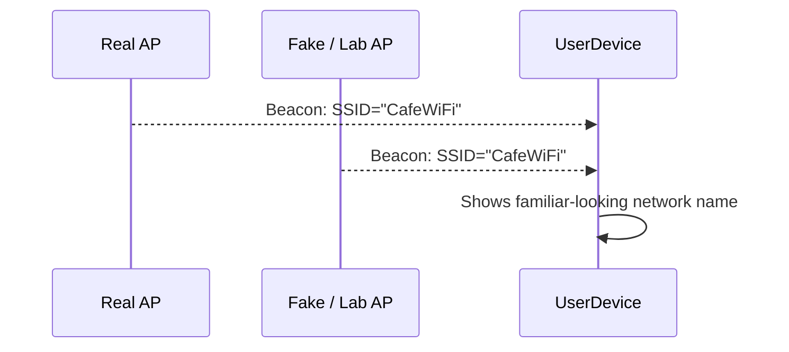
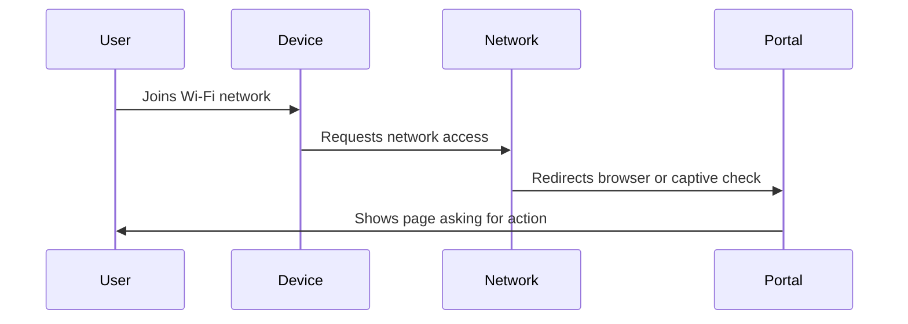

# User Awareness

## Purpose

This section explains what ordinary users and students need to understand after seeing the Mar-x-Auder capabilities. The purpose is not to scare users away from Wi-Fi or Bluetooth. The purpose is to build accurate intuition about trust.

The central lesson is that wireless trust is layered. A familiar network name, a strong signal, or a professional-looking page is not enough to prove that the connection is safe.

## Technologies involved

This section connects to the following foundations:

- [Wi-Fi / 802.11 basics](../foundations/02-wifi-80211.md)
- [WPA, WPA2, and WPA3](../foundations/03-wpa-wpa2-wpa3.md)
- [DHCP, DNS, HTTP, and captive portals](../foundations/06-dhcp-dns-http-captive-portals.md)
- [TLS, certificates, and trust](../foundations/07-tls-certificates.md)
- [Bluetooth and BLE](../foundations/08-bluetooth-ble.md)

User awareness is most effective when it explains the mechanism. Users do not need to become protocol engineers, but they should understand why certain warnings and behaviors matter.

## Main user-facing lessons

| Lesson | Why it matters |
|---|---|
| A Wi-Fi name is not identity | SSIDs can be copied or imitated |
| A strong signal is not trust | A nearby rogue or lab AP can look stronger than the real one |
| A login page is not proof of legitimacy | Captive portals can be deceptive |
| Certificate warnings matter | TLS warnings indicate a failure in site identity validation |
| Password prompts should be questioned | A Wi-Fi portal should not ask for unrelated credentials |
| Auto-join can create risk | Devices may join known-looking or previously saved networks |
| Bluetooth prompts should be treated carefully | Unexpected pairing or device prompts may be deceptive or noisy |

## The misleading simplicity of Wi-Fi names

Most users think of a Wi-Fi network as a name in a list. Technically, the name is only the SSID. It is advertised in management frames and can be copied.

The user-facing explanation should be simple:

> A Wi-Fi name is like a sign on a door. Anyone can print a similar sign. The real protection comes from the security behind the door and from knowing whether the device is connecting to the expected network.

For home networks, the risk is usually lower if the user controls the router and uses a strong password. In public places, familiar names are less trustworthy.

## Guidance on fake portals

A captive portal is a page that appears before internet access is granted. Many legitimate networks use them. This creates a training problem: users become accustomed to logging in or clicking through unexpected pages.

A safe awareness message:

> A portal may ask for terms acceptance or a voucher. Treat requests for email, school, cloud, banking, router, or Wi-Fi passwords as suspicious unless the reason and identity of the portal are clear.

The important distinction is that a portal can be visually convincing without being trustworthy.

## Guidance on HTTPS and certificate warnings

HTTPS is meant to protect both confidentiality and site identity. A browser warning means the browser could not validate something important about the connection.

Users should not be trained to click through certificate warnings. The warning may indicate:

- wrong hostname;
- expired certificate;
- untrusted issuer;
- interception attempt;
- misconfigured website;
- captive portal interfering with normal browsing.

The practical rule:

> A certificate warning during login is a stop signal. Credentials are not entered until the warning is understood and resolved.

This matters during evil portal demonstrations because a deceptive network may try to push users into HTTP pages or cause HTTPS failures.

## Password prompts and credential boundaries

Users should learn to ask: "Why does this page need this password?"

Examples of suspicious prompts:

- a cafe Wi-Fi page asking for an email password;
- a hotel Wi-Fi page asking for a corporate password;
- a router-looking page appearing on a public network;
- a school-looking page with a strange address;
- a phone prompt asking to trust an unknown certificate;
- a Wi-Fi page asking users to re-enter the network password.

The correct behavior is not to guess. The correct behavior is to stop, verify the network, and use a trusted channel to confirm the prompt.

## Auto-join and remembered networks

Many devices remember networks and may reconnect automatically. This is convenient, but it can create confusion when network names are reused or imitated.

Awareness guidance:

- remove old networks that are no longer used;
- avoid auto-joining open networks;
- be careful with generic SSIDs such as `Free WiFi`, `Guest`, or `Airport WiFi`;
- use managed Wi-Fi profiles for school or organizational networks where available;
- when unsure, use mobile data or a known trusted hotspot.

Modern operating systems include protections such as MAC randomization, but users should not treat them as complete anonymity.

## Probe request privacy

Some devices may reveal information while looking for networks. Modern devices are better than older ones, but privacy leakage can still occur through timing, behavior, device type, or directed probes.

A user-friendly explanation:

> A device looking for Wi-Fi can sometimes reveal clues about networks it has used before. Newer devices try to reduce this, but it is still a reason to avoid keeping unnecessary old networks saved.

Practical advice:

- forget old networks;
- disable Wi-Fi when not needed in sensitive environments;
- avoid joining unknown open networks;
- keep device software updated;
- use privacy features provided by the operating system.

## Bluetooth awareness

Bluetooth and BLE devices often advertise, scan, or request pairing. This is normal behavior, but users should treat unexpected prompts carefully.

User guidance:

- do not accept unexpected pairing requests;
- keep devices non-discoverable when not pairing;
- rename devices if the name reveals personal information;
- update earbuds, watches, phones, and laptops;
- remove old paired devices that are no longer used;
- be cautious of public demos that trigger device pop-ups.

Bluetooth awareness is not about panic. It is about recognizing that nearby wireless interaction can be visible and sometimes noisy.

## Public Wi-Fi behavior

Public Wi-Fi should be treated as an untrusted access network. That does not mean it is always dangerous. It means the user should not grant it more trust than necessary.

Recommended behavior:

- prefer known networks operated by the venue;
- verify the network name with posted material or staff when needed;
- avoid entering sensitive credentials into unexpected portals;
- pay attention to browser certificate warnings;
- keep HTTPS enabled;
- use a trusted VPN when appropriate for the environment;
- avoid file sharing and local discovery features on public networks;
- forget the network after use if it is not needed again.

## Explaining demonstrations to users

A Mar-x-Auder demonstration can easily be misunderstood. The instructor should explain what the device is and is not doing.

### Deauthentication demonstration

Clear explanation:

> The device is not learning the Wi-Fi password. It is sending management traffic that may cause the client to disconnect and reconnect. The lesson is that connection state can be disrupted when management frames are not protected.

### Beacon spam or AP clone demonstration

Clear explanation:

> The device is showing that Wi-Fi names are easy to advertise. This does not mean it has the real network's password. It means users should not trust a network only because the name looks familiar.

### Evil portal demonstration

Clear explanation:

> The device is creating a deceptive web experience. The lesson is that users can be tricked into entering information into the wrong page. This is social engineering supported by network behavior, not a cryptographic break of WPA.

### Handshake or PMKID capture demonstration

Clear explanation:

> The device is observing authentication-related material. It does not display the password. Weak passwords are risky because captured material may support offline guessing.

## Awareness language to avoid

Avoid unclear or sensational wording:

| Avoid saying | Prefer saying |
|---|---|
| "The Wi-Fi was hacked" | "The client was disconnected using management-frame interference" |
| "The password was stolen from the air" | "Authentication material was captured; weak passphrases may be guessed offline" |
| "HTTPS was cloned" | "The user was shown a deceptive page or certificate validation failed" |
| "The network name proves it is safe" | "The SSID is only a label and can be imitated" |
| "Bluetooth is dangerous" | "Unexpected pairing and nearby-device prompts should be treated carefully" |

Precise language builds better intuition.

## User-facing guidance summary

Before joining a network:

- Is this the network I intended to join?
- Is the name generic or easily imitated?
- Does the network require credentials it should not need?
- Did a certificate warning appear?
- Am I being asked to install a profile or root certificate?
- Is mobile data or a known hotspot safer for this task?

After joining a network:

- Did the portal look expected?
- Did the browser stay on HTTPS for sensitive sites?
- Did any unexpected certificate warning appear?
- Did the network ask for unrelated credentials?
- Should I forget this network after use?

For Bluetooth:

- Did I initiate this pairing request?
- Do I recognize the device name?
- Does the prompt match what I am trying to do?
- Should the device be discoverable right now?

## Ethical awareness for students

Readers should understand that technical curiosity does not justify involving uninformed people. The ethical line is based on consent, scope, and effect.

Legitimate learning:

- owned lab network;
- owned or explicitly consented devices;
- fake credentials;
- clear training labels;
- controlled duration;
- minimal data collection;
- deletion of unnecessary captures.

Unethical behavior:

- confusing strangers with fake networks;
- collecting real credentials;
- disrupting other people's connectivity;
- tracking devices or people without consent;
- capturing unrelated traffic and treating it as research data;
- making users believe a training demonstration is a real service.

This framing is stronger than relying on legal wording because it is understandable across jurisdictions and institutions.

## Final user-facing principle

A concise user-awareness summary is:

> Wireless security is not only about passwords. Trust depends on the network name, the connected device or access point, the authentication method, the displayed web page, certificate validation, and the choices made at prompts.

The Mar-x-Auder is useful in education because it makes those hidden layers visible.

## References

- Wi-Fi Alliance, Security: https://www.wi-fi.org/discover-wi-fi/security
- RFC 8446, The Transport Layer Security Protocol Version 1.3: https://www.rfc-editor.org/rfc/rfc8446
- ESP32 Marauder Wiki, Evil Portal Workflow: https://github.com/justcallmekoko/ESP32Marauder/wiki/evil-portal-workflow
