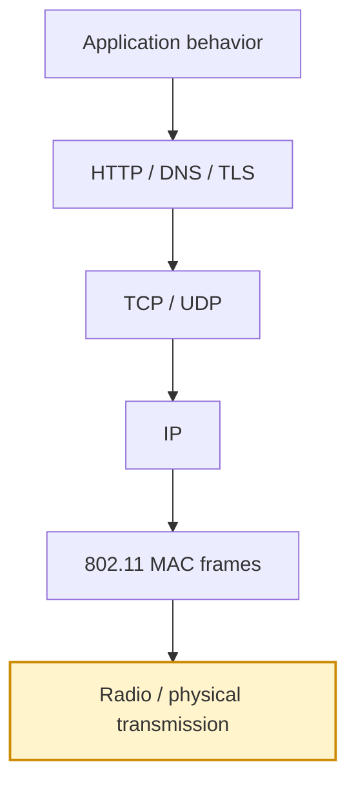
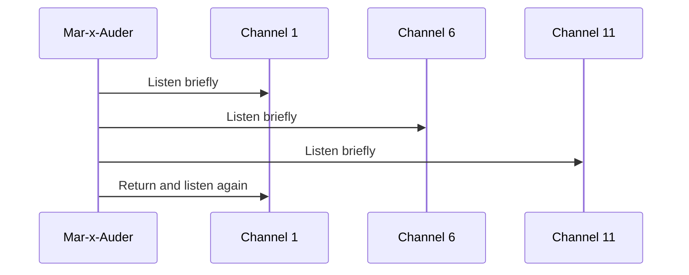
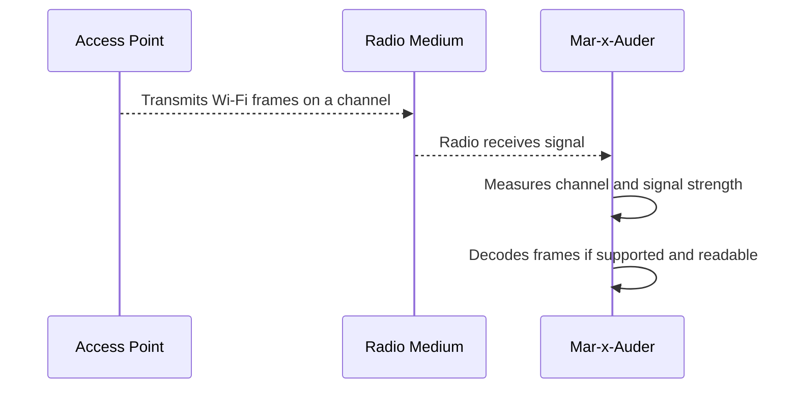

# Radio and Wireless Basics

Wireless tools such as the Mar-x-Auder operate in a physical radio environment before any higher-level network protocol exists. A Wi-Fi access point does not begin as an IP address, a TCP connection, or a website. It begins as radio energy transmitted on a channel, received by nearby devices, and interpreted according to the Wi-Fi standard.

This chapter explains the radio concepts that appear throughout the guide: frequency, channels, signal strength, interference, attenuation, and the practical limits of observation.

## Where radio sits in the stack

Radio is the lowest layer discussed in this guide. It is the part of the system that carries wireless signals through space.

Radio-level observation can reveal that something is transmitting. It can reveal signal strength, channel use, and timing. By itself, it does not explain the full meaning of the traffic. Higher layers are needed to understand whether the signal is a beacon, a deauthentication frame, a DNS request, an HTTPS session, or an application login flow.

## Frequency bands

Wi-Fi uses radio frequency bands. The most common consumer Wi-Fi bands are 2.4 GHz, 5 GHz, and 6 GHz. Bluetooth and Bluetooth Low Energy also use the 2.4 GHz ISM band.

The Mar-x-Auder / ESP32 Marauder class of devices is commonly used for 2.4 GHz Wi-Fi and Bluetooth/BLE research because ESP32-based radios are built around those capabilities. Some Wi-Fi concepts apply to 5 GHz and 6 GHz as well, but the device itself may not observe or transmit on those bands depending on its hardware.

| Band | Common use | Practical behavior |
|---|---|---|
| 2.4 GHz | Wi-Fi, Bluetooth, BLE, many IoT devices | Longer range, better wall penetration, more crowding |
| 5 GHz | Modern Wi-Fi | More channels, higher throughput, shorter range |
| 6 GHz | Wi-Fi 6E / Wi-Fi 7 | Cleaner spectrum where supported, shorter range, newer client/AP support required |

The important lesson is that a wireless research tool is constrained by the radio hardware it contains. If the hardware only supports 2.4 GHz, it cannot directly observe 5 GHz or 6 GHz frames.

## Channels

A Wi-Fi channel is a defined slice of radio spectrum. Access points transmit on channels so that clients know where to listen.

In 2.4 GHz Wi-Fi, the classic practical model is to prefer non-overlapping 20 MHz channels such as 1, 6, and 11 where those are available in the local regulatory domain. Nearby networks on overlapping channels may interfere with each other, even when they use different SSIDs.

A channel analyzer does not need to decrypt traffic. It only needs to observe transmissions and their channel placement. This is why channel analysis is one of the safest and most useful introductory capabilities.

## RSSI and signal strength

RSSI means Received Signal Strength Indicator. It is a measurement of how strong a received signal appears to the radio. In many Wi-Fi tools, RSSI is shown as a negative dBm value. A value closer to zero usually indicates a stronger signal.

Approximate interpretation:

| RSSI range | Common interpretation |
|---|---|
| -30 dBm | Very strong; usually very close |
| -50 dBm | Strong |
| -67 dBm | Often acceptable for reliable data use |
| -75 dBm | Weak or unstable for many applications |
| -85 dBm or lower | Very weak; may be difficult to use reliably |

RSSI is not distance. It is affected by transmit power, antenna orientation, walls, people, furniture, reflections, and interference. A strong signal may come from a nearby low-power device or a farther high-power device. A weak signal may be caused by distance or by a wall between the transmitter and receiver.

## Attenuation and obstacles

Radio signals lose strength as they travel. They are also absorbed, reflected, or scattered by physical objects.

Common sources of attenuation include:

- concrete walls;
- metal doors, cabinets, and elevator shafts;
- water, including people and aquariums;
- low-quality antenna placement;
- hidden access points inside cabinets or behind equipment;
- microwave ovens and other noisy 2.4 GHz devices.

The practical consequence is that Wi-Fi behavior is spatial. A network may look stable in one room and unstable five meters away.

## Interference and congestion

Interference means that unwanted radio energy makes communication harder. Congestion means many devices are trying to share the same medium.

They are related but not identical.

| Problem | Meaning | Example |
|---|---|---|
| Interference | Non-cooperative signal energy disrupts reception | Microwave noise near 2.4 GHz |
| Congestion | Many Wi-Fi devices compete for airtime | Apartment building with many APs |
| Overlap | Adjacent channels partially collide | APs using channels 4 and 6 in 2.4 GHz |

A Mar-x-Auder can help demonstrate visible Wi-Fi congestion, but it is not a complete spectrum analyzer. It sees frames that its radio can decode. It may not show all non-Wi-Fi radio noise.

## Channel hopping versus fixed-channel observation

Many wireless tools can hop between channels to discover more devices. Channel hopping is useful for broad surveys, but it also means the tool is not listening to any single channel continuously.

The tradeoff is important:

| Mode | Benefit | Limitation |
|---|---|---|
| Channel hopping | Finds more networks across channels | May miss frames while listening elsewhere |
| Fixed channel | Captures one channel more completely | Ignores other channels |

For packet capture, fixed-channel observation is usually clearer. For discovery, channel hopping is usually more useful.

## What the Mar-x-Auder is handling at this layer

At the radio layer, the device is handling:

- which channel to monitor;
- how strong nearby transmissions appear;
- whether decodable Wi-Fi/Bluetooth frames are present;
- whether a capture is focused on one channel or hopping across many.

At this layer, the device is not yet handling:

- IP addresses;
- TCP ports;
- websites;
- TLS certificates;
- user credentials;
- application content.

Those appear only after higher layers are involved.

## Normal wireless observation flow

The device does not need to join the network to observe many management frames. It only needs to be close enough, on the right channel, and able to decode the frame type.

## Ethical and safety boundary

Radio observation should still respect people and environments. A classroom lab may accidentally observe unrelated devices nearby. Ethical research minimizes that exposure, avoids publishing third-party identifiers, and does not use observations to track uninvolved people.

Legitimate use means observing owned or consented environments for learning, troubleshooting, and defense. The ethical line is crossed when wireless observations are used to profile, track, disrupt, deceive, or identify uninvolved people or devices.

## Ability chapters that depend on this foundation

- Access point discovery
- Channel analysis
- Signal monitoring
- Beacon sniffing
- Probe request observation
- Raw packet capture
- Wardriving
- Bluetooth and BLE observation

## References

- IEEE 802.11 Working Group: <https://www.ieee802.org/11/>
- Wi-Fi Alliance, Wi-Fi technology and certification resources: <https://www.wi-fi.org/>
