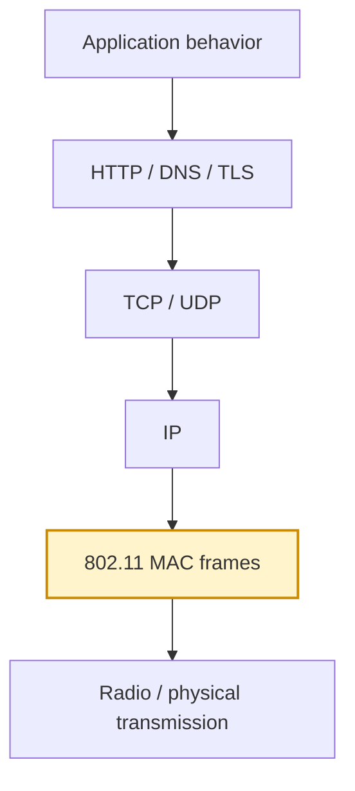
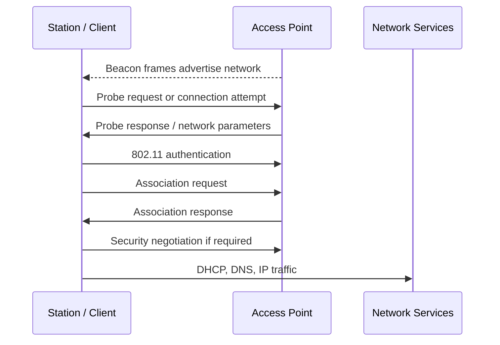
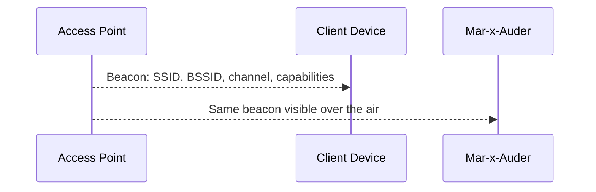
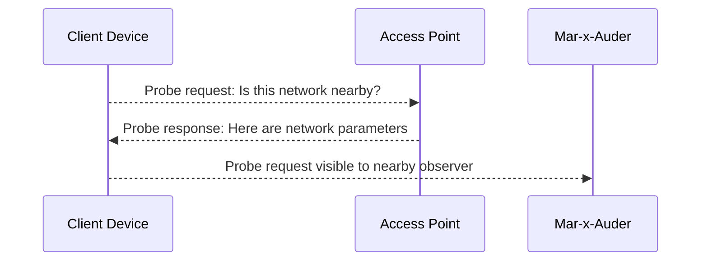
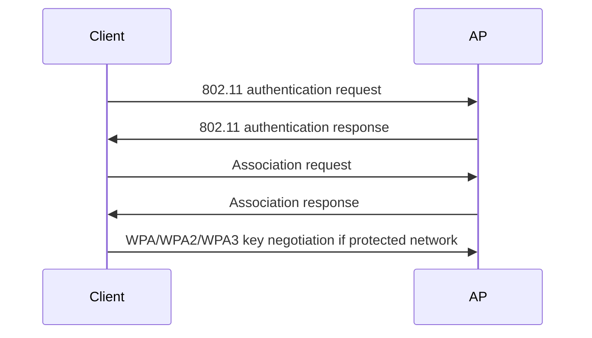
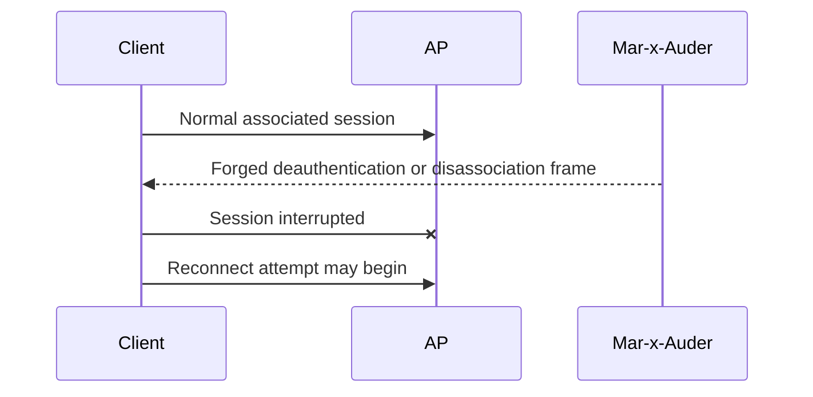
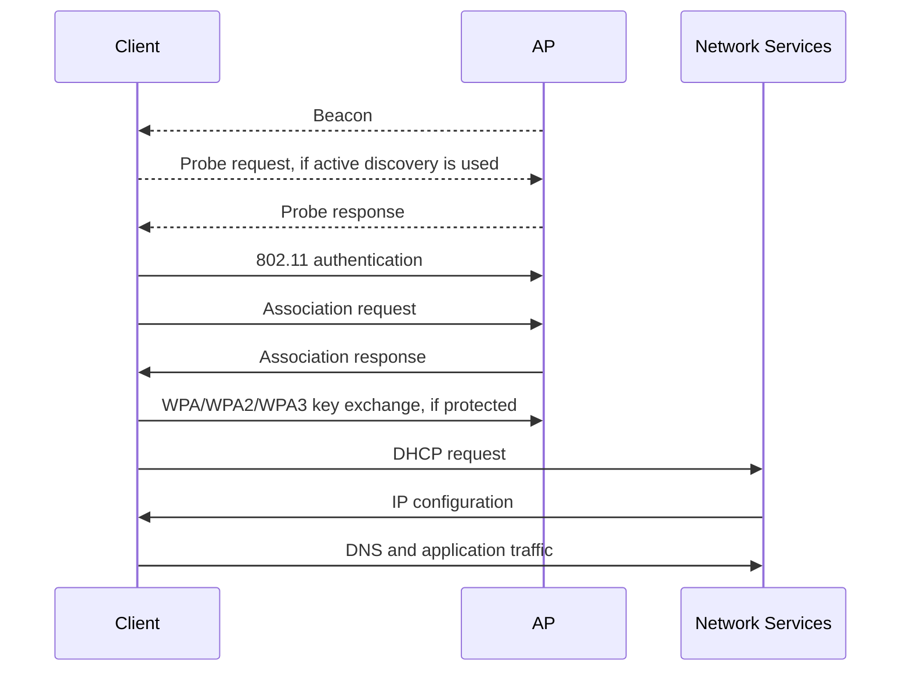

# Wi-Fi and 802.11 Basics

Wi-Fi is built on the IEEE 802.11 family of standards. The most important idea for this guide is that Wi-Fi has its own link-layer protocol before IP, TCP, HTTP, or TLS are involved.

Many Mar-x-Auder capabilities operate at this 802.11 layer. Beacon spam, AP clone spam, probe observation, deauthentication, disassociation, raw sniffing, and station observation are not primarily TCP/IP features. They involve Wi-Fi frames exchanged between stations and access points.

## Where 802.11 sits in the stack

The 802.11 layer defines how wireless devices discover each other, advertise networks, associate, exchange management information, and carry data frames over the air.

## Main roles: access point and station

A typical Wi-Fi network has two basic roles:

| Role | Meaning |
|---|---|
| Access point / AP | The device that advertises the network and bridges wireless clients to the rest of the network |
| Station / STA / client | A laptop, phone, IoT device, or other device that joins a Wi-Fi network |

The access point periodically advertises the network. A station discovers networks, selects one, authenticates, associates, completes security negotiation if required, then starts sending higher-layer traffic.

## SSID and BSSID

The SSID is the human-readable network name. The BSSID is the radio identity of a specific access point interface, usually represented as a MAC address.

| Term | Example | Meaning |
|---|---|---|
| SSID | `LabNetwork` | Name shown to users |
| BSSID | `aa:bb:cc:11:22:33` | Specific AP radio identity |
| ESSID | Often used loosely as SSID | Extended service set name |

A key lesson in this guide is that **SSID is not identity**. A device can advertise the same SSID string as another network. The client must rely on security negotiation and remembered network configuration, not only the visible name.

## 802.11 frame families

802.11 traffic is organized into frame families. The three broad categories are management, control, and data.

| Frame family | Purpose | Examples relevant to this guide |
|---|---|---|
| Management frames | Create, maintain, or end Wi-Fi relationships | Beacon, probe request/response, authentication, association, deauthentication, disassociation |
| Control frames | Coordinate access to the wireless medium | ACK, RTS, CTS |
| Data frames | Carry network payloads | Encrypted or unencrypted traffic carrying IP packets |

The Mar-x-Auder guide focuses heavily on management frames because many educational capabilities involve observing or injecting them.

## Beacon frames

Beacon frames are periodic advertisements sent by access points. They tell nearby stations that a network exists and describe important parameters.

A beacon may include:

- SSID;
- BSSID;
- channel information;
- supported rates;
- timing information;
- security capabilities;
- vendor-specific information;
- network capability information.

Normal beacon flow:

Beacon sniffing observes these frames. Beacon spam transmits fabricated beacon frames. AP clone spam transmits beacon frames that imitate the SSID of another network.

## Probe requests and probe responses

A station can discover networks passively by listening for beacons or actively by sending probe requests.

Probe behavior matters for privacy. Depending on the device, operating system, and configuration, probe requests may reveal information about networks the client is looking for. Modern devices often use MAC randomization and less verbose probe behavior, but the privacy lesson remains important.

## Authentication and association

802.11 authentication and association are link-layer steps used before normal network traffic begins.

The naming can be confusing: 802.11 authentication is not the same thing as WPA password verification. It is part of the Wi-Fi link establishment process. WPA/WPA2/WPA3 security negotiation happens as an additional layer after association.

Simplified flow:

This distinction is critical. A deauthentication frame interferes with 802.11 management state. It does not directly reveal a Wi-Fi password, decrypt data, or attack HTTP/TLS.

## Deauthentication and disassociation

Deauthentication and disassociation frames end or alter the relationship between a station and an access point.

| Frame | Effect |
|---|---|
| Disassociation | Ends the current association while the station may remain authenticated |
| Deauthentication | Ends the authenticated relationship and forces the station to restart more of the connection process |

Interference point:

Historically, many management frames were not protected in the same way as encrypted data frames. Protected Management Frames were introduced to reduce the ability to forge certain management frames in protected networks.

## Data frames and encryption

Data frames carry higher-layer traffic such as IP packets. On a protected WPA/WPA2/WPA3 network, data frames are encrypted after key negotiation.

The Mar-x-Auder may still observe that encrypted data frames exist, along with metadata such as frame timing and MAC-layer information, but it cannot simply read encrypted application traffic without the necessary cryptographic context.

The practical distinction:

| What is often visible | What is not directly visible on a protected network |
|---|---|
| Beacons, some probes, metadata, management behavior | Plain HTTP content inside encrypted Wi-Fi data frames |
| BSSID, channel, frame types | WPA-protected payloads without keys |
| Deauth/disassociation events | TLS-protected website content |

## Normal Wi-Fi connection flow

The ability chapters in this guide show where each Mar-x-Auder capability observes, injects, or interferes with this flow.

## Capability mapping

| Capability | 802.11 element involved | Type |
|---|---|---|
| Access point discovery | Beacons and probe responses | Observation |
| Beacon sniffing | Beacon frames | Observation / capture |
| Probe request observation | Probe request frames | Observation / privacy analysis |
| Station observation | Client/AP relationships | Observation |
| Raw packet capture | Management/control/data frames | Capture |
| Deauthentication lab | Deauth/disassociation management frames | Injection / interference |
| Beacon spam | Fabricated beacon frames | Injection |
| AP clone spam | Beacon frames using copied SSID values | Impersonation / confusion |
| Probe request flooding | Fabricated probe request behavior | Injection / noise |

## Ethical and safety boundary

802.11 visibility does not make every observed device a valid research target. A wireless device can hear nearby traffic that belongs to uninvolved people. Ethical research limits collection, avoids identification, and keeps active transmission inside controlled self-owned or explicitly consented environments.

The ethical line is crossed when 802.11 capabilities are used to disconnect others, confuse users, impersonate networks, track devices, or collect data outside the defined research scope.

## Ability chapters that depend on this foundation

- Access point discovery
- Beacon sniffing
- Probe request observation
- Station observation
- Raw packet capture
- Deauthentication and disassociation
- Beacon spam
- AP clone spam
- Probe request flooding

## References

- IEEE 802.11 Working Group: <https://www.ieee802.org/11/>
- IEEE 802 standards availability: <https://www.ieee802.org/11/>
- IEEE 802 privacy threat analysis material: <https://www.ieee802.org/1/files/public/docs2017/802E-henry-private-threat-analysis-0115-v01.pdf>
