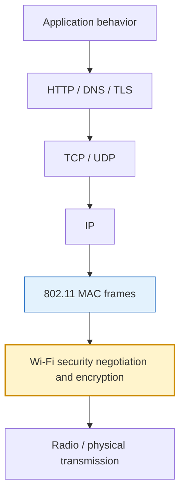
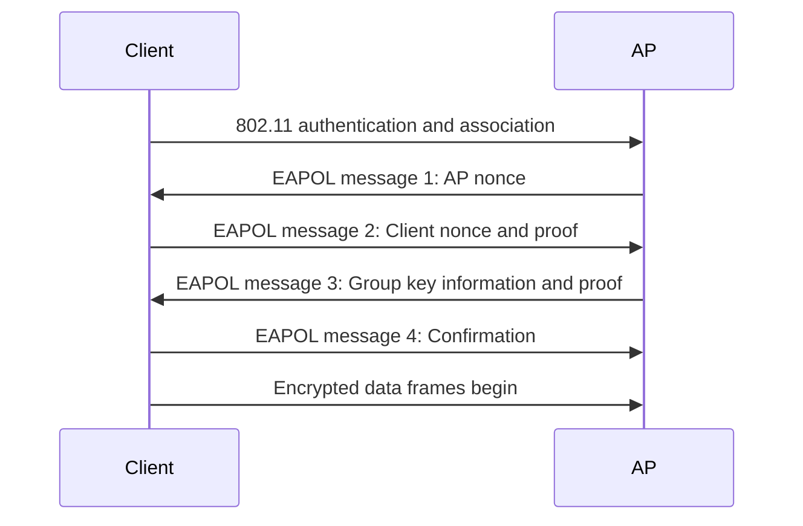
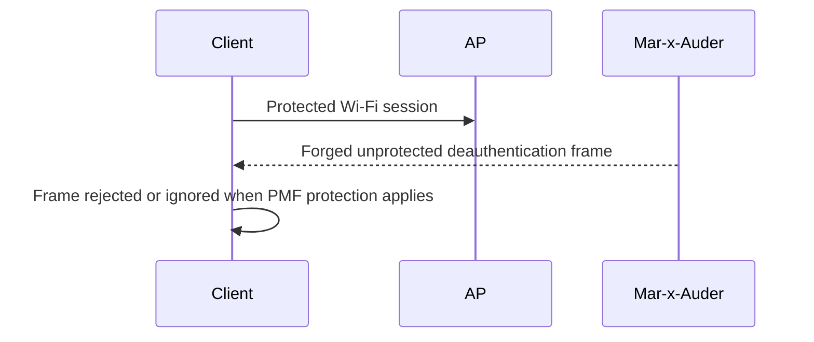
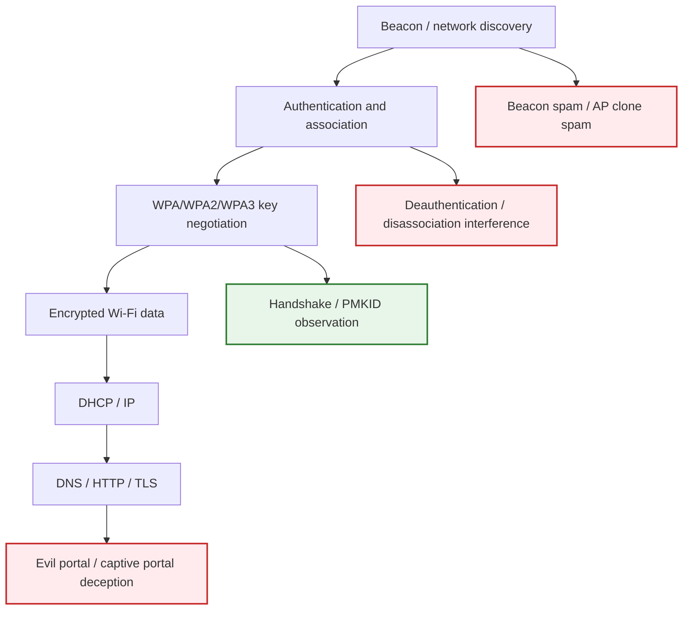

# WPA, WPA2, WPA3, and Wi-Fi Security

Wi-Fi security is often misunderstood because many different processes are compressed into the phrase “connecting to Wi-Fi.” A protected Wi-Fi connection involves discovery, association, authentication, key negotiation, encryption, and later IP networking. WPA, WPA2, and WPA3 describe security mechanisms used to protect Wi-Fi networks after the basic 802.11 link process begins.

This chapter explains what Wi-Fi security protects, what it does not protect, and where Mar-x-Auder capabilities such as deauthentication, handshake observation, PMKID capture, AP cloning, and evil-portal demonstrations fit into the security model.

## Where WPA sits in the stack



WPA-family security protects Wi-Fi link traffic. It is separate from HTTPS/TLS, which protects web traffic at a higher layer. A secure website can still use TLS even on an open Wi-Fi network. A WPA2 network can still carry malicious HTTP content if the user connects to the wrong service. These layers solve different problems.

## Open networks versus protected networks

An open Wi-Fi network does not require a shared Wi-Fi password to connect. A protected network requires a security process such as WPA2-Personal, WPA3-Personal, or WPA-Enterprise.

| Network type | Access model | Main risk |
|---|---|---|
| Open network | Anyone nearby can join | No Wi-Fi-layer encryption for ordinary open networks; higher-layer protections matter greatly |
| WPA/WPA2-Personal | Shared passphrase | Weak passphrases can be audited through captured authentication artifacts |
| WPA3-Personal | SAE-based password-authenticated exchange | Stronger protection against offline guessing, but deployment and transition-mode details matter |
| WPA/WPA2/WPA3-Enterprise | Per-user authentication through 802.1X/EAP/RADIUS | Certificate validation and identity infrastructure become critical |

The Mar-x-Auder guide treats these as different learning environments because the same visible network name may behave very differently depending on the configured security mode.

## What WPA protects

WPA-family security is designed to protect Wi-Fi data traffic between a station and an access point.

It helps provide:

- confidentiality for data frames;
- integrity protection for protected traffic;
- key establishment for a session;
- protection against simple passive reading of Wi-Fi data;
- stronger authentication properties in newer modes.

It does not automatically protect:

- users from joining a fake network with a similar name;
- users from typing credentials into a fake portal;
- all management-frame behavior unless PMF is supported and required;
- weak passphrases from offline guessing in older PSK models;
- application-layer trust problems such as certificate warnings or phishing pages.

## WPA2-Personal simplified

WPA2-Personal uses a shared passphrase. The passphrase is not sent over the air as plain text. Instead, the client and access point use key derivation and a four-way handshake to prove they share the right secret and to derive session keys.

Simplified WPA2-Personal flow:



The passphrase is not recovered from the air by simply capturing this exchange. The security concern is that captured handshake material can be used in a password-audit context to test guesses offline. A strong passphrase makes that impractical; a weak one may make it feasible.

## PMK, PTK, and GTK in plain language

The exact cryptographic details are complex, but the conceptual roles are important.

| Term | Plain meaning |
|---|---|
| PSK | The shared secret derived from the Wi-Fi passphrase in Personal mode |
| PMK | Pairwise Master Key; long-lived key material derived from authentication |
| PTK | Pairwise Transient Key; session-specific key material for client/AP communication |
| GTK | Group Temporal Key; key material for broadcast/multicast traffic |
| EAPOL | Protocol messages used during key negotiation |

Students do not need to memorize every field to understand the security lesson: the network does not send the password. It establishes proof and derives working encryption keys.

## PMKID concept

Some networks may expose a PMKID value as part of roaming and key-management behavior. In password-audit contexts, PMKID material can sometimes be captured without waiting for a full client reconnect. The risk is again tied to offline password guessing against weak passphrases.

A correct explanation avoids two common mistakes:

- PMKID capture is not the same as reading the Wi-Fi password.
- PMKID capture is not useful against a strong passphrase in the same way it may be useful against a weak one.

## WPA3-Personal and SAE

WPA3-Personal replaces the WPA2-Personal PSK exchange model with SAE, Simultaneous Authentication of Equals. SAE is designed to improve resistance to offline dictionary attacks and provide stronger password-authenticated key exchange properties.

Simplified WPA3-Personal flow:

```mermaid
sequenceDiagram
    participant Client
    participant AP

    Client->>AP: 802.11 discovery and association process
    Client<->>AP: SAE commit and confirm exchange
    Client<->>AP: Key material established
    Client<->>AP: Protected data communication
```

The practical lesson is not that WPA3 makes all attacks impossible. The lesson is that the authentication design changes the economics and mechanics of password guessing and management-frame protection.

## Protected Management Frames

Protected Management Frames, often referred to as PMF, protect certain management frames from forgery. This matters because deauthentication and disassociation interference targets management-frame behavior.

Without PMF, a client may accept forged management frames that appear to come from an access point. With PMF required and properly supported, robust management frames receive protection, making simple forged deauthentication and disassociation behavior much less effective.



PMF behavior depends on AP support, client support, network configuration, and security mode. WPA3 networks generally make PMF more central than older WPA2-only networks.

## Transition modes

Many real networks run compatibility modes so older devices can still connect. A network may advertise support for newer security while still allowing older behavior for legacy clients.

This matters because readers may expect a single label such as “WPA3” to fully describe the network. It may not. A mixed WPA2/WPA3 transition mode can behave differently from WPA3-only mode.

| Mode | Practical implication |
|---|---|
| WPA2-only | Broad compatibility, older security assumptions |
| WPA3-only | Stronger modern posture, may exclude older devices |
| WPA2/WPA3 transition | Compatibility with mixed security behavior |

## Where Mar-x-Auder capabilities fit

| Capability | Security concept involved | Correct interpretation |
|---|---|---|
| Deauthentication | Management-frame protection | Disruption of association state, not password recovery |
| Handshake capture | WPA2 key negotiation artifacts | Enables password-audit concepts if passphrase is weak |
| PMKID capture | Key-management artifact | Can support password-audit concepts in some configurations |
| AP clone spam | SSID trust | Shows that network name is not cryptographic identity |
| Evil portal | User deception and captive-portal behavior | Social engineering, not WPA cryptographic break |
| WPA3/PMF comparison | Modern security behavior | Shows why protections change attack outcomes |

## Normal protected connection flow

```mermaid
sequenceDiagram
    participant Client
    participant AP
    participant Network as Network Services

    AP-->>Client: Beacon advertises SSID and security capabilities
    Client->>AP: Authentication and association
    Client<->>AP: WPA/WPA2/WPA3 security negotiation
    Client<->>AP: Encrypted Wi-Fi data frames
    Client->>Network: DHCP, DNS, and application traffic
```

## Interference points used in the guide



The same device can touch different points in the chain. That is why each ability chapter identifies its exact technology layer and interference point.

## Ethical and safety boundary

Security research on WPA-family behavior is legitimate when it is limited to owned or consented networks and devices. It becomes unethical when it is used to interrupt connectivity, capture authentication material, impersonate networks, or pressure users outside the agreed scope.

A clear ethical boundary is especially important for Wi-Fi security because wireless range can cross walls. A lab action may be visible outside the room. The guide therefore treats active interference and authentication-artifact capture as controlled-lab capabilities only.

## Ability chapters that depend on this foundation

- Deauthentication and disassociation
- Handshake and PMKID capture
- WPA3 SAE and PMF behavior
- AP clone spam
- Evil portal
- Hardening Wi-Fi networks

## References

- Wi-Fi Alliance: <https://www.wi-fi.org/>
- IEEE 802.11 Working Group: <https://www.ieee802.org/11/>
- IEEE material on protected management frames: <https://www.ieee802.org/misc-docs/GlobeCom2009/IEEE_802d11_Kraemer.pdf>
