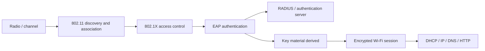
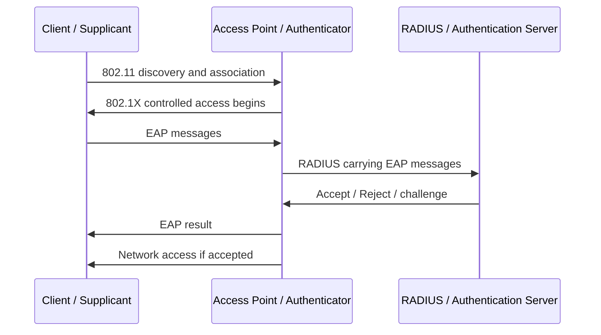
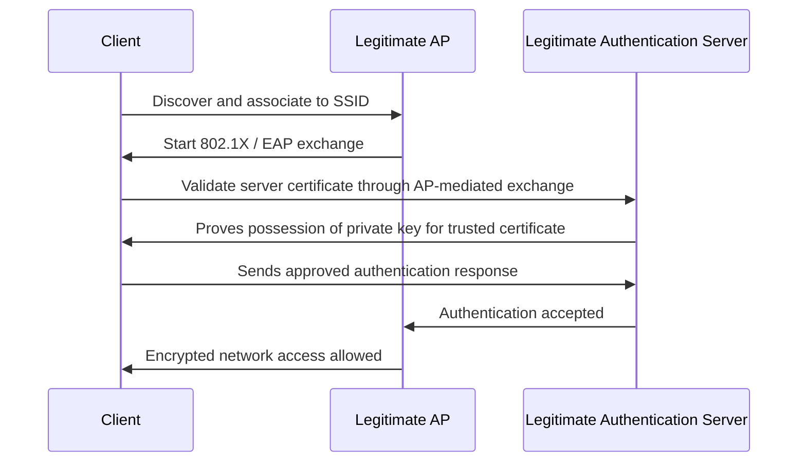
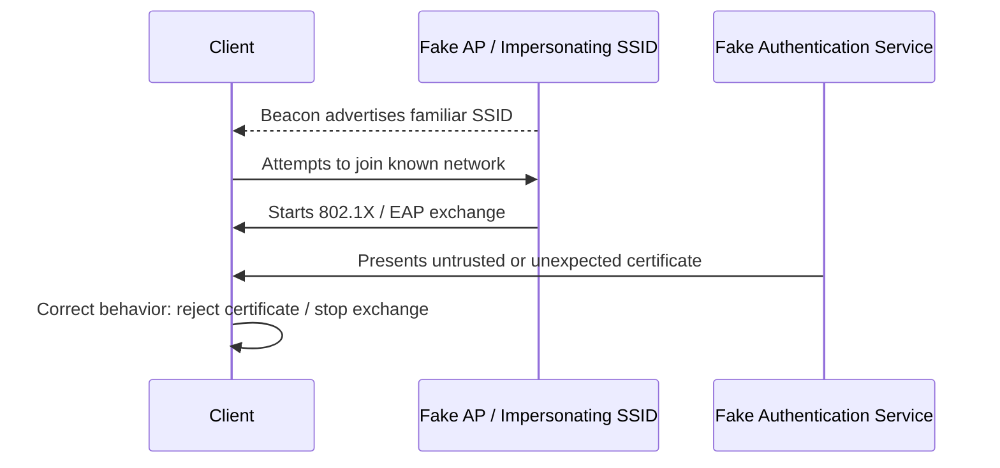

# WPA Enterprise and Certificates

## Purpose of this section

WPA Enterprise is the authentication model used by many organizations, schools, universities, and managed networks. It is different from WPA Personal because users do not all share one Wi-Fi password. Instead, the client proves its identity through an authentication exchange, usually involving 802.1X, EAP, and a backend authentication service such as RADIUS.

This section explains the building blocks that matter for Mar-x-Auder labs involving enterprise Wi-Fi concepts, certificate validation, evil-twin behavior, and authentication-server impersonation risk.

The goal is not to teach unauthorized access to enterprise networks. The goal is to make clear why enterprise Wi-Fi is safer when configured correctly, why it fails dangerously when certificate validation is ignored, and where a Wi-Fi research device can observe or interfere with the surrounding process.

## Relevant Mar-x-Auder abilities

This foundation section is referenced by ability chapters involving:

- access point discovery;
- beacon and SSID impersonation;
- evil twin concepts;
- authentication artifact observation;
- WPA Enterprise behavior;
- certificate trust and validation;
- user deception through fake network identity.

## Technology stack position

WPA Enterprise sits between basic Wi-Fi association and normal IP networking.

The important point is that IP networking normally begins only after the Wi-Fi access decision has succeeded. In an enterprise network, the access decision is not only “does the client know a shared password?” It is “did the client complete an approved authentication method and trust the correct authentication server?”

## WPA Personal compared with WPA Enterprise

WPA Personal and WPA Enterprise solve different problems.

| Model | Typical use | Credential model | Main risk |
|---|---|---|---|
| WPA/WPA2/WPA3 Personal | Home, small office, lab network | One shared passphrase | Shared secret leaks or weak password guessing |
| WPA Enterprise | Organizations, schools, campuses | Per-user or per-device identity | Misconfigured certificate validation, weak EAP methods, credential phishing |

In WPA Personal, the user enters a shared Wi-Fi passphrase. In WPA Enterprise, the user or device authenticates using a method such as username/password, client certificate, SIM-based credentials, or another EAP method.

## 802.1X: port-based access control

802.1X is a network access-control framework. In a Wi-Fi environment, it controls whether a client is allowed to pass normal network traffic through the access point.

The common participants are:

| Participant | Role |
|---|---|
| Supplicant | The client device trying to join the network |
| Authenticator | The access point or network device controlling access |
| Authentication server | The backend service that decides whether the client should be allowed |

The access point acts as a gatekeeper. It does not necessarily decide the user's identity by itself. It forwards authentication messages between the client and the authentication server.

## EAP: a container for authentication methods

EAP, the Extensible Authentication Protocol, is not a single login method. It is a framework that supports multiple authentication methods. Some methods use certificates, some use tunneled username/password authentication, and some use device or SIM-based credentials.

Common EAP families include:

| EAP method | General idea | Security dependency |
|---|---|---|
| EAP-TLS | Client and server authenticate with certificates | Correct certificate issuance and trust management |
| PEAP | Creates a TLS tunnel, then authenticates inside it | Client must validate the server certificate |
| EAP-TTLS | Similar tunneled model with flexible inner authentication | Client must validate the server certificate |
| EAP-SIM / AKA | Uses SIM/mobile-network credentials | Operator and device provisioning |

The critical lesson for students is that the EAP method determines what must be protected. In many enterprise deployments, the most important user-side control is validation of the authentication server certificate.

## RADIUS: the backend authentication service

RADIUS is commonly used to carry authentication, authorization, and configuration information between the network access device and the backend authentication service.

In a Wi-Fi Enterprise deployment, the AP or controller often forwards EAP messages to a RADIUS server. The RADIUS server checks the user's credentials or certificate and returns an access decision.

The client may not communicate with the RADIUS server directly. The AP mediates the exchange. This is why an access point can be part of the trust boundary even when it is not the final identity authority.

## Certificates in WPA Enterprise

Certificates are used to prove identity. In WPA Enterprise, they are most important in two places:

1. The authentication server presents a certificate so the client can verify that it is talking to the correct organization-controlled authentication service.
2. In EAP-TLS, the client may also present a certificate so the server can verify the device or user.

A certificate contains public identity information and a public key. The corresponding private key is not supposed to be shared. The certificate is only useful for authentication when the party presenting it can also prove possession of the matching private key.

## Why server certificate validation matters

When a client joins an enterprise Wi-Fi network, it must avoid sending credentials to an impostor authentication service. Server certificate validation is the control that prevents this.

A correct client configuration checks:

- whether the certificate chains to a trusted certificate authority;
- whether the certificate is valid for the expected authentication server identity;
- whether the certificate is expired or otherwise invalid;
- whether the user or device has been configured to trust that server for this network.

If the client skips validation, accepts any certificate, or trains the user to click through warnings, an attacker can create a fake network with the same SSID and present a different authentication server. The client may then reveal credentials to the wrong party, depending on the EAP method and client behavior.

## Normal enterprise authentication flow

In the normal flow, the client does not trust the SSID alone. The SSID is only the advertised network name. Trust comes from the authentication exchange and certificate validation.

## Interfered flow: fake enterprise network identity

If the client is configured correctly, the attack stops at certificate validation. If the client is misconfigured or the user accepts an unexpected certificate prompt, the device may continue the authentication process with the wrong server.

## Certificate cloning: precise terminology

The phrase “certificate cloning” is often misleading. A public certificate can be copied because certificates are public by design. Copying a certificate is not enough to impersonate a service.

A successful impersonation would require one of the following:

- possession of the matching private key for the certificate;
- a valid certificate for the expected name issued by a trusted authority;
- installation of a rogue trusted root certificate on the client;
- a client that fails to validate the server certificate correctly;
- a user who accepts a certificate warning and continues.

The practical lesson is that trust depends on validation and private-key proof, not on the visual appearance of a certificate file or network name.

## Where Mar-x-Auder fits

A Mar-x-Auder-class device can help demonstrate the surrounding conditions of enterprise Wi-Fi risk:

- SSIDs can be observed and imitated.
- Beacon frames can advertise familiar names.
- Clients may attempt to connect to familiar SSIDs.
- Evil-twin behavior can be demonstrated in a lab.
- The visible network name is not the same thing as cryptographic identity.

The device is not presented as “breaking WPA Enterprise.” The more accurate teaching point is that enterprise Wi-Fi depends on correct authentication and certificate validation, and weak configuration can turn network familiarity into a credential-exposure risk.

## Ethical and safety boundary

Legitimate research means using a lab SSID, lab authentication server, lab client, and training credentials. The research subject must be the system being studied, not uninvolved people.

The ethical line is crossed when a fake enterprise SSID, fake authentication service, or deceptive portal is used to collect credentials, confuse real users, or impersonate an organization outside a controlled educational setting.

## Defensive understanding

The main defenses are:

- require server certificate validation on managed clients;
- use EAP-TLS where appropriate;
- avoid user-managed “trust this certificate” prompts for enterprise access;
- deploy managed network profiles through MDM or equivalent tooling;
- monitor for duplicate SSIDs and suspicious BSSIDs;
- train users that a familiar network name is not proof of authenticity.

## References

- RFC 3748: Extensible Authentication Protocol (EAP): https://datatracker.ietf.org/doc/html/rfc3748
- RFC 2865: Remote Authentication Dial In User Service (RADIUS): https://datatracker.ietf.org/doc/html/rfc2865
- RFC 3579: RADIUS support for EAP: https://www.rfc-editor.org/info/rfc3579/
