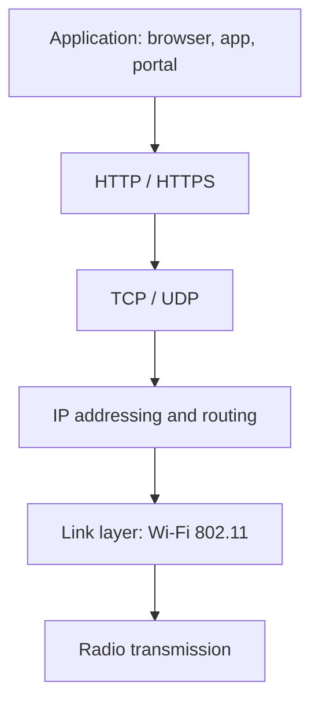
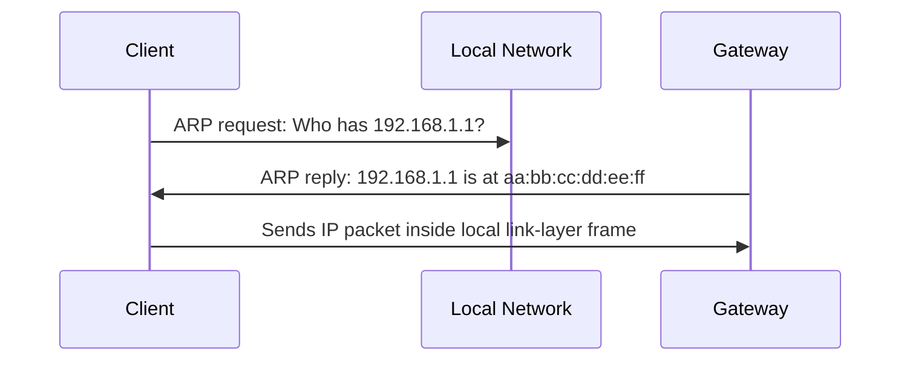
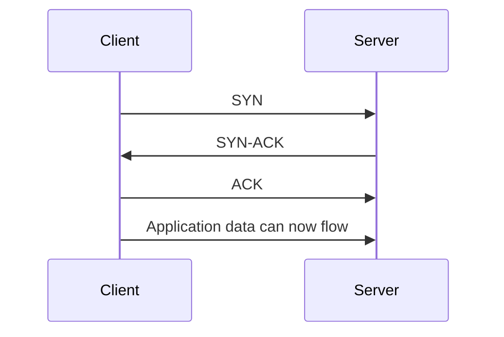
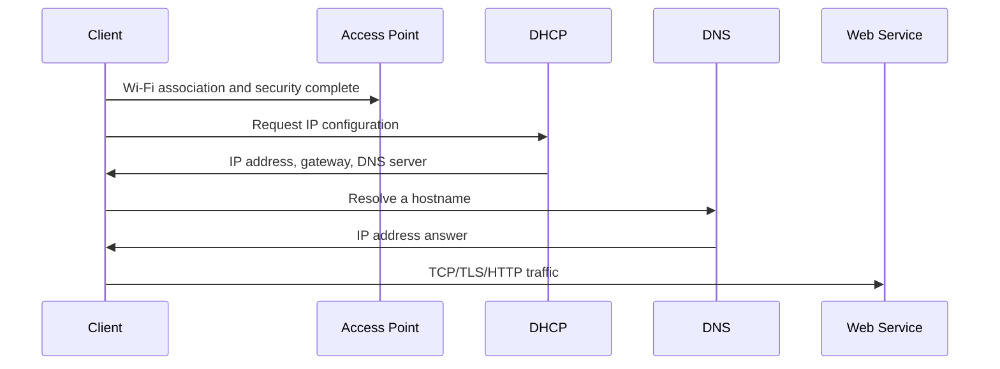
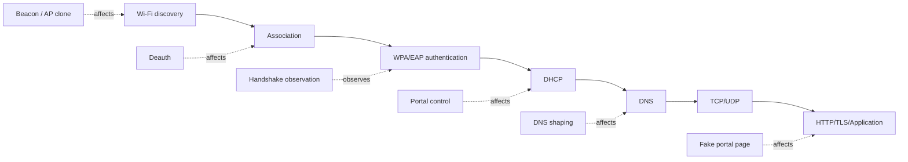

# TCP/IP Networking

## Purpose of this section

Many Mar-x-Auder capabilities happen before TCP/IP exists. Beacon frames, probe requests, deauthentication, and association are Wi-Fi-layer behaviors. Other capabilities, especially evil portal demonstrations and captive portal behavior, become meaningful only after the client has joined a network and started using IP, DHCP, DNS, TCP, UDP, HTTP, and TLS.

This section explains the TCP/IP building blocks needed to understand where Wi-Fi ends and normal network communication begins.

## Relevant Mar-x-Auder abilities

This foundation section is referenced by ability chapters involving:

- evil portal demonstrations;
- captive portal behavior;
- DNS and HTTP redirection concepts;
- packet capture analysis;
- separation of Wi-Fi-layer interference from IP-layer behavior;
- defensive network interpretation.

## The stack boundary

A common misunderstanding is to treat “Wi-Fi” and “the internet” as the same thing. They are not.

Wi-Fi provides local wireless link access. TCP/IP provides addressing, routing, and transport once the device has network access.

A deauthentication frame affects the Wi-Fi link layer. It does not directly attack TCP, HTTP, or TLS. An evil portal, by contrast, uses Wi-Fi access plus IP configuration plus DNS/HTTP behavior to influence what the user sees.

## Link layer versus network layer

The link layer moves data across a local medium. In this guide, that local medium is usually Wi-Fi. The network layer moves packets between IP addresses and across routed networks.

| Layer | Example concepts | Mar-x-Auder relevance |
|---|---|---|
| Radio / physical | channel, signal, RSSI | scanning, signal monitoring |
| Link layer | 802.11 frames, association, BSSID | beacon, probe, deauth, AP clone |
| Network layer | IP addresses, subnets, routing | portal networks, client traffic after connection |
| Transport layer | TCP and UDP ports | DNS, HTTP, HTTPS, application flows |
| Application layer | DNS, HTTP, captive portal pages | evil portal and user deception flows |

The Mar-x-Auder can be used to demonstrate features across these boundaries, but each feature should be described at the correct layer.

## IP addresses

An IP address identifies a device interface at the network layer. On a typical home or lab network, the client receives a private IP address such as `192.168.1.50` or `10.0.0.23`.

The IP address is not the same thing as a MAC address:

| Identifier | Layer | Example | Meaning |
|---|---|---|---|
| MAC address | Link layer | `aa:bb:cc:dd:ee:ff` | Local network interface identity, subject to randomization in some contexts |
| IP address | Network layer | `192.168.1.50` | Network-layer address used for routing packets |
| Hostname | Application/user layer | `example.com` | Human-readable name resolved through DNS |

A device can have a Wi-Fi MAC address before it has an IP address. That is why Wi-Fi scanning can observe stations even when normal IP communication has not yet begun.

## Subnets and local delivery

A subnet defines which IP addresses are considered local. For example, in the network `192.168.1.0/24`, addresses from `192.168.1.1` to `192.168.1.254` are typically local.

When a client wants to communicate:

- if the destination IP is local, the client sends traffic directly to the destination at the link layer;
- if the destination IP is outside the local subnet, the client sends traffic to the default gateway/router.

This distinction matters when analyzing portal traffic. A client may first talk to local infrastructure: DHCP server, gateway, DNS resolver, or captive portal service.

## ARP and local address resolution

On IPv4 networks, ARP is commonly used to map an IP address to a local MAC address. If a client knows it wants to reach `192.168.1.1` but does not know the MAC address of that host, it can ask the local network.

ARP is not a Wi-Fi authentication mechanism. It happens after the client has network-layer access. In packet captures, ARP often appears shortly after association and DHCP.

## Routing and the default gateway

A router moves IP packets between networks. In a home or lab network, the Wi-Fi router often acts as:

- access point;
- DHCP server;
- DNS forwarder;
- default gateway;
- NAT device;
- firewall.

These roles are conceptually different even when they are performed by one physical box.

In an evil portal lab, the device or lab infrastructure may imitate or control some of these roles. The important concept is that after Wi-Fi association, the client depends on network services to learn its IP configuration and reach names and websites.

## NAT

Network Address Translation allows many private devices to share one public internet address. NAT is not central to every Mar-x-Auder lab, but students need to understand it because it is common in lab and home networks.

A client may think it is communicating from `192.168.1.50`, while the outside website sees the router's public IP address. This is normal. It also means that packet observations inside the Wi-Fi network and observations on the public internet may not show the same addressing.

## TCP and UDP

TCP and UDP are transport protocols above IP.

| Protocol | General behavior | Common examples |
|---|---|---|
| TCP | Connection-oriented, ordered byte stream, retransmission | HTTP, HTTPS, SSH, many application protocols |
| UDP | Message-oriented, no built-in connection or delivery guarantee | DNS, DHCP, QUIC, streaming and real-time protocols |

TCP is often used when reliable ordered delivery matters. UDP is often used where speed, simplicity, or application-level control matters.

## TCP connection concept

A TCP connection is established before application data is exchanged.

This is far above the Wi-Fi management-frame layer. A deauthentication frame can interrupt TCP connections by breaking the underlying link, but it does not itself participate in TCP.

## UDP concept

UDP does not establish a connection in the TCP sense. A client sends a UDP datagram to a destination IP and port. DNS queries and DHCP messages commonly use UDP.

This matters for captive portal and evil portal labs because early client behavior often includes UDP-based DHCP and DNS before browser-level HTTP behavior appears.

## Normal post-association network flow

Once a client has successfully joined a Wi-Fi network, the typical network sequence is:

Different devices and operating systems may add captive portal checks, connectivity probes, time synchronization, and background service traffic.

## Where interference can occur

Different Mar-x-Auder abilities affect different parts of the chain.

This model helps prevent inaccurate explanations. A fake portal page is not the same thing as a WPA handshake. A cloned SSID is not the same thing as a cloned certificate. A deauthentication frame is not an HTTP request.

## Packet capture interpretation

When reviewing PCAPs, layer identification is required:

- 802.11 management frames: beacons, probes, authentication, association, deauthentication;
- EAPOL: WPA/WPA2 key exchange artifacts;
- ARP: local IPv4 address resolution;
- DHCP: IP configuration;
- DNS: hostname resolution;
- TCP/UDP: transport communication;
- HTTP/TLS: application and encrypted web flows.

Correct layer identification is a core skill. It prevents false claims about what a capture proves.

## Ethical and safety boundary

TCP/IP knowledge is neutral. The ethical line is crossed when network control is used to deceive, disrupt, collect, or redirect uninvolved users or devices.

In this guide, TCP/IP labs must use lab networks, lab clients, fake credentials, and clear training pages. The goal is to understand how the protocols behave, not to trick people into trusting a network they did not agree to study.

## References

- RFC 791: Internet Protocol: https://www.rfc-editor.org/rfc/rfc791
- RFC 8200: IPv6 Specification: https://www.rfc-editor.org/rfc/rfc8200
- RFC 9293: Transmission Control Protocol (TCP): https://www.rfc-editor.org/rfc/rfc9293
- RFC 768: User Datagram Protocol (UDP): https://www.rfc-editor.org/rfc/rfc768
