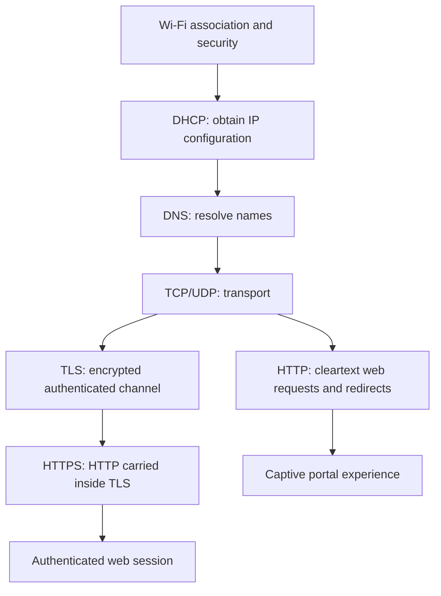
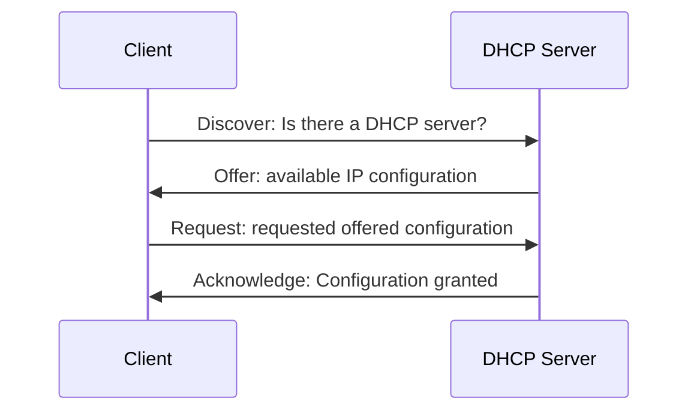
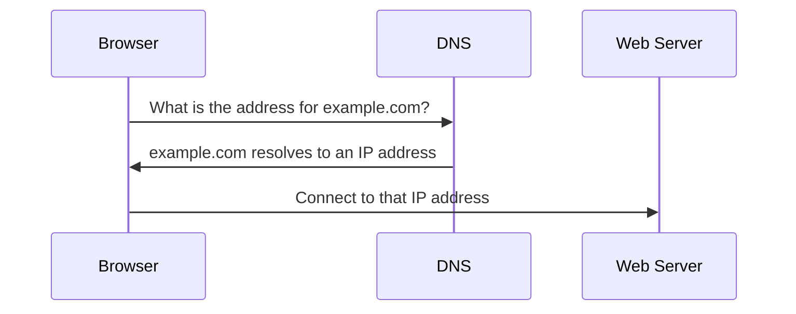
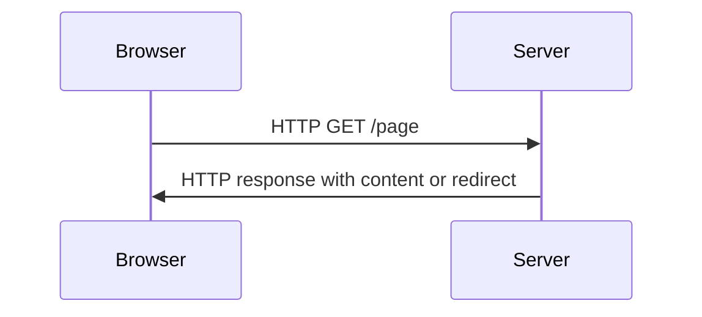
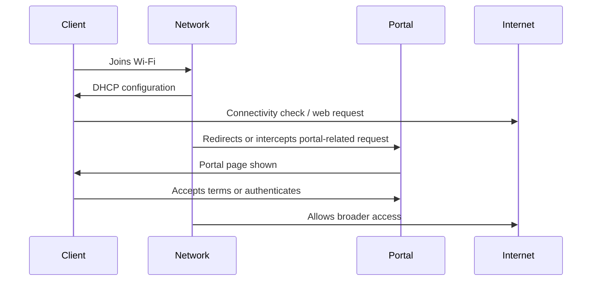
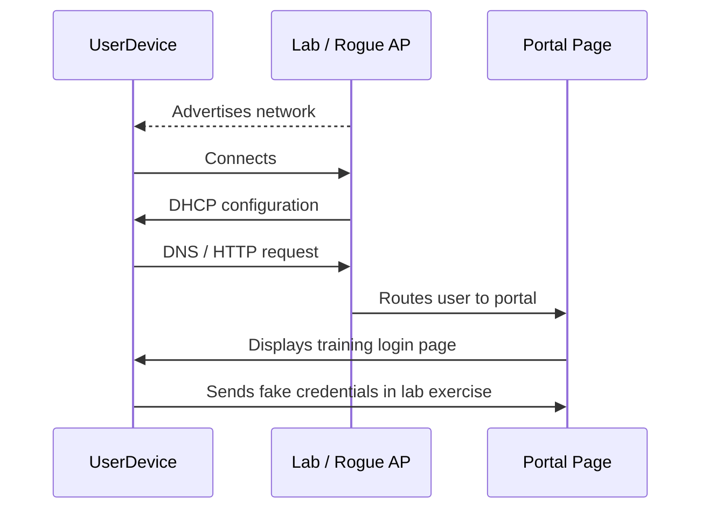

# DHCP, DNS, HTTP, and Captive Portals

## Purpose of this section

This section explains the network services that appear after a client joins a Wi-Fi network. These services are central to evil portal demonstrations and to understanding how a device moves from “connected to Wi-Fi” to “able to browse the web.”

The key idea is that captive portal and evil portal behavior usually does not break Wi-Fi encryption. It shapes the network environment after connection: IP assignment, name resolution, HTTP behavior, and user-interface expectations.

## Relevant Mar-x-Auder abilities

This foundation section is referenced by ability chapters involving:

- evil portal demonstrations;
- fake captive portal pages;
- DNS and HTTP redirection concepts;
- post-association packet capture;
- interpreting browser warnings and TLS behavior;
- separating social engineering from cryptographic attacks.

## Where these technologies sit in the stack

DHCP, DNS, and HTTP are not Wi-Fi management protocols. They become relevant after the client has connected far enough to send normal network traffic.

## DHCP: obtaining network configuration

DHCP gives a client the information it needs to participate in an IP network. This typically includes:

- client IP address;
- subnet mask or prefix;
- default gateway;
- DNS resolver address;
- lease time;
- optional configuration values.

A simplified DHCP flow is often described as Discover, Offer, Request, Acknowledge.

In a lab portal environment, controlling DHCP means controlling the network information the client receives. For example, the lab network may tell the client which gateway and DNS resolver to use.

## DNS: turning names into addresses

DNS maps human-readable names to network addresses and other records. When a browser wants to reach a website, it usually needs to resolve the hostname first.

In captive portal environments, DNS may be used to guide the client toward a portal page. In deceptive environments, DNS behavior can be abused to send the client somewhere unexpected. This is one reason TLS and certificate validation matter: a browser should not silently accept a fake HTTPS identity just because DNS was manipulated.

## HTTP: the web protocol behind many portal flows

HTTP is an application-layer protocol. Browsers use it to request resources and receive responses. HTTP can also carry redirects, which tell the browser to request a different URL.

A simplified HTTP exchange:

Captive portal behavior often relies on HTTP because it is easier to redirect or intercept than HTTPS. Modern operating systems usually perform connectivity checks to detect whether the network is open to the internet or is forcing a portal first.

## HTTPS and TLS as a boundary

HTTPS is HTTP protected by TLS. TLS is designed to provide confidentiality, integrity, and server authentication. A network can route or block HTTPS traffic, but it should not be able to impersonate a real HTTPS site without a trusted certificate for that site and proof of possession of the matching private key.

This creates an important teaching point for evil portal labs:

- Redirecting plain HTTP is easy in a controlled network.
- Impersonating HTTPS correctly is not supposed to be easy.
- Browser certificate warnings are security boundaries, not cosmetic errors.
- A copied public certificate is not enough to impersonate a real HTTPS service.

## Captive portal concept

A captive portal is a network flow that restricts normal access until the user sees or completes a portal page. Hotels, airports, guest networks, and campuses commonly use captive portals for terms acceptance, payment, login, or access control.

Normal captive portal behavior:

Captive portals are not inherently malicious. The risk is that users are trained to enter information into network-provided pages, and deceptive portals can imitate that experience.

## Evil portal concept

An evil portal imitates the captive portal experience for deceptive purposes. In a controlled educational lab, it demonstrates how users can be misled by network names, login pages, and familiar branding.

The important technical distinction is this:

> The portal does not recover the WPA password from encrypted Wi-Fi traffic. It asks the user to type information into a page.

That makes the issue a combination of network control and user-interface deception.

## Expected process versus interfered process

| Stage | Expected process | Interfered portal process |
|---|---|---|
| Wi-Fi selection | User selects a trusted or known network | User may select a network based only on name or appearance |
| IP configuration | Network assigns correct local settings | Lab/rogue network assigns settings under its control |
| DNS | Names resolve through expected resolver | Names may resolve through controlled resolver or be redirected |
| HTTP | Browser reaches requested site or connectivity check endpoint | Browser is redirected or shown portal page |
| HTTPS | Browser validates certificate and hostname | Fake HTTPS should trigger warnings unless trust is compromised |
| User decision | User understands where credentials are being entered | User may trust the page because it appears during Wi-Fi connection |

## Certificate and HTTPS implications

A deceptive portal may try to look like a legitimate login page. TLS is designed to make impersonation difficult, but only if users and devices respect certificate validation.

The following distinctions are central:

- A public certificate can be copied, but the matching private key should not be available.
- A browser should reject a certificate that does not match the requested hostname.
- A self-signed certificate may encrypt traffic but is not automatically trusted.
- A rogue root certificate installed on a client can subvert trust for that client.
- Users should not ignore certificate warnings during Wi-Fi login.

## Where Mar-x-Auder fits

A Mar-x-Auder evil portal demonstration can show how Wi-Fi access, DHCP/DNS/HTTP behavior, and user trust combine into a realistic deception path.

The device is useful for demonstrating:

- why a network name is not proof of identity;
- how a portal can appear before normal browsing;
- why HTTP is easier to manipulate than HTTPS;
- why fake credential collection is a user-deception problem;
- why certificate warnings are meaningful.

The device is not described as “breaking HTTPS” or “stealing Wi-Fi passwords” through the portal. The accurate description is that it can create a deceptive network and web experience in which the user may be persuaded to submit information.

## Ethical and safety boundary

Legitimate portal research uses:

- a lab SSID;
- a lab client;
- fake credentials;
- pages that identify themselves as training material;
- no collection of real passwords or real personal information;
- no imitation of real organizations outside approved training context.

The ethical line is crossed when a portal is used to collect real credentials, mislead uninvolved users, imitate a real institution without consent, or cause people to trust a network they did not agree to study.

## Defensive understanding

Defensive lessons include:

- users should distrust unexpected Wi-Fi login prompts;
- organizations should avoid training users to enter sensitive credentials into arbitrary captive portals;
- HTTPS certificate warnings must be treated as real security events;
- managed devices should use trusted network profiles where possible;
- network monitoring can look for duplicate SSIDs, unusual captive portal behavior, and suspicious DNS patterns.

## References

- RFC 2131: Dynamic Host Configuration Protocol: https://datatracker.ietf.org/doc/html/rfc2131
- RFC 9110: HTTP Semantics: https://datatracker.ietf.org/doc/html/rfc9110
- RFC 8446: The Transport Layer Security (TLS) Protocol Version 1.3: https://datatracker.ietf.org/doc/html/rfc8446
- RFC 8910: Captive-Portal Identification in DHCP and Router Advertisements: https://www.rfc-editor.org/rfc/rfc8910
