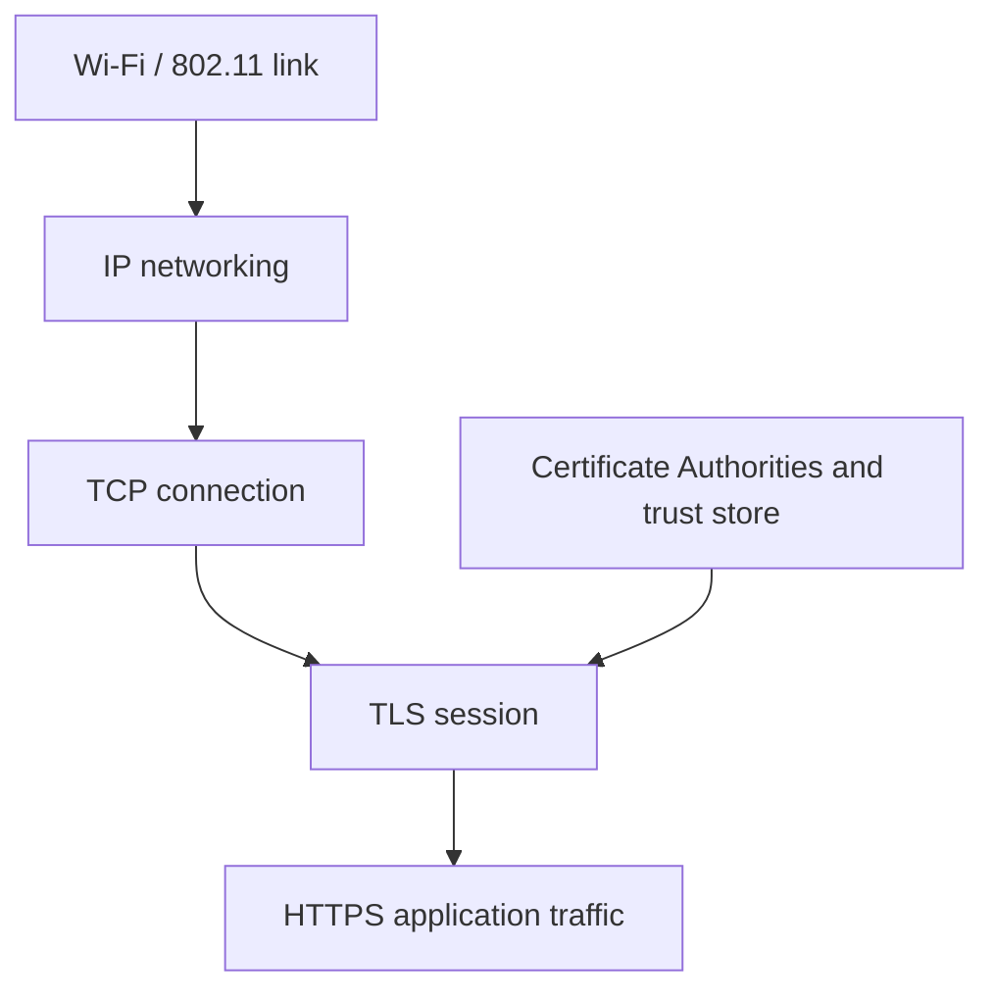
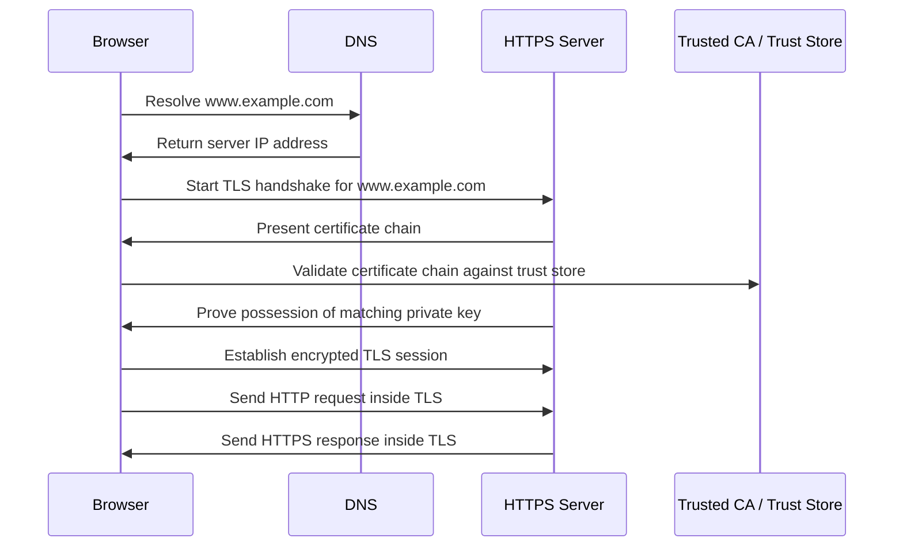
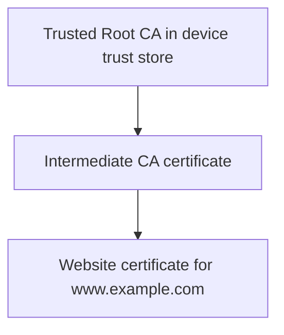
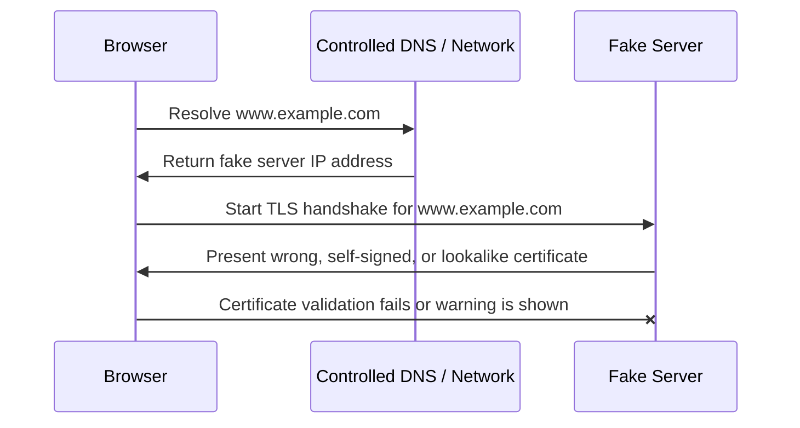

# TLS, Certificates, and Trust

## Purpose of this section

This section explains TLS, certificates, and trust validation. These concepts are essential for understanding what captive portals, evil portals, cloned-looking websites, and network impersonation can and cannot do.

The central point is simple but important: a network tool can influence Wi-Fi association, DHCP, DNS, and HTTP behavior, but HTTPS is designed to prevent silent impersonation of real websites. If a browser accepts a fake identity without warning, something in the trust model has failed or has been deliberately changed.

## Relevant Mar-x-Auder abilities

This foundation section is referenced by ability chapters involving:

- evil portal demonstrations;
- fake captive portal pages;
- DNS and HTTP redirection;
- HTTPS browser warnings;
- certificate validation failures;
- WPA Enterprise certificate validation;
- distinguishing social engineering from cryptographic compromise.

## Where TLS sits in the stack

TLS normally sits above TCP and below the application protocol. HTTPS is HTTP carried inside a TLS-protected connection.

A Mar-x-Auder evil portal demonstration may influence the path that leads a client toward a portal, but it does not automatically defeat TLS. TLS is specifically designed to detect when a server cannot prove that it is the real identity requested by the client.

## SSL versus TLS

The term “SSL” is still often used in casual speech, but modern secure web traffic uses TLS. SSL is the older predecessor family. In this guide, the accurate term is TLS.

When students hear phrases like “SSL certificate,” they should understand that people usually mean an X.509 certificate used by TLS.

## What TLS provides

TLS is intended to provide three major security properties:

| Property | Meaning |
|---|---|
| Confidentiality | Other parties on the network should not be able to read the protected traffic. |
| Integrity | Other parties should not be able to modify the protected traffic without detection. |
| Authentication | The client can verify that the server controls the identity represented by the certificate. |

TLS does not prove that a website is honest, safe, or well-run. It proves that the encrypted connection is with a party that can satisfy the certificate validation rules for the requested name.

## The normal HTTPS flow

In the normal flow, DNS tells the browser where to connect, but DNS alone does not prove identity. The TLS certificate must match the hostname requested by the browser, chain to a trusted authority, be valid for the current time, and be usable by a server that has the matching private key.

## What a certificate is

A certificate is a signed statement binding a public key to an identity. For web TLS, the most visible identity is usually a hostname such as `www.example.com`.

A certificate commonly contains:

- the subject or subject alternative names, especially DNS names;
- a public key;
- validity dates;
- issuer information;
- signature information;
- usage constraints.

The certificate is public. Anyone can see it. The certificate is not the secret.

## Public key versus private key

Public-key cryptography uses a key pair:

| Key | Role |
|---|---|
| Public key | Shared inside the certificate. Others can use it to verify cryptographic proof. |
| Private key | Kept secret by the server. Used to prove control of the identity. |

Copying a public certificate is not enough to impersonate a site. A successful TLS server must prove possession of the corresponding private key during the handshake.

## Certificate chains and trust stores

Most public websites do not rely on a certificate that browsers trust directly. Instead, they use a chain:

The browser trusts the root CA because it is in the operating system or browser trust store. The root or an intermediate CA signs the website certificate. The browser validates the chain from the website certificate back to a trusted root.

## Hostname validation

Hostname validation is one of the most important checks. If the browser asks for `bank.example`, a certificate for `portal.local` or `other.example` should not be accepted for that connection.

This is why DNS manipulation alone should not allow silent HTTPS impersonation. A deceptive network may send the browser to a different IP address, but the server at that address still needs a valid certificate for the original hostname.

## Certificate cloning explained correctly

“Certificate cloning” is often used imprecisely. The guide uses precise terms:

| Phrase | Accurate meaning |
|---|---|
| Copying a certificate | Usually means copying the public certificate. This is not enough to impersonate the site. |
| Cloning a certificate | Misleading unless the private key is also compromised or the client trust model is altered. |
| Self-signed certificate | A certificate signed by itself. It may encrypt traffic, but browsers do not automatically trust it. |
| Lookalike certificate | A certificate for a similar-looking or different name. It should not validate for the real hostname. |
| Rogue root CA | A malicious or unauthorized CA installed into a client trust store. This can allow trusted interception for that client. |
| Compromised private key | A serious failure that may allow a server to prove control of a certificate it should not control. |

The important teaching point:

> A public certificate can be copied because it is public. The private key and the client trust store are what make impersonation difficult.

## Interfered HTTPS flow

The network interference can change where the browser connects. TLS validation is the control that prevents the fake endpoint from being silently trusted as the real website.

## Captive portals and why HTTP still matters

Captive portals often rely on HTTP behavior because HTTP can be redirected or intercepted more easily than HTTPS. Modern operating systems may perform captive portal checks by requesting known endpoints and looking for expected responses.

An evil portal lab should therefore be explained as a deception workflow:

- the client joins a network;
- DHCP and DNS behavior guide the client;
- HTTP traffic or captive portal detection opens a portal page;
- the user is asked to enter information;
- the security failure is user trust and network deception, not TLS being broken.

## TLS and Wi-Fi password theft misconceptions

An evil portal page may ask the user to type a Wi-Fi password, email password, or other credential. That does not mean the tool extracted the password from WPA traffic. It means the user submitted information into a page.

Avoid phrases such as “the device steals the Wi-Fi password” unless the text clearly explains that the password was typed by the user into a deceptive page.

## WPA Enterprise certificate relevance

TLS and certificates also matter in WPA Enterprise environments. In many 802.1X/EAP deployments, the client must validate the authentication server certificate. If users or devices skip this validation, they may connect to an impersonating authentication environment.

This makes certificate validation a Wi-Fi security topic, not just a browser topic.

## What Mar-x-Auder can demonstrate

A Mar-x-Auder-based lab can demonstrate:

- how a captive portal can appear during network onboarding;
- why HTTP can be redirected more easily than HTTPS;
- what a browser warning means;
- why copying a certificate is not enough;
- why users should not trust network names or login pages alone;
- why managed devices should enforce certificate validation.

The device must not be described as silently breaking TLS or decrypting HTTPS traffic. If HTTPS is bypassed in a lab, the explanation must identify the trust assumption that was changed.

## Ethical and safety boundary

Legitimate research demonstrates TLS boundaries using lab domains, fake credentials, training pages, and controlled devices. The ethical line is crossed when users are tricked into ignoring certificate warnings, installing rogue trust anchors, submitting real credentials, or trusting impersonated services outside an explicitly authorized training environment.

## Defensive understanding

Defensive lessons include:

- never ignore browser certificate warnings;
- do not install unknown root certificates;
- prefer HTTPS and HSTS-aware services;
- use managed Wi-Fi profiles for enterprise networks;
- validate EAP server certificates in WPA Enterprise;
- train users to distinguish captive portal prompts from real organizational login pages;
- treat duplicate SSIDs and unexpected portals as suspicious signals.

## References

- RFC 8446: The Transport Layer Security (TLS) Protocol Version 1.3: https://datatracker.ietf.org/doc/html/rfc8446
- RFC 5280: Internet X.509 Public Key Infrastructure Certificate and Certificate Revocation List Profile: https://datatracker.ietf.org/doc/html/rfc5280
- RFC 9110: HTTP Semantics: https://datatracker.ietf.org/doc/html/rfc9110
- RFC 3748: Extensible Authentication Protocol: https://datatracker.ietf.org/doc/html/rfc3748
