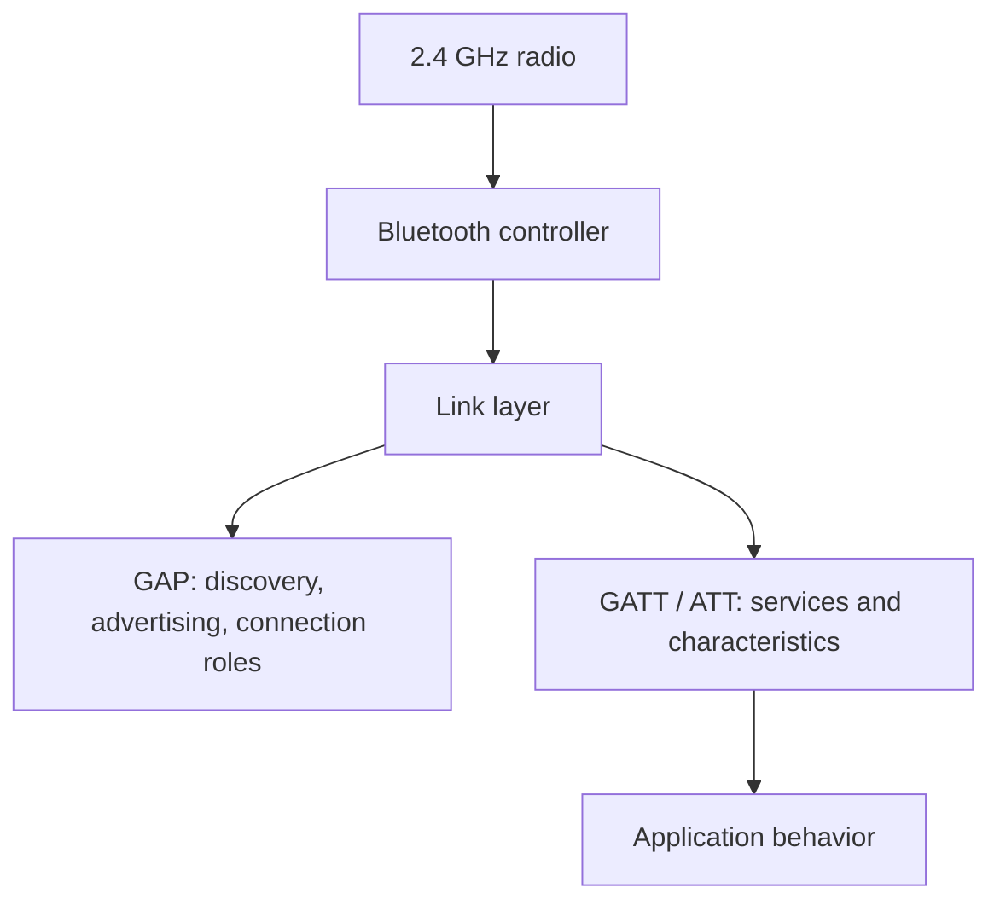
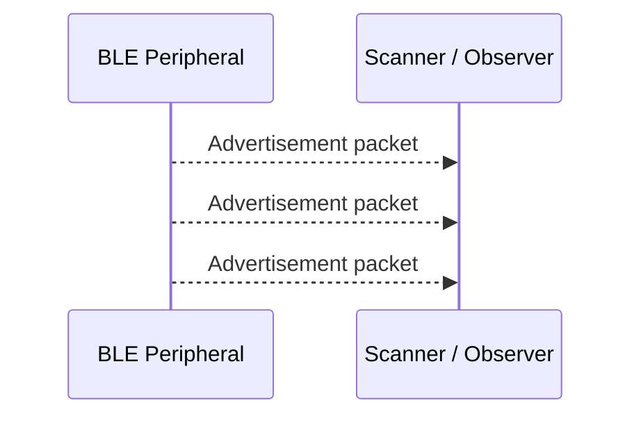
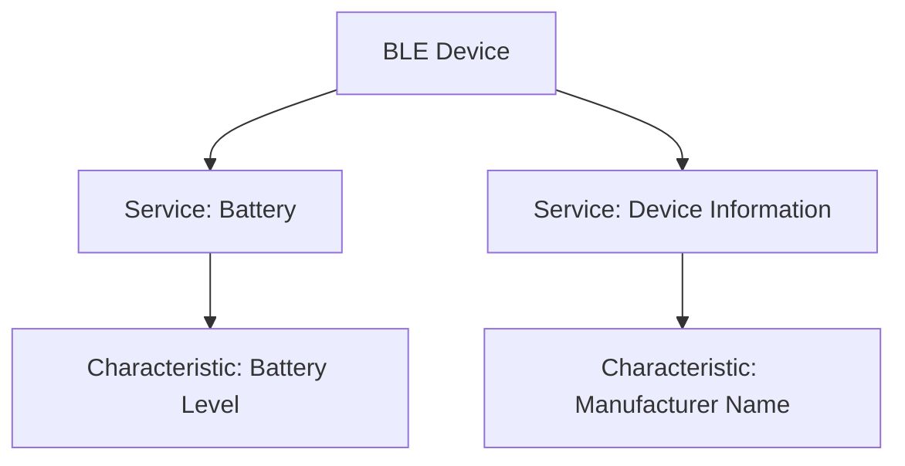
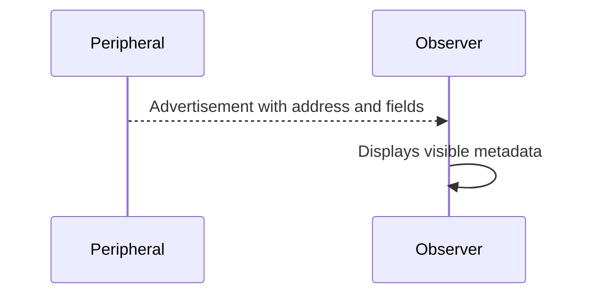
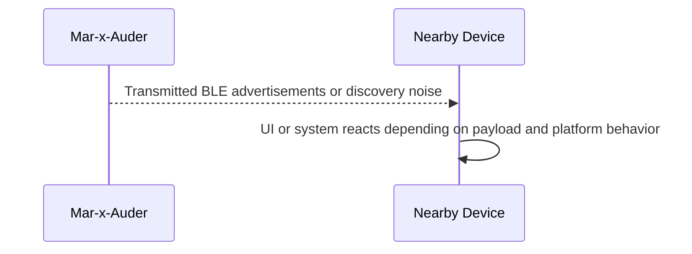

# Bluetooth and Bluetooth Low Energy

## Purpose of this section

This section explains Bluetooth and Bluetooth Low Energy concepts needed to understand the Bluetooth-related capabilities of a Mar-x-Auder or ESP32 Marauder-style device.

Bluetooth is not Wi-Fi. It uses different roles, discovery behavior, pairing models, profiles, and privacy mechanisms. A reader should not assume that Wi-Fi concepts such as SSID, BSSID, WPA, and deauthentication apply directly to Bluetooth.

## Relevant Mar-x-Auder abilities

This foundation section is referenced by ability chapters involving:

- Bluetooth discovery;
- BLE advertisement observation;
- device enumeration;
- Bluetooth spam or nuisance demonstrations where supported;
- privacy implications of nearby wireless devices;
- differences between Wi-Fi and Bluetooth research.

## Bluetooth Classic versus Bluetooth Low Energy

Bluetooth is a family of technologies. Two broad categories are relevant for this guide:

| Category | Typical use | Key idea |
|---|---|---|
| Bluetooth Classic | Audio devices, keyboards, mice, serial-style links, older peripherals | Connection-oriented use cases with profiles built on the classic Bluetooth stack. |
| Bluetooth Low Energy | Sensors, beacons, wearables, phones, trackers, IoT devices | Low-power discovery and small data exchanges, often using advertisements and GATT. |

Many modern devices support both, but not every Bluetooth tool can inspect or influence every Bluetooth mode.

## Where Bluetooth sits in the stack

Bluetooth and Wi-Fi may both use 2.4 GHz spectrum, but they use different protocols and channel behavior. Bluetooth is not IP networking by default, and BLE advertisements are not HTTP, TCP, or Wi-Fi frames.

## BLE advertising

BLE devices can broadcast advertisement packets. These advertisements may announce that a device exists, identify a service, support pairing, or provide small amounts of data.

A simplified BLE advertisement flow:

The scanner does not need to connect in order to see advertisements. This is why BLE observation can reveal nearby devices even without pairing.

## GAP roles

The Generic Access Profile defines roles related to discovery and connection establishment. Common BLE terms include:

| Role | Meaning |
|---|---|
| Peripheral | A device that advertises and may accept a connection. |
| Central | A device that scans and initiates connections. |
| Broadcaster | A device that only sends advertising data. |
| Observer | A device that only listens for advertising data. |

A Mar-x-Auder-style BLE scan is usually acting as an observer. Some active demonstrations may transmit advertisements or imitate certain discovery patterns depending on firmware support.

## GATT, services, and characteristics

After a BLE connection is established, devices often exchange data using the Generic Attribute Profile, commonly called GATT.

GATT organizes data into:

- services;
- characteristics;
- descriptors;
- read, write, notify, and indicate operations.

A passive advertisement scan does not necessarily expose GATT data. GATT usually requires a connection, and some data may require pairing, bonding, or application-level authorization.

## Pairing and bonding

Pairing is the process of establishing security between Bluetooth devices. Bonding stores the security relationship for future use.

Common pairing-related ideas include:

- exchanging or deriving keys;
- confirming user intent;
- protecting future connections;
- preventing unauthorized access to protected services.

The exact details depend on device capabilities, Bluetooth version, association model, and security configuration.

## Bluetooth identity and privacy

Bluetooth devices may expose identifiers. These can include public device addresses, random addresses, names, manufacturer data, service UUIDs, or application-specific payloads.

Modern BLE privacy mechanisms may rotate addresses to reduce long-term tracking. However, privacy is not absolute. Other stable fields, timing patterns, manufacturer data, or application behavior may still reveal useful signals.

The guide teaches that wireless visibility can create privacy risk even when the device is not connected to the network.

## Normal BLE discovery flow

The observer receives only what the peripheral broadcasts. No connection or pairing is required for advertisement observation.

## Interfered or active BLE flow

The exact behavior depends heavily on the firmware feature and the receiving device. Some active Bluetooth demonstrations are nuisance or spam demonstrations rather than deep protocol compromise.

## Bluetooth versus Wi-Fi misconceptions

| Misconception | Correction |
|---|---|
| Bluetooth has SSIDs | Bluetooth devices may have names and addresses, but not Wi-Fi SSIDs. |
| BLE scanning means pairing | Advertisement scanning does not require pairing. |
| Seeing a device means it is vulnerable | Visibility is not the same as exploitability. |
| Bluetooth attacks work like Wi-Fi deauth | Bluetooth has different protocol mechanics and different failure modes. |
| A visible BLE address is always permanent | Many devices rotate random addresses for privacy. |

## What Mar-x-Auder can demonstrate

A Mar-x-Auder can help students understand:

- nearby Bluetooth/BLE device visibility;
- the difference between advertisements and connections;
- how device names and metadata can leak context;
- why address randomization exists;
- how wireless spam or impersonation can create user-interface confusion;
- why Bluetooth research requires consent, even when only observing metadata.

## Ethical and safety boundary

Legitimate Bluetooth research observes lab devices, instructor-owned devices, or consented participant devices. The ethical line is crossed when observation becomes tracking, when identifiers are collected from uninvolved people, when active transmissions create nuisance or panic, or when devices are impersonated in a way that misleads real users.

Because Bluetooth devices are often personal wearables, phones, medical-adjacent devices, headphones, keyboards, and trackers, Bluetooth research should treat nearby device metadata as potentially sensitive.

## Defensive understanding

Defensive lessons include:

- disable Bluetooth when not needed in sensitive environments;
- avoid revealing unnecessary device names;
- keep firmware and operating systems updated;
- understand pairing prompts before accepting them;
- treat unexpected device popups as suspicious;
- prefer devices that support modern privacy and security behavior;
- minimize logging of third-party Bluetooth identifiers during research.

## References

- Bluetooth Core Specification: https://www.bluetooth.com/specifications/specs/
- Bluetooth Core Specification HTML edition: https://www.bluetooth.com/wp-content/uploads/Files/Specification/HTML/Core-54/out/en/index-en.html
- Bluetooth SIG overview: https://www.bluetooth.com/learn-about-bluetooth/tech-overview/
