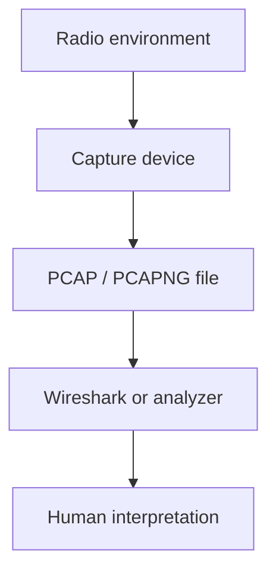
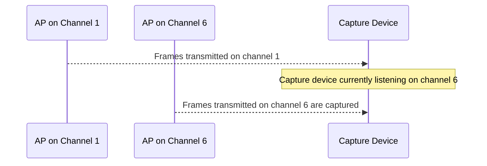
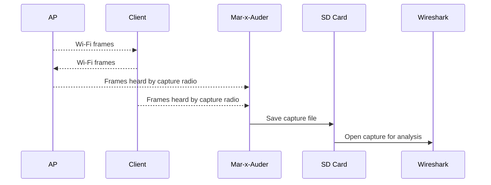
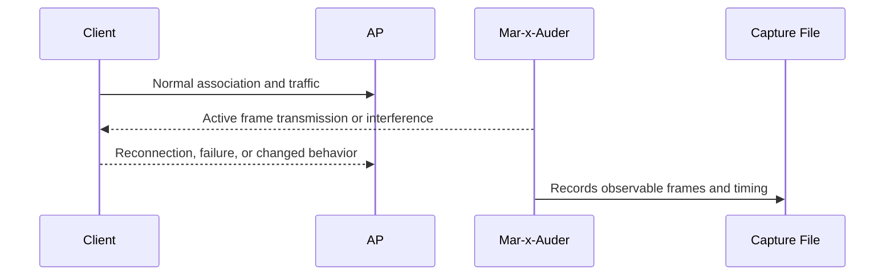

# Packet Capture and Analysis

## Purpose of this section

This section explains packet capture as a research method. The Mar-x-Auder can produce evidence by observing wireless traffic and storing captures for later analysis. Students need to understand what a capture contains, what it does not contain, and how to interpret captured data without overstating it.

Packet capture is not a complete source of truth. It is a time-limited observation from a specific radio, channel, antenna, firmware, and location.

## Relevant Mar-x-Auder abilities

This foundation section is referenced by ability chapters involving:

- raw Wi-Fi sniffing;
- beacon sniffing;
- probe request observation;
- deauthentication observation;
- EAPOL or PMKID artifact observation;
- wardriving;
- defensive reporting;
- validating whether a practical demonstration behaved as expected.

## What a packet capture is

A packet capture is a file or stream containing observed network frames or packets plus metadata. Common capture formats include PCAP and PCAPNG.

A capture may include:

- timestamps;
- captured frame bytes;
- link-layer type;
- radio metadata where available;
- packet lengths;
- channel or signal metadata depending on capture source;
- protocol fields that analysis tools can decode.

A capture does not necessarily include every frame transmitted nearby. Wireless capture is especially dependent on channel, signal quality, device capability, and timing.

## Where packet capture sits in the stack

The analyzer can decode what was captured, but the human still needs to understand context.

## Wi-Fi capture is channel-bound

A Wi-Fi radio usually listens on one channel at a time. If the device is listening on channel 6, it will not reliably capture frames on channel 1 or 11 at the same time.

Channel hopping can discover more networks, but it can also miss parts of a conversation. A full WPA handshake, for example, may occur while the device is listening on a different channel.

For analysis of one lab AP, a fixed-channel capture is usually clearer than channel hopping.

## 802.11 frame categories in captures

Wi-Fi captures may include several major categories of 802.11 frames:

| Category | Examples | Why it matters |
|---|---|---|
| Management frames | beacons, probes, authentication, association, deauthentication | Explain discovery, joining, leaving, and many interference demonstrations. |
| Control frames | acknowledgments, RTS/CTS, block acknowledgments | Coordinate radio access and delivery behavior. |
| Data frames | encrypted or unencrypted payload-carrying frames | Carry network traffic after association. |

Many Mar-x-Auder demonstrations operate at the management-frame layer. This is why a capture can show important behavior even before IP, TCP, or HTTP exist.

## Metadata versus payload

Wireless captures often reveal metadata even when payloads are encrypted.

Metadata may include:

- SSID;
- BSSID;
- client MAC address or randomized address;
- frame type and subtype;
- channel;
- signal strength if provided;
- timing;
- authentication and association events;
- deauthentication reason codes;
- EAPOL frame presence.

Payload visibility depends on encryption and capture conditions. A reader should not assume that encrypted traffic contents are visible just because frames appear in a capture.

## Radiotap and radio metadata

Some Wi-Fi captures include radio metadata through headers such as Radiotap. This metadata can include fields such as channel, data rate, signal strength, antenna, and flags.

Whether this metadata appears depends on the capture device, firmware, driver, and file format. If a field is absent, the analyzer cannot invent it.

## Normal capture flow

The capture device is an observer. It records what it can hear under its current settings.

## Interference validation flow

For active capability chapters, packet capture is used to verify what changed.

The capture should be used to explain the mechanism, not just the visible symptom. For example, a client disconnecting is the symptom; deauthentication or disassociation frames in the capture are the protocol evidence.

## What to look for in Wireshark

A guide can reference common analysis targets without turning the chapter into an exercise sheet:

| Situation | Useful evidence in capture |
|---|---|
| AP discovery | Beacon frames, SSID tags, BSSID, channel, RSN information. |
| Client discovery | Probe requests, probe responses, source addresses, requested SSIDs. |
| Association | Authentication, association request/response, capability information. |
| WPA handshake observation | EAPOL frames and timing around association. |
| Deauthentication | Deauthentication/disassociation frame subtype and reason code. |
| Portal behavior | DHCP, DNS, HTTP requests after Wi-Fi connection. |
| TLS boundary | TLS ClientHello, ServerHello, certificate exchange, alerts, or browser failure. |

## Interpretation pitfalls

Packet captures are easy to misread. Common mistakes include:

| Mistake | Correction |
|---|---|
| Treating absence as proof | A frame may have been missed due to channel, timing, or signal. |
| Confusing SSID with identity | SSID is only a label inside management frames. |
| Assuming payload visibility | Encrypted data frames may reveal metadata but not contents. |
| Assuming RSSI equals distance | Signal strength is affected by walls, antennas, reflections, and power. |
| Treating one capture as complete | A capture is a partial observation from one location and time. |
| Ignoring randomized addresses | Modern devices may rotate identifiers. |

## Privacy and minimization

Captures can contain sensitive information even when no passwords or message contents are visible. Device identifiers, network names, locations, and timing patterns can reveal personal or organizational context.

Recommended minimization practices:

- capture only in the lab environment;
- avoid long captures in shared spaces;
- redact third-party MAC addresses and SSIDs when publishing screenshots;
- store captures securely;
- delete captures that are no longer needed;
- avoid collecting payload data when metadata is enough.

## What Mar-x-Auder can demonstrate

A Mar-x-Auder can help students understand:

- the difference between visible wireless metadata and encrypted payload;
- how APs advertise themselves;
- how clients search for networks;
- how association and deauthentication appear on the air;
- how DHCP, DNS, HTTP, and TLS appear after network connection;
- how practical findings should be supported by packet evidence.

## Ethical and safety boundary

Legitimate packet capture is limited to owned networks, lab devices, and consented participants. The ethical line is crossed when captures are used to track people, collect identifiers from uninvolved devices, retain unnecessary sensitive data, or infer private behavior outside the research scope.

Even passive capture can be intrusive. Passive does not automatically mean harmless.

## Defensive understanding

Packet capture supports defensive work by making invisible protocol behavior visible. It can help defenders:

- confirm duplicate SSIDs or suspicious beacons;
- observe deauthentication bursts;
- verify whether PMF changes behavior;
- inspect captive portal flows;
- distinguish Wi-Fi-layer problems from IP or HTTP problems;
- produce evidence-backed findings rather than vague claims.

## References

- Wireshark libpcap file format notes: https://wiki.wireshark.org/Development/LibpcapFileFormat
- Wireshark User's Guide: https://www.wireshark.org/docs/wsug_html_chunked/
- tcpdump and libpcap project: https://www.tcpdump.org/
- Radiotap header project: https://www.radiotap.org/
